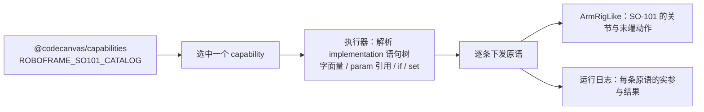

# Robot3D · RoboFrame 能力目录的 3D 执行器

把 `@codecanvas/capabilities` 里那份**真实的 RoboFrame 目录**变成看得见的动作：
左边是设备会做什么（照目录渲染，不写死技能名），中间是 SO-101 单臂，右边是这次执行的
语句与逐条结果。点一个能力就动一次，每一步都能对上目录里的原文。

```bash
pnpm --filter @codecanvas/robot3d dev     # http://localhost:5273（studio 占着 5173）
pnpm --filter @codecanvas/robot3d test
pnpm --filter @codecanvas/robot3d typecheck
```

深链（自动化与自查用）：

```text
?capability=celebrate                                 打开就执行一个能力
?capability=move_relative_ee&param.motion_direction=left&param.motion_distance=0.05
?task=<URL 编码的 JSON>                                打开就执行一份任务 JSON
?capabilities=inspect_scene,wave_hello                 连续跑几个能力（验证「不回零」）
```

浏览器控制台里也能直接喂：`__ROBOT3D__.runTask({ skill: 'wave_hello' })`、
`__ROBOT3D__.validateJson(text)`、`__ROBOT3D__.lastPlan()`。

## 接收 JSON 指令

右上「JSON 指令」区贴一份 JSON 就能跑，认三种形状，**都归到 `SkillPlan` 再执行**：

| 形状 | 例子 | 说明 |
| --- | --- | --- |
| 技能计划（主路径） | `{"schemaVersion":1,"robot":"so101_single_arm","plan":[{"step":"skill","skill":"wave_hello"}]}` | 本仓库的任务格式，`packages/contracts` 的 `SkillPlan` |
| 单条指令 | `{"task_id":"abc","skill":"celebrate","params":{}}` | RoboFrame bridge `/v1/skills/execute` 的请求体，去掉不改就能贴 |
| 上面两者的字符串 | 从文件/接口原样粘的一整段文本 | 多一层 `JSON.parse` |

校验**不自己实现一遍**：`validateSkillPlan(input, { catalog, expectedRobot })` 判据就是目录，
诊断（`code` / `path` / `message`）原样显示在界面上。不合法的计划**一步都不动**——
试过给一份 `robot: "some_other_arm"` + 不存在的技能 + `step: "wait"` 的计划，界面报三条：

```text
✕ plan.robot.mismatch @ robot — 计划是给「some_other_arm」编的，当前设备是「so101_single_arm」
✕ plan.step.skill.unknown @ plan[0].skill — 目录「SO-101 单臂（RoboFrame 技能库）」里没有技能「make_coffee」
✕ plan.step.kind_unsupported @ plan[1].step — 这一版只认 step: "skill"，收到 "wait"
```

执行侧与契约的分工：契约管**文档合不合法**，执行侧管**这条调用能不能动**。
目录里没有「必填参数」这一栏，所以缺参数在契约那层只是 warning；到了执行侧，
没有可编的默认值（比如「往哪边移」）就直接拒绝，并在步骤 detail 里说清缺哪个。

计划执行**失败即停、不自动重试**（与 bridge 的纪律一致：重试与否由技能的 `recovery_policy` 决定）。

## 点几次排几次（串行队列）

「执行」不再是"忙就忽略"——它把指令**入队**：点几下排几条，一条跑完接着下一条，
面板上就写着现在在跑谁、后面还排着谁：

```text
执行中：观察桌面　|　排队（2）：打招呼 → 跳舞      [清空队列]
```

- 队列只管顺序（`src/roboframe/queue.ts`，有独立的单测）：一条抛错不挡后面的，
  但也不替它吞掉——错误由任务自己上报，队列留一个 `onError` 兜底。
- 「清空队列」只清**等待中**的；正在跑的那条要停得用「取消」。
- 选技能（左栏）**不再清空日志**：点一个技能就把历史清掉，看起来像"从头开始"。
  清日志只发生在按「复位」时。
- 地址栏的 `?capabilities=a,b,c` 走的也是这条队列。

界面上的用法就一句：**左栏点一个技能 → 按「执行」（入队）→ 接着点下一个 → 再按「执行」**，
中间不用等。实测连点四个（观察桌面 → 跳舞 → 摇头 → 打开夹爪）：

```text
执行中：观察桌面　|　排队（3）：跳舞 → 摇头 → 打开夹爪
2.6s 后（第一条跑完，自动接上）：
执行中：跳舞　|　排队（2）：摇头 → 打开夹爪
▶ 执行 观察桌面（inspect_scene）
  起始姿态 0.000 0.000 0.000 0.000 0.000
▶ 执行 跳舞（dance_basic）
  起始姿态 0.020 0.540 -0.820 -0.180 0.020      ← 上一条结束的姿态，没有回零
```

**选 ≠ 排队**：左栏点击只是选中（看实现、填参数），入队要按「执行」。
想让点击直接入队，把 `panel.ts` 里那个 `click` 处理器一并调 `onRun` 即可——
默认不做，是因为点着看实现时不该顺手把动作排进去。

## 连续执行：不回零

跑一条新指令**不会**先把机械臂复位——真机上换技能是从当前姿态接着走，
回零是目录里 `recover_zero_pose` / `recover_safe_pose` 这两个技能干的活。

执行器因此把两件事分开：

- `beginRun()`：开始一次运行，只清取消标记，**不动机械臂**（每次执行、每条计划都走它）；
- `reset()`：关节归零、夹爪张开——只有用户按右栏「复位」时才发生，顺带清日志。

日志按顺序累加、每条记下起始姿态，连续跑一眼能看出是接上的：

```text
▶ 执行 观察桌面（inspect_scene）
  起始姿态 0.000 0.000 0.000 0.000 0.000
1/1  move_to_named_pose pose_name=observe_table — observe_table（upstream）  DONE
▶ 执行 打招呼（wave_hello）
  起始姿态 0.020 0.540 -0.820 -0.180 0.020      ← 上一条结束的姿态，没有回零
1/4  close_gripper  DONE
```

连续跑几条也能从地址栏发起：`?capabilities=inspect_scene,wave_hello,dance_basic`。

## 一句数据流



`packages/capabilities` 的目录是加载即校验的（zod 契约），所以这里不做二次校验：
形状不对在那里就炸了，能到界面上的一定是过过契约的。

## 执行器怎么把原语变成动作

| 原语 | 本执行器的做法 |
| --- | --- |
| `move_to_named_pose(pose_name)` | 命名位姿 → 关节角，1.6 s 到位（来源标注见下） |
| `move_to_joint_positions(joint_positions, duration_sec)` | 关节角线性 + 缓动插值，时长照抄参数 |
| `move_to_configuration(joint_positions)` | 同上，时长取默认 1.5 s（目录没给） |
| `move_through_joint_positions(trajectory_template)` | 合成轨迹路点后逐拍播放；`wave_dance_v1` 按傅里叶级数、`single_joint_wave_v1` 按单关节正弦 |
| `move_relative_ee(direction, distance)` | 末端相对平移：`up/down=±z`、`left/right=±y`、`forward/back=±x`（基座系，米），用平面双连杆解析解定位 |
| `open_gripper` / `close_gripper` | 夹爪开度 0.4 s 过渡 |
| `rotate_gripper_cw/ccw(度)` | 工具自转轴按度数转（目录标注单位是「度」） |

关节映射：目录 1~5 → 肩回转 / 肩抬升 / 肘 / 腕俯仰 / 工具自转；SO-101 没有前臂自转轴，恒 0。

## 哪些是上游真值，哪些是本地近似

这是本应用最要紧的一节，界面上也写着同样的话：

| 东西 | 来源 |
| --- | --- |
| 技能、原语、实参、命名位姿**名字**、workspace_limits | 上游目录，逐字照抄（`provenance.commit` = `8f364c3f`） |
| `observe_table` 的关节值 | 上游真值：轨迹模板里的 `base_pose` |
| `zero` | 按定义全零 |
| `home` | **本次近似**：上游 YAML 里才有真值，导入工具只带了名字 |
| 连杆长度 | **近似**：按 SO-101 量级取（真值在 `robot_description` 的 URDF） |
| 关节零点偏移 `DISPLAY_OFFSET` | **本模型的显示约定**：上游零点在标定文件里，这里只为让姿态读得懂 |

界面右下角那句「本执行器映射」就是这张表的现场版；`?capability=` 跑起来以后，
HUD 里显示的关节角始终是**目录原值**，不掺显示偏移。

## 安全边界：按标定可信度分级

模板自带 `workspace_limits`，执行器逐拍正解出检查点比对。越界怎么处理取决于
`ArmRigLike.calibration`：

- `verified`（标定过的真机）→ **拒绝执行**，报出越界的检查点与数值；
- `approximate`（本应用，连杆长度还是估的）→ 照跑，但在步骤 detail 里标「边界提示」。
  拿估算的运动学去否决上游动作是假精确，那不叫安全，叫编。

改一处即可切换：`So101Rig.calibration`。

## 「往前一点」为什么会闪现：三层错，全在运动学

`move_relative_ee` 起初是**一帧跳到位**的，肉眼就是"闪现"。查下来是三处叠加，每一处都让
解析解和实际装出来的手臂不是同一个东西：

1. **起点用错**：拿的是腕心（`toolWorld`）而不是指尖（`toolTip`），凭空差一个工具长；
2. **直接写角度**：解析解算完就赋值给关节，腕部在第一帧弹到位。改成"解出目标姿态 → 按关节插值走过去"；
3. **两套约定**：解析解在**不带** `DISPLAY_OFFSET` 的约定里算，渲染时 `applyJoints` 又会加偏移；
   而且模型里 j2 的正向旋转把手臂指向 **−z**，解析推导的前向是 +z——镜像差一个 π，
   于是底座先原地转半圈再走。现在解算先把目标搬到 `(u,w) = (−x,−z)`，返回前再减掉偏移。

还有两处**尺寸对不上**，误差是厘米级的：

- 「肘 → 腕心」少算了一段：球腕的 J4/J5/J6 三轴交于一点，所以这段就是
  `foreArm + wristStack`；照原先的写法还多带了 `flangeStack`，且那段是**转过腕俯仰之后**的方向，
  差出约 2cm；
- 工具长写成 0.11，实际手指根部在 0.062 + 手指 0.055 = 0.117。

现在这些常数从 `SO101_DIM` 一份布局推出来（`KIN`），装配和解析解共用同一组数字。
三条测试钉着：动作第一帧不跳、每帧增量有界（闪现回归）、**要 4cm 就真走 4cm（±5mm）**、
以及相对移动不重新定向手腕。行程边界会夹住时，执行器如实报「实际走了多远」，
不照抄请求值。

## 已知欠账

- 设计令牌是从 `apps/studio/src/shell/theme.css` **复制**过来的一套 `--cc-*`。
  正确做法是抽成 `packages/theme` 两边引用；那要动 studio，本次没做。
- 命名位姿的关节值：建议在 `tools/import-roboframe` 里顺手把 `named_poses` 的关节值一起导出来
  （上游 YAML 里就有），这样 `home` 也不用近似。
- `move_to_pose(target_pose)` 只做了「认不出就明说」，没有完整位姿解算——SO-101 的 16 个技能
  没有一个用到它，等有真实调用再补。
