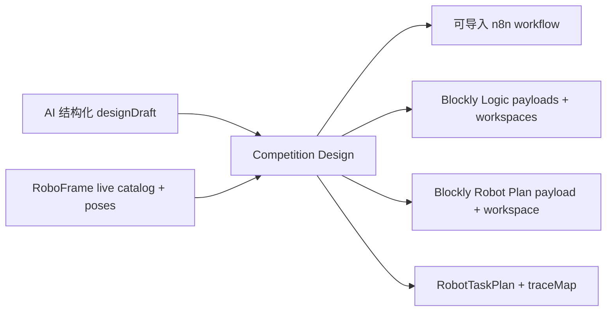
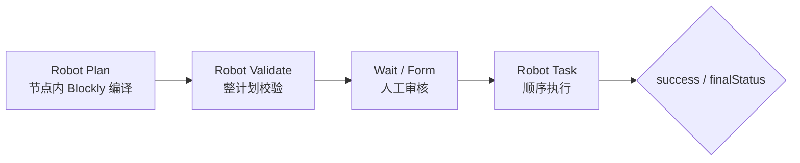

# n8n-nodes-roboframe

RoboFrame（IB-Robot）动作节点族：通过
[RoboFrame HTTP Bridge](../../../services/roboframe-bridge/README.md) 消费受控的
`skill | primitive` action 边界。架构与执行边界见
[设计稿](../../../docs/roboframe/roboframe-integration-design.md)。

## AI 双图生成入口



`Competition Design` 把 AI 的受约束语义草稿交给
`@n8n/competition-designer`，同一次生成得到外层 n8n 编排图、节点内 Blockly Logic
与节点内 Blockly Robot Plan。局部数据代码统一生成 `CUSTOM.blocklyCode`，不生成普通
Code 节点。节点先从 bridge 同时读取 action catalog 和 named poses，并严格核对
`robot_name/config_digest`，因此生成使用的是当前机器人能力，而非固定样例目录。
动作超时按 `timeout_sec` → `timeout_policy.timeout_sec` →
`timeout_policy.default_skill_timeout_sec` → `timeout_policy.default_timeout_sec`
的优先级映射，保留 Bridge enriched catalog 的实际执行预算。

生成的工作流使用实际节点类型 `CUSTOM.blocklyCode`、`CUSTOM.robotStatus`、`CUSTOM.robotSkillPlan`、
`CUSTOM.robotValidate`、`CUSTOM.robotTask`，并包含表单审核、批准/驳回、执行结果分流。
它还会在编译计划前按 `motionAuthorized/busy` 分出 Robot Ready 与 Not Ready 路径。
`Target Credential ID/Name` 会写入生成工作流的 RoboFrame 节点；默认值是醒目的
`REPLACE_WITH_ROBOFRAME_CREDENTIAL_*` 占位符，导入目标 n8n 前填写目标实例中的凭据引用。

## 比赛主执行链



`Robot Plan` 只负责编译。机器人动作统一由下游 `Robot Task` 执行，避免编辑器节点与执行节点形成两条语义重复的路径。`Robot Validate` 的 `Plan` operation 会保留上游 item 和 `plan`，并附加 `validation` 汇总及绑定该计划的 `planDigest`，因此审核节点之后仍可直接交给 `Robot Task`。

## 节点

| 节点 | 用途 |
| --- | --- |
| **Competition Design** | 消费严格 v2 AI `designDraft`，结合 live catalog/poses 生成可导入 n8n workflow、一个或多个 Blockly Logic、Blockly Robot Plan、教学草稿、`RobotTaskPlan` 与 `traceMap` |
| **Robot Catalog** | 列出 skill 与 primitive action，所有项携带同一份 `configDigest`；`Include Details` 附带参数 schema 与策略 |
| **Robot Status** | 查询 Gateway：授权/控制模式/busy、robot 与 catalog digest、registry、control-plane、capability readiness |
| **Robot Skill** | 单 skill 调试：校验（可选）→ 提交 → 轮询至终态；也可仅返回 `accepted` |
| **Robot Validate** | 默认 `Plan`：逐步校验编译计划；`Action (Debug)`：校验一个带 `kind/name` 的动作 |
| **Robot Task** | 顺序执行已编译计划；每步一个 task；首个失败、取消或未知状态即停 |
| **Robot Plan** | 严格解析内嵌 catalog 的 Blockly payload v2，回编译为 `RobotTaskPlan` 并输出 compilation 元数据 |

### Competition Design 输出

成功 item 的核心字段为：

```json
{
  "ok": true,
  "stage": "complete",
  "catalogDigest": "sha256:LIVE_DIGEST",
  "n8nWorkflow": { "nodes": [], "connections": {} },
  "logicNodes": [
    {
      "nodeRef": "logic.prepare-input",
      "blocklyPayload": "{...}",
      "workspace": { "blocks": { "blocks": [] } },
      "javascript": "const output = { ...$json }; ..."
    }
  ],
  "blocklyPayload": "{...}",
  "blocklyWorkspace": { "blocks": { "blocks": [] } },
  "semanticDraft": { "schemaVersion": "2.0", "logicNodes": [], "robotPlan": { "steps": [] } },
  "robotTaskPlan": { "schemaVersion": 1, "plan": [] },
  "traceMap": []
}
```

其中 `semanticDraft` 保留 Logic 与 Robot 每步教学所需的
`what/why/editable/expectedEffect`。AI 生成的 Logic statement 也把该教学说明写入
Blockly block 的标准 `data` 字段，选中积木即可在节点内查看。
`traceMap` 连接 AI 意图步骤、n8n 节点和 Blockly block。失败 item 统一输出
`ok=false`、`stage`、`diagnostics[]`；例如目录漂移落在 `robot-plan`，并给出
`CATALOG_DIGEST_MISMATCH` 与字段路径，供 AI 定点修订后重新生成。

## Blockly payload v2

Robot Plan 只接受唯一结构：

```json
{
  "schemaVersion": 2,
  "catalog": {
    "robotName": "so101_single_arm",
    "configDigest": "DIGEST",
    "skills": [],
    "primitives": [],
    "namedPoses": []
  },
  "workspace": { "blocks": { "blocks": [] } }
}
```

payload 仅包含 `schemaVersion/catalog/workspace`。运行时始终使用 `payload.catalog` 回编译 `payload.workspace`；固定 SO-101 快照只用于生成节点的初始示例 payload。plan preview 已退出格式，减少同一任务出现两份计划语义的机会。

## Action API 契约

- 校验：`POST /v1/actions/validate`
  - body：`{ action: { kind: "skill" | "primitive", name }, params }`
- 提交：`POST /v1/actions/execute`
  - body：`{ task_id, action: { kind, name }, params, timeout_sec? }`
  - 受理状态：`accepted`
  - Blockly 生成的 `blockId/planStepId` 放入可选 `context`，查询结果可回溯到积木
- 查询：`GET /v1/tasks/{task_id}`
  - 活动态：`accepted → running`
  - 终态：`completed | failed | canceled | unknown`
- 取消：`POST /v1/tasks/{task_id}/cancel`
  - `confirmed=true` 代表 bridge 已确认 `completed | failed | canceled`
  - 本地轮询超时会先请求取消；取消仍处于 `running` 时继续限时查询，确认窗口结束后记录 `unknown`

提交后的短暂任务查询空窗会在一个有界注册宽限期内继续轮询。持续缺失会请求取消并形成结构化结果。

## Robot Task 输出

成功与任务级失败都输出普通 n8n item，供 IF/Switch 节点按字段分流：

```json
{
  "robot": "so101_single_arm",
  "configDigest": "DIGEST",
  "catalogDigest": {
    "valid": true,
    "plan": "DIGEST",
    "live": "DIGEST",
    "message": ""
  },
  "success": false,
  "finalStatus": "failed",
  "taskIds": ["TASK_ID"],
  "steps": [
    {
      "index": 0,
      "action": { "kind": "primitive", "name": "open_gripper" },
      "taskId": "TASK_ID",
      "status": "failed",
      "state": "failed",
      "errorCode": "ERROR_CODE",
      "message": "DETAIL"
    }
  ],
  "error": {
    "index": 0,
    "step": "open_gripper",
    "taskId": "TASK_ID",
    "state": "failed",
    "errorCode": "ERROR_CODE",
    "message": "DETAIL",
    "completedSteps": 0
  }
}
```

输入结构、凭据或 catalog digest 校验错误在动作提交前结束节点执行；提交之后的 terminal 结果全部保留 `steps/taskIds/finalStatus`。Robot Task 还严格要求上游
`validation.mode=plan`、`validation.valid=true`、`validation.catalogDigest.valid=true`，
并用稳定键序 JSON 的 SHA-256 重新计算计划摘要，与 `validation.planDigest` 精确比较。
因此审核后的任一步骤、参数、顺序或超时变化都会在动作提交前被识别。

## Catalog digest 路径

1. AI/编辑器把本次设计采用的 catalog 与 workspace 一起封入 payload v2。
2. `Robot Plan` 严格解析 payload，用其中的 catalog 回编译，并把该 catalog digest 写入 `plan.configDigest`。
3. `Robot Plan` 在 `compilation.catalogDigest` 以 `source=payloadCatalog` 标记来源和值。
4. `Robot Validate` 拉取 live catalog，在 `validation.catalogDigest` 输出 plan/live 对照。
5. `Robot Validate` 同时把计划的规范化 JSON SHA-256 写入 `validation.planDigest`。
6. 人工审核之后，`Robot Task` 先重算 plan digest，再拉一次 live catalog，分别识别计划篡改与目录漂移。
7. `Robot Task.catalogDigest` 记录实际执行前的最终目录对照。

plan digest、live digest、二者相等性均为显式字段；空 digest 视为配置错误。

## 凭据与执行边界

`RoboFrame Bridge API` 使用 `baseUrl + token`，token 对应机器人侧
`ROBOFRAME_BRIDGE_TOKEN`。连接测试调用受保护的 `GET /v1/status`，同时验证地址与 token。

- 所有动作经 bridge 进入 RoboFrame 的 skill/primitive safety guard。
- 失败与超时保持单次执行语义；重试由外层 n8n 工作流按审核后的策略决定。
- 运动授权入口保持在 RoboFrame 操作员启动流程，节点族未暴露相应开关。
- bridge 任务登记用于当前执行观察；长期记录使用 n8n execution history。

## 开发

```bash
pnpm install
pnpm build
pnpm test
pnpm typecheck
pnpm lint
```

直载运行：`N8N_CUSTOM_EXTENSIONS=<repo>/custom-nodes/n8n-nodes-roboframe/dist pnpm start`
（节点类型前缀为 `CUSTOM.`）。
