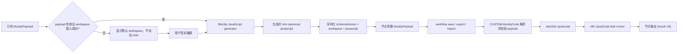

# Blockly Code MVP 架构

> 基线：n8n `2.35.4`。本文记录当前分支的真实实现和已验证运行形态；验收结论见 `acceptance.md`。

## 为什么采用 custom node + 最小 editor-ui 接缝

MVP 将“编辑”和“执行”分开：custom node 定义节点参数、校验载荷并把生成的 JavaScript 交给 n8n task runner；editor-ui 只增加一种参数编辑器，不改画布、工作流保存协议或执行引擎。

- `custom-nodes/n8n-nodes-blockly-code/**` 是独立 custom node package，负责 `Blockly Code` 节点和 task runner 调用。
- `packages/workflow/src/interfaces.ts` 只在 `EditorType` 中加入 `blocklyEditor`。
- `packages/frontend/editor-ui/src/features/ndv/parameters/components/ParameterInput.vue` 只在参数声明 `typeOptions.editor: 'blocklyEditor'` 时挂载 `BlocklyEditor`。
- `packages/frontend/editor-ui/src/features/shared/editors/components/BlocklyEditor/**` 负责 Blockly 工作区、canonical JavaScript 生成和参数回写。
- workflow 仍保存标准节点参数；浏览器不直接执行生成代码，custom node 通过 `startJob('javascript', ...)` 交给 n8n task runner。

这样可以复用 n8n 的节点发现、workflow import/save/export 和执行链路，同时把核心前端改动控制在一个类型扩展和一个参数渲染分支内。

## 直载节点的运行时类型

当前运行方式是 `N8N_CUSTOM_EXTENSIONS=<package>/dist` 直载。`packages/core/src/nodes-loader/constants.ts` 明确定义：

```ts
export const CUSTOM_NODES_PACKAGE_NAME = 'CUSTOM';
```

`CustomDirectoryLoader` 使用该 package name，而节点自身的 description name 是 `blocklyCode`，因此当前 workflow 中的节点类型固定为：

```text
CUSTOM.blocklyCode
```

`n8n-nodes-blockly-code` 是源码 package 名和构建单元，不是 `N8N_CUSTOM_EXTENSIONS` 直载时的 workflow node type 前缀。

## 当前目录与文件

```text
custom-nodes/n8n-nodes-blockly-code/
├── package.json
├── tsconfig.json
├── eslint.config.mjs
└── nodes/BlocklyCode/
    ├── BlocklyCode.node.ts
    ├── BlocklyCode.node.test.ts
    ├── blockly-code.svg
    └── blockly-code.dark.svg

packages/frontend/editor-ui/src/features/shared/editors/components/BlocklyEditor/
├── BlocklyEditor.vue
├── blockly.ts
├── payload.ts
├── payload.test.ts
└── vitest.config.ts

scripts/blockly-mvp/
├── README.md
├── setup-demo.sh
├── run-demo.sh
├── verify-payload.mjs
└── fixtures/blockly-code-demo.workflow.json
```

### 修改与新增清单

| 类型 | 文件 | 当前职责 |
| --- | --- | --- |
| 新增 | `custom-nodes/n8n-nodes-blockly-code/**` | custom node package、节点实现、14 项测试和图标；构建产物位于 `dist/`。 |
| 新增 | `packages/frontend/editor-ui/src/features/shared/editors/components/BlocklyEditor/**` | Blockly UI、默认工作区、canonical payload 及 10 项定向测试。 |
| 修改 | `packages/workflow/src/interfaces.ts` | 将 `blocklyEditor` 加入 `EditorType`。 |
| 修改 | `packages/frontend/editor-ui/src/features/ndv/parameters/components/ParameterInput.vue` | 在弹窗和内联两种参数布局中挂载 `BlocklyEditor`。 |
| 修改 | `packages/frontend/editor-ui/src/features/ndv/parameters/components/ParameterInput.test.ts` | 覆盖新的参数编辑器接缝，共 56 项测试通过。 |
| 修改 | `packages/frontend/@n8n/i18n/src/locales/en.json` | Blockly 分类、返回块和无障碍文本。 |
| 修改 | `packages/frontend/editor-ui/package.json` | 通过 catalog 声明 `blockly` 依赖。 |
| 修改 | `pnpm-workspace.yaml` | 加入 `custom-nodes/*` workspace，并固定 catalog 中的 `blockly: 12.3.1`。 |
| 修改 | `pnpm-lock.yaml` | 锁定 Blockly、custom node importer 及其依赖解析。 |
| 新增 | `scripts/blockly-mvp/**` | 隔离数据库、fixture 导入/导出、运行日志和载荷检查。 |
| 新增 | `docs/blockly-mvp/**` | 架构、运行和验收说明。 |

`custom-nodes/*` 加入 pnpm workspace 只服务于本仓库内的依赖安装、类型解析、测试和构建。n8n 运行时不会因为 workspace 成员关系自动加载该节点，仍必须设置：

```bash
N8N_CUSTOM_EXTENSIONS="$PWD/custom-nodes/n8n-nodes-blockly-code/dist"
```

路径必须指向编译后的 `dist`，不能指向 package 根目录。

## 参数契约与 canonical JavaScript

节点参数名固定为 `blocklyPayload`，其值是一个 JSON 字符串。字符串解码后的对象固定为：

```ts
{
  schemaVersion: 1,
  workspace: Record<string, unknown>,
  javascript: string,
}
```

默认 `workspace` 包含一个 `n8n_return_output` 块，其 `VALUE` 连接 `math_number`，数值为 `42`。对应 JavaScript 为：

```js
return [{ json: { result: 42 } }];
```

P1 修复后，editor-ui 载入已有 payload 时以 `workspace` 为源重新生成 JavaScript。只有 payload 解析有效且 workspace 载入成功时，组件才自动 emit canonical payload。即使有效 payload 的 `javascript` 是过期值，载入 return block + `math_number 42` 后也会重新生成 `result: 42`；第 10 项 Blockly 测试已覆盖“过期 `result: 7` 被替换”这一行为。

非法、未知 schema 或 workspace 载入失败的 payload 仍会在界面中显示默认工作区，但挂载过程不会自动 emit，也不会用默认值覆盖原参数。只有用户随后真实编辑工作区，非 UI change event 才会生成并回写新 payload。因此“invalid/unknown payload 挂载时被默认 workspace 自动覆盖”已修复，不是未解决的 P1。

canonical serialization 会对 Blockly generator 产出的 JavaScript 执行 `trim()`，去除尾部空白和换行，使节点默认值、fixture 与 UI 保存值保持一致：`return [{ json: { result: 42 } }];`。

该 canonical 化发生在 Blockly editor 载入链路。custom node 生产代码已移除对 `getNodeParameter()` 结果的 `as string` 断言：先检查参数确为字符串，再解析并校验 `schemaVersion`、`workspace` 与 `javascript`，最后执行 payload 中的 `javascript` 字段。非字符串输入会直接产生节点参数错误，不会进入 task runner。

`scripts/blockly-mvp/verify-payload.mjs` 同时接受仓库中的单 workflow 对象 fixture，以及 n8n `export:workflow` 产生的单 workflow 数组。两种形态都要求节点类型为 `CUSTOM.blocklyCode`，并执行同一 payload 校验。

## Blockly 版本选择

当前 catalog 固定 `blockly@12.3.1`：

- `13.2.1` 要求 `jsdom >=27.4`，而 n8n 2.35.4 基线使用 `jsdom 23.0.1`，升级会引入 peer 依赖冲突；
- `12.3.1` 避免该 peer 冲突；
- `12.3.1` 的 Node 入口仍依赖 `jsdom 26.1.0`，因此 lockfile 中会保留该传递依赖；
- editor-ui 通过 Vite ESM 动态导入 `blockly` 与 `blockly/javascript`，分别走包的浏览器 ESM 入口，而不是 Node 入口。

## 数据流


