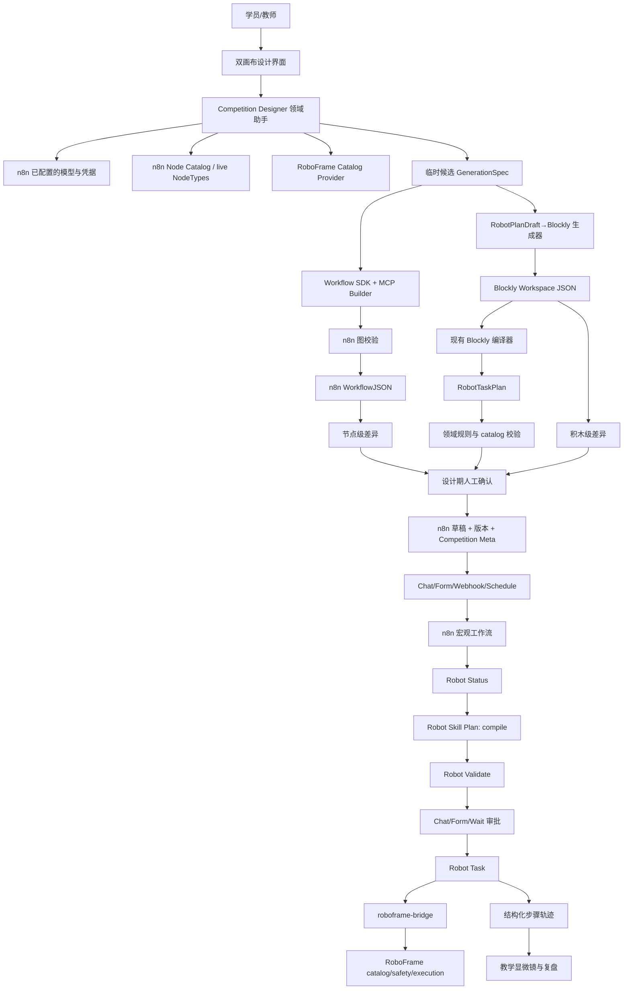

# 面向 OpenHarmony 的 AI Agent 低代码具身智能任务开发平台
## n8n × Blockly × RoboFrame 软件平台详细设计稿 v1.0

> 分支：`codex/competition-blockly-robot-framework-n8n`
> 文档状态：设计评审稿，尚未进入功能开发
> 编写日期：2026-08-22
> 软件审计基线：`zhaoyilun/n8n-blockly@cd13e77691943e501b4978dfaa2e28be9684b021`，n8n `2.35.4`
> OpenHarmony 端审计基线：当前 `harmony-blockly` 比赛分支，基线提交 `11d8532`
> 本稿边界：先完成软件平台、双画布、教学闭环与模拟执行设计；RK3588、OpenHarmony 系统镜像、板级驱动、机器人选型及接线在软件验收门通过后另立硬件详细设计。

---

## 0. 执行摘要

### 0.1 一句话产品定义

学员输入自然语言后，AI 生成一张 **n8n 宏观编排图**和一张与其中“机器人详细任务”节点绑定的 **Blockly 技能图**；学员可以查看、修改、校验、模拟运行并逐步回放，最后由 RoboFrame 执行受审查的任务计划。

### 0.2 回答比赛的核心问题

比赛思想不是“让 AI 替学生生成更多代码”，而是：

> **把 AI 的任务分解过程变成可观察、可修改、可验证的两层图，让学员理解从自然语言、业务编排、机器人技能、参数到实际动作的完整映射。**

学员需要看懂四件事：

1. **为什么做**：自然语言意图和教学目标；
2. **先后做什么**：n8n 里的触发、AI、审批、分支、记录和外部系统；
3. **机器人具体怎么做**：Blockly 里的技能、primitive、位姿、参数、局部等待和简单守卫；
4. **实际发生了什么**：校验结果、步骤结果、错误位置、任务终态以及 AI 原方案与学员修改版的差异。

### 0.3 本设计冻结的六个架构决策

1. **n8n 是核心平台**：主画布、触发、AI、审批、条件、外部集成、凭据、执行历史、版本和发布全部复用 n8n。
2. **Blockly 只补机器人领域细节**：它表达一次具身任务内部的短技能序列和强类型参数，不复制 n8n 的通用编排能力。
3. **RoboFrame 是能力与执行边界**：技能目录、参数约束、安全校验、运动授权、状态、取消和实际执行由 RoboFrame 决定。
4. **复用 Workflow SDK 与 n8n Workflow Builder 工具链**：n8n 图由官方 SDK、live NodeTypes 校验和原生创建/更新能力完成，不另造工作流格式、画布或版本系统。
5. **双真相、单映射**：n8n WorkflowJSON 是宏观编排真相；Blockly workspace JSON 是机器人详细计划真相；RobotTaskPlan 是派生执行产物；GenerationManifest 只做映射与审计。
6. **先软件、后硬件**：先用固定版本的 RoboFrame 能力目录和状态机模拟器完成双图生成、保存、修改、校验、审批、执行回放及证据包，再开始 RK3588/OpenHarmony 的板级设计。

### 0.4 最重要的事实校准

n8n 自带的许可版 AI Workflow Builder 源码确实存在，但当前 `filterNodeTypes()` 只接收 `n8n-nodes-base.*` 与 `@n8n/*` 节点，现有 RoboFrame 社区节点尚未进入它的节点目录。因此：

- “n8n 已经拥有通用 AI 工作流生成能力”是事实；
- “它目前已经会生成本项目的 RoboFrame 节点”不是当前事实；
- 本项目选择复用 `@n8n/workflow-sdk`、MCP Workflow Builder 的搜索/校验/创建/更新工具以及 n8n 版本系统，新增很薄的 RoboFrame/Blockly 领域设计助手；
- 这个领域设计助手是**设计期能力**，不是运行时工作流节点。

---

## 1. 赛题目标拆解与产品闭环

| 赛题要求 | 本平台对应能力 | 当前状态 | 软件验收证据 |
|---|---|---:|---|
| 自然语言转可视化任务流程 | 领域设计助手生成 n8n 图和 Blockly 图 | 欠缺 | 30 条提示词生成套件 |
| AI Agent 辅助编程 | 设计期 AI 生成与修订；运行期按场景选用 AI Agent | 部分 | 生成记录、结构化规格、版本差异 |
| 映射 RoboFrame 底层技能 | catalog 驱动 Blockly，编译为 RobotTaskPlan | 部分 | catalog/参数/计划一致性测试 |
| 运行前看清逻辑、步骤、参数和接口 | 双画布、教学显微镜、校验报告 | 欠缺 | 浏览器端审阅流程 |
| 人工审核与修改 | 设计期差异确认；运行期 Chat/Form/Wait 审批 | n8n 已有，尚未整合 | 两道审核门 E2E |
| 低代码、可解释教学 | n8n 负责宏观，Blockly 负责机器人细节 | 部分 | 学员修改、定位和复盘事件 |
| OpenHarmony 端侧 | 软件接口先冻结，硬件阶段实现 | 后续阶段 | 后续板端实测包 |
| 具身任务运行安全 | Validate、授权、任务状态、取消、终态确认 | 部分 | mock/sim/设备分层证据 |

### 1.1 标准用户闭环

```text
学员输入任务
  → AI 查询 n8n 节点能力和 RoboFrame catalog
  → 生成候选设计规格
  → 生成 n8n 宏观图
  → 生成每个机器人任务节点对应的 Blockly 详细图
  → 确定性校验与一次受限修订
  → 展示节点级、积木级差异
  → 学员/教师确认应用
  → 软件模拟运行
  → 运行前审批
  → RoboFrame 校验与执行
  → 结果映射回 n8n 节点和 Blockly 积木
  → 生成教学复盘与比赛证据包
```

### 1.2 两种 AI 的角色必须分开

| 名称 | 发生时机 | 任务 | 是否进入已发布工作流 |
|---|---|---|---|
| 设计期领域助手 | 创建或修改流程时 | 生成/修订 n8n 图、Blockly 图、解释和映射 | 否 |
| n8n AI Workflow Builder | 设计期 | 通用 n8n 工作流生成；当前对社区节点有限制 | 否 |
| n8n Workflow SDK/MCP Builder | 设计期确定性层 | 校验代码、创建/更新图、保存版本 | 否 |
| n8n AI Agent 节点 | 工作流运行时 | 根据实时输入推理、调用工具、生成结构化结果 | 是，按场景选用 |
| RoboFrame 规划/执行能力 | 任务运行时 | 解析技能、校验、安全裁决、执行 | 位于机器人执行域 |

基础演示可在设计期完成 AI 规划，运行图里无需再放一个 AI Agent。需要根据实时感知动态决策的课程，才在 n8n 图中加入运行期 AI Agent。

---

## 2. 评估方法与状态定义

本次盘点按“代码存在、运行条件、真实职责、自动化证据、端到端证据”五个维度进行，不以文件名或设计稿声明代替运行事实。

| 状态 | 含义 |
|---|---|
| **已有可复用** | 源码、接口和现有证据覆盖当前软件设计用途 |
| **条件可用** | 能力已存在，同时依赖许可、设置、凭据、NodeTypes 或目标部署验证 |
| **已有但不完整** | 主体存在，比赛闭环仍有明确缺口 |
| **比赛必增** | 当前缺少，属于软件闭环必要能力 |
| **重复应收敛** | n8n 与 Blockly 或多个自研模块表达同一职责，需确定唯一归属 |
| **硬件后置** | 软件阶段只冻结端口和证据要求，板级实现进入下一份设计 |

---

## 3. n8n 原生模块详细盘点

### 3.1 AI 与工作流生成

| 模块 | 状态 | 当前事实 | 设计结论 |
|---|---|---|---|
| AI Agent / LangChain | 已有可复用 | 支持模型、工具、memory、结构化输出和 streaming | 只承担运行期推理，或为设计服务提供模型能力 |
| Structured Output Parser | 已有可复用 | 支持 JSON Schema、Zod 与自动修复 | 用于候选规格，后面仍接项目级确定性校验 |
| AI Workflow Builder | 条件可用 | `/ai/build` 有 `feat:aiBuilder` 许可门；依赖 n8n AI 服务；节点过滤排除普通社区节点 | 复用交互模式和通用节点知识，不作为 RoboFrame 图生成核心 |
| Workflow SDK 0.28.2 | 已有可复用 | fluent builder、JSON/代码互转、AI subnodes、布局、确定性 ID、校验 | n8n 图生成的唯一代码层 |
| SDK 静态校验 | 条件可用 | 完整参数与端口校验需要 node-definition 和 live `INodeTypes` | 生成环境必须加载自研节点后再校验 |
| MCP Workflow Builder | 条件可用，推荐基础 | 已有节点搜索、类型读取、代码验证、创建、更新、测试、历史和恢复 | 作为设计助手的 n8n 生成后端 |
| MCP 对自研节点 | 已有但不完整 | create/validate 使用 live NodeTypes，理论上可识别已加载的 RoboFrame 节点 | 先完成 NodeCatalog、参数 schema、builder hint 的实测门 |
| Public API 创建/更新 | 已有可复用 | 支持草稿创建、更新、发布控制 | 服务内部保存通道 |
| 工作流导入 | 已有可复用 | 编辑器可加载 nodes + connections | 作为比赛包导入能力 |
| 版本历史 | 已有可复用 | 读取历史、版本、恢复并形成新历史条目 | 展示 AI 原版与学员修正版 |
| 执行历史 | 已有可复用 | 查询、读取、停止、重试、删除 | 运行审计基础，比赛证据另行冻结 |

### 3.2 入口、控制流和人工审核

| 模块 | 状态 | 归属结论 |
|---|---|---|
| Manual / Chat / Form / Webhook / Schedule Trigger | 已有可复用 | 全部归 n8n |
| Chat 审批、Form、Wait | 已有可复用 | 运行前人工审核归 n8n |
| IF / Switch / Merge / Loop Over Items | 已有可复用，且与 Blockly 有重复风险 | 跨系统与宏观分支归 n8n |
| Execute Workflow / 子工作流 | 已有可复用 | 课程模板和可复用宏观流程归 n8n |
| 每节点错误分支 / Error Workflow | 已有可复用 | 平台错误分流归 n8n |
| 停止、重试与执行状态 | 已有可复用 | n8n 工作流层负责；机器人取消仍需 RoboFrame 节点闭环 |

### 3.3 数据、凭据和可观测性

| 模块 | 状态 | 归属结论 |
|---|---|---|
| Edit Fields / Code / Filter / Aggregate / Sort / Split / Merge | 已有可复用 | 一般数据处理直接选 n8n 原生节点 |
| Data Tables / 外部数据库节点 | 已有可复用 | 教学事件、课程信息和摘要存储优先复用 |
| 凭据库 | 已有可复用 | API token、模型凭据、通知凭据只引用凭据 ID |
| 应用日志 | 已有可复用 | 平台日志 |
| Prometheus | 条件可用 | 比赛仪表盘按部署设置开启 |
| 外部日志流 | 条件可用 | 最小比赛闭环不依赖 |
| RoboFrame 逐步可观测性 | 已有但不完整 | 需要自研节点输出 blockId、stepId、耗时和错误码 |

---

## 4. 自研 n8n-blockly / RoboFrame 模块盘点

### 4.1 已有模块与真实职责

| 模块 | 状态 | 已经实现 | 主要缺口 | 最终定位 |
|---|---|---|---|---|
| Blockly Data Transform | 已有但不完整、重复风险 | 受限 JSON 字段读取、文本/数学/布尔/条件、后端重编译、逐 item 执行 | 与 Edit Fields/Code 重叠；范围限于同步 JSON 变换 | 仅保留“数据逻辑教学模式” |
| Robot Skill Plan 编辑器 | 已有但不完整 | 独立 robot-skills 模式、计划预览、workspace 保存 | 固定 SO-101 快照、参数表单不动态、缺 plan→workspace、缺 blockId 映射、缺真实浏览器 E2E | 机器人详细任务主编辑器 |
| Robot 编译器 | 已有但不完整 | workspace→RobotTaskPlan、技能 schema、步数/预算/参数限制、后端重编译 | block ID 丢失、部分隐藏块处理松散、primitive schema 和 UTF-8 大小边界缺口 | workspace 到执行计划的唯一编译器 |
| Robot Catalog 节点 | 已有但不完整 | 技能目录、digest、详情 | poses、缓存和编辑器 live catalog 链路未闭合 | 设计与运行的能力入口 |
| Robot Status 节点 | 已有但不完整 | 授权、控制模式、busy、activeTaskId、readiness | ledger 和更完整健康字段未进入输出 | 运行前状态闸门 |
| Robot Validate 节点 | 已有可复用 | bridge dry-run，输出 valid/error/message | 节点专项测试与结构化错误需补 | 显式教学校验闸门 |
| Robot Skill 节点 | 已有但不完整、重复风险 | 单技能校验、提交、轮询 | 首轮 404、取消、网络超时、catalog 驱动参数缺口 | 单技能调试与高级课程 |
| Robot Task 节点 | 已有但不完整 | 顺序计划、wait、skipIf、digest 检查、首败停止 | primitive 路由、取消、结构化失败结果、recovery 语义 | 计划的唯一运行执行器 |
| Robot Skill Plan 节点 | 已有但不完整、重复风险 | compile/execute 两模式，运行时重编译 workspace | execute 隐藏审批链，固定快照，空计划语义 | 主路径只保留 compile |
| roboframe-bridge | 已有但不完整 | health/catalog/status/validate/execute/task/cancel、Bearer、终态缓存 | 运行中状态、并发、异常登记、参数编码、任务冲突 | 轻量协议适配层 |
| RK3588 kiosk | 硬件后置 | Ubuntu 22.04、host-network Docker、Chromium 自启、离线 bundle | 板上与 OpenHarmony 证据 | 软件部署资产，硬件阶段重新定责 |

### 4.2 当前四个阻断级执行问题

| 编号 | 当前问题 | 影响 | 软件阶段修复目标 |
|---|---|---|---|
| B-01 | primitive 被执行引擎按 skill 发送，bridge 又只接受 catalog.skills | primitive 路径在真实契约中断 | 建立带 `kind` 判别的统一 action 契约，并覆盖 skill/primitive 集成测试 |
| B-02 | bridge 只在终态写 registry，节点提交后首轮查询常遇到 404 | 慢任务在刚开始时就被 n8n 判错 | 接受请求时创建 accepted 记录，随后进入 running 和终态 |
| B-03 | Robot Task 本地超时后未调用 cancel | n8n 已结束等待，机器人任务仍可能继续 | 超时触发 cancel，并等待可确认终态；未确认时标记 unknown |
| B-04 | 编辑器固定 snapshot digest，执行期强比对 live digest | 正常生成的计划可能被判为 stale | live catalog 成为主路径真相；课程 fixture 仅用于软件模拟并带固定 digest |

### 4.3 进入双画布开发前一并处理的问题

1. Robot Task 失败时保留 `steps[]`、最后确认状态、错误码和 taskId；
2. bridge 线程异常也写入终态或 unknown；
3. 同一 taskId 重复提交得到确定性的冲突结果；
4. bridge 对对象和数组参数采用规范 JSON 编码；
5. credential test 改用需要鉴权的轻量端点；
6. fetch 添加明确超时与中止；
7. 空计划、未知 input、隐藏子块、block 数量和 UTF-8 字节限制全部进入测试；
8. named pose、extra parameters 与文档保持一致，过时声明直接移除；
9. Robot Catalog、Status、Validate 和 Skill Plan execute 路径补专项测试；
10. 建立慢任务、超时、取消、digest stale、primitive 的跨语言契约测试。

---

## 5. 当前 harmony-blockly 的定位

当前 OpenHarmony 工程已经具备 Blockly 编辑、任务包、WebView Runner、HTTP/WebSocket、日志、LLM/STT/TTS/Vision 以及 Dayu200 GPIO 链路。真实执行链是：

```text
Blockly workspace
  → async main(sdk) + Manifest
  → 任务包保存
  → 应用页加载
  → 隐藏 Runner WebView
  → SDK
  → ArkTS / native bridge / 板级服务
```

其中 GPIO 深度绑定 Dayu200/RK3568/J9903 引脚与 `harmony_blockly_hwsvc`；ADC/I2C/SPI/UART/PWM 仍含模拟实现；当前源码里没有 n8n、RoboFrame 或 ROS2 集成。

本设计阶段的定位：

- `n8n-blockly`：参赛软件主体，负责任务设计、双画布、校验、审批、执行入口和复盘；
- `harmony-blockly`：后续 OpenHarmony 端教学终端或设备伴生应用；
- 两者共享设计协议和教学映射，不复制对方的画布与运行引擎；
- 当前比赛分支只保存设计稿，软件闭环确认后再决定板端改动范围。

---

## 6. 职责边界与重复模块收敛

### 6.1 功能归属判定规则

把一个需求分配给哪一层，只问三个问题：

1. 它是否跨越多个系统、多个任务或较长时间？是则归 n8n；
2. 它是否描述一次机器人任务内部的技能、参数或相邻步骤关系？是则归 Blockly；
3. 它是否决定机器人具备什么能力、动作是否安全、任务是否真正执行？是则归 RoboFrame。

### 6.2 完整归属矩阵

| 需求 | n8n | Blockly | RoboFrame | 唯一主责 |
|---|:---:|:---:|:---:|---|
| 自然语言、表单、Webhook、定时入口 | ● |  |  | n8n |
| 设计期 AI 生成工作流 | ● |  |  | n8n 设计助手 + Workflow SDK |
| 运行期 AI Agent | ● |  |  | n8n |
| 外部 API、数据库、通知、IM | ● |  |  | n8n |
| 凭据 | ● |  |  | n8n |
| 跨任务 IF/Switch/Loop/Merge | ● |  |  | n8n |
| 长等待、人工审批、发布 | ● |  |  | n8n |
| 通用字段转换 | ● | 教学模式 |  | n8n |
| 机器人目录/状态/校验节点 | ● | 展示 | ● | n8n 适配，RoboFrame 裁决 |
| 单次机器人任务技能顺序 | 作为一个节点 | ● | 执行 | Blockly |
| 技能参数、位姿、速度、距离 | 传递 | ● | 最终校验 | Blockly |
| 上一步结果的简单守卫 |  | ● | 返回结果 | Blockly |
| 跨机器人/跨任务恢复策略 | ● |  | ● | n8n 编排 |
| 局部短等待 |  | ● |  | Blockly |
| 机器人能力目录与参数范围 | 读取 | 渲染 | ● | RoboFrame |
| primitive 真正执行 | 调用 | 表达 | ● | RoboFrame |
| motion authorization / safety guard | 状态检查 | 只读提示 | ● | RoboFrame |
| 任务状态与取消 | 编排 | 回放 | ● | RoboFrame + n8n |
| 执行历史与版本 | ● | 作为嵌入产物 | 终态来源 | n8n |
| 积木级解释、差异和高亮 | 提供上下文 | ● | 提供运行结果 | 双画布 UI |

### 6.3 重复模块的冻结决策

| 重复点 | 决策 | 原因 |
|---|---|---|
| 原生 AI Builder vs 自研 n8n 图生成器 | 使用 Workflow SDK/MCP Builder；新增领域规划和 Blockly 编译工具 | 保留 n8n 图格式、校验、创建、版本和编辑器 |
| Edit Fields/Code vs Blockly Data Transform | 生产数据流选原生节点；Blockly Data Transform 只用于数据逻辑课 | 避免同一字段转换出现两套生产语义 |
| IF/Switch/Loop vs Blockly 控制流 | 宏观控制流只放 n8n；Blockly 只保留上一步结果守卫 | 防止两层图表达同一业务分支 |
| Wait/Form/Chat 审批 vs 自研审批节点 | 直接使用 n8n | 审批链接、恢复、等待状态和权限已有 |
| 多个 Robot Skill 节点串联 vs Blockly 计划 | 单技能调试用 Robot Skill；多步骤任务用一个 Robot Skill Plan + Robot Task | 主图保持可读，细节下钻 |
| Robot Validate vs Robot Skill.validateFirst | 比赛模板放显式 Validate；单技能调试可使用 validateFirst | 显式闸门更适合教学 |
| Skill Plan.execute vs compile→Validate→审批→Robot Task | 主路径只保留 compile；直执行退出主界面并在重构时删除 | 确保计划可见并经过审核 |
| n8n 执行历史 vs bridge 长期历史 | n8n 保存长期记录；bridge 只保留活动任务与短期终态 | bridge 保持轻量 |
| 固定 catalog snapshot vs live catalog | live catalog 是运行真相；fixture 是版本化软件测试输入 | 消除双真相 |
| 自研 Teaching Report 节点 vs n8n Data Tables/执行历史 | 先由 UI/服务汇总现有数据；确认标准节点覆盖缺口后再考虑节点 | 最小实现 |
| 自研 Dual Canvas Exporter 节点 vs设计期导出服务 | 导出属于设计器操作，不进入运行图 | 运行时无需生成自身 |

### 6.4 明确不进入 Blockly 的内容

- Webhook、Schedule、Chat、Form、邮件和 IM；
- 凭据、URL、Header、TOKEN；
- 通用 HTTP、数据库、文件、通知；
- 任意 JavaScript/Python；
- 跨任务循环、并行、合流和长等待；
- 通用错误工作流、工作流发布和版本恢复；
- 设备直控接口；
- 绕开 RoboFrame safety guard 的动作路径。

---

## 7. 目标软件架构

### 7.1 总体逻辑架构



### 7.2 设计期组件

| 组件 | 职责 | 复用/新增 |
|---|---|---|
| n8n editor canvas | 宏观图展示、编辑、版本、发布 | 复用 |
| AI 对话/变更面板 | 接收自然语言、展示假设和差异 | 新增轻量领域 UI |
| Competition Designer service | 调模型、组织工具、生成候选规格、受限修订 | 新增 |
| Workflow SDK/MCP Builder adapter | 搜索节点、校验代码、创建/更新工作流 | 复用加薄适配 |
| RoboFrame catalog tool | 查询技能、primitive、pose、参数 schema、digest | 新增只读工具 |
| Robot plan generator | 结构化计划草稿生成 workspace | 新增 |
| Blockly compiler | workspace 重新编译为 RobotTaskPlan | 复用并加强 |
| Competition validator | 检查图结构、领域约束、映射、审核路径 | 新增 |
| Design manifest builder | 建立稳定 ID、摘要和证据映射 | 新增 |

### 7.3 运行期组件

| 组件 | 职责 |
|---|---|
| n8n 原生触发与控制流 | 启动、分支、等待、审批、通知、持久化 |
| Robot Status | 检查授权、控制模式、busy、readiness |
| Robot Skill Plan | 从 workspace 确定性重编译，仅输出 plan |
| Robot Validate | 显式 dry-run |
| Robot Task | 顺序执行计划、超时取消、输出完整步骤轨迹 |
| bridge | action/task API 与 robot-skill CLI 适配 |
| RoboFrame | live catalog、校验、安全、执行、取消、状态 |
| 教学回放 UI | 把运行轨迹映射回 n8n 节点和 Blockly block |

### 7.4 部署域边界

软件阶段只定义三个逻辑域：

1. **设计与编排域**：n8n、双画布 UI、AI 设计助手；
2. **机器人执行域**：bridge 与 RoboFrame；
3. **教学呈现域**：浏览器或后续 OpenHarmony 应用。

三个域之间只通过版本化 JSON/HTTP 契约通信。系统、CPU/NPU、摄像头、GPIO、总线和板级服务留给硬件设计。

---

## 8. 真相源与派生产物

### 8.1 真相源表

| 对象 | 角色 | 是否可编辑 | 生成者 | 运行用途 |
|---|---|:---:|---|---|
| n8n WorkflowJSON | 宏观编排真相 | 是 | Workflow SDK + 用户 | n8n 运行 |
| Blockly workspace JSON | 机器人详细计划真相 | 是 | 确定性生成器 + 用户 | 每次执行前重编译 |
| RoboFrame live catalog | 能力和参数真相 | 只读 | RoboFrame | 设计、校验、执行 |
| RobotTaskPlan | 派生执行产物 | 否 | Blockly compiler | Robot Task 输入 |
| CompetitionGenerationSpec | 一次 AI 候选设计 | 只在差异面板审阅 | AI + schema 校验 | 生成证据 |
| GenerationManifest | ID 映射与摘要 | 否 | manifest builder | 高亮、审计、导出 |
| explanation records | 教学解释 | 可由教师补充 | AI + catalog 模板 | 教学面板 |
| runtime trace | 执行事实 | 否 | Robot Task/bridge/RoboFrame | 回放与报告 |

### 8.2 一致性规则

1. 保存的 JavaScript 预览、计划预览、解释文本都不参与执行；
2. Robot Skill Plan 运行时从 workspace 重编译；
3. plan 内的 `catalogDigest` 与运行前 live digest 一致后才进入执行；
4. 同一个 `planRef` 只对应一个 Robot Skill Plan 节点；
5. 每个可执行计划步骤必须携带稳定 `blockId` 和 `planStepId`；
6. n8n 节点 ID、block ID、planStep ID 在修订中尽量保持稳定；
7. 删除节点或积木时，映射记录同步删除；
8. GenerationSpec 只保存为生成证据，后续用户编辑以两张真实画布为准；
9. AI 修订先生成 proposal，用户确认后才写入真相源；
10. 映射覆盖率低于 100% 时，执行按钮保持锁定。

---

## 9. 核心数据契约

### 9.1 候选设计规格

```ts
type CompetitionGenerationSpec = {
  schemaVersion: '1.0';
  designId: string;
  title: string;
  intent: string;
  learningObjectives: string[];
  assumptions: string[];
  macroSteps: MacroStepDraft[];
  robotPlans: RobotPlanDraft[];
  reviewPolicy: {
    designApprovalRequired: true;
    motionApprovalRequired: true;
    mockBeforeMotion: true;
  };
  explanation: {
    overview: string;
    keyDecisions: string[];
    learnerQuestions: string[];
  };
};

type MacroStepDraft = {
  ref: string; // 例如 macro.status
  kind:
    | 'trigger'
    | 'transform'
    | 'ai'
    | 'robotCatalog'
    | 'robotStatus'
    | 'robotValidate'
    | 'robotExecute'
    | 'approval'
    | 'branch'
    | 'wait'
    | 'notify'
    | 'persist'
    | 'subworkflow'
    | 'report';
  label: string;
  dependsOn: string[];
  planRef?: string;
  nodeHint?: string;
  reason: string;
};
```

它是 AI 输出的受限建议，不是第三套运行引擎。生成完成后由确定性模块分别产出 n8n 图与 Blockly 图。

### 9.2 机器人计划草稿

```ts
type RobotPlanDraft = {
  schemaVersion: '1.0';
  planRef: string;
  label: string;
  robotProfileRef: string;
  catalogDigest: string;
  budgetSec: number;
  steps: RobotStepDraft[];
};

type RobotStepDraft =
  | {
      stepRef: string;
      kind: 'skill' | 'primitive';
      name: string;
      params: Record<string, string | number | boolean>;
      timeoutSec: number;
      when?: LastResultGuard;
      teaching: TeachingAnnotation;
    }
  | {
      stepRef: string;
      kind: 'namedPose';
      pose: string;
      timeoutSec: number;
      when?: LastResultGuard;
      teaching: TeachingAnnotation;
    }
  | {
      stepRef: string;
      kind: 'wait';
      durationMs: number;
      teaching: TeachingAnnotation;
    };

type LastResultGuard = {
  field: 'last.success' | 'last.status' | 'last.errorCode';
  op: 'eq' | 'neq';
  value: string | boolean;
};

type TeachingAnnotation = {
  what: string;
  why: string;
  editable: string[];
  expectedEffect: string;
};
```

`name`、`pose`、`params`、范围和枚举全部以对应 `catalogDigest` 的目录为依据。初级课程默认隐藏 primitive，只展示由 RoboFrame 封装的技能；高级课程开启 primitive 视图。

### 9.3 Robot Skill Plan 持久化载荷

```ts
type RobotSkillPlanPayload = {
  schemaVersion: '2.0';
  editorMode: 'robot-skills';
  designId: string;
  planRef: string;
  catalogRef: {
    robotProfileRef: string;
    digest: string;
    capturedAt: string;
  };
  workspace: BlocklyWorkspaceJson;
  sourceMap: RobotBlockSourceMap[];
  preview: {
    plan: RobotTaskPlan;
    planDigest: string;
  };
};

type RobotBlockSourceMap = {
  intentRef: string;
  macroRef: string;
  workflowNodeId: string;
  planRef: string;
  blockId: string;
  planStepId: string;
  explanationRef: string;
};
```

`preview` 用于界面展示；运行节点忽略其中的 plan，再从 workspace 编译。

### 9.4 工作流元数据

利用现有 Workflow `meta` JSON 字段存放少量全局信息，避免新增数据库迁移：

```ts
type CompetitionDesignMeta = {
  schemaVersion: '1.0';
  designId: string;
  revisionId: string;
  promptHash: string;
  generatorVersion: string;
  policyVersion: string;
  catalogDigests: string[];
  reviewState: DesignReviewState;
  robotPlanNodes: Array<{
    planRef: string;
    workflowNodeId: string;
    workspaceDigest: string;
    planDigest: string;
  }>;
};
```

完整对话沿用 n8n 的 builder/session 或项目自己的生成事件表；完整 workspace 保存在 Robot Skill Plan 节点参数中，meta 只保存索引和摘要。

### 9.5 运行轨迹

```ts
type RobotTaskExecutionResult = {
  schemaVersion: '1.0';
  designId: string;
  revisionId: string;
  planRef: string;
  taskId: string;
  requestedMode: 'mock' | 'sim' | 'device';
  finalStatus: 'completed' | 'failed' | 'cancelled' | 'unknown';
  catalogDigest: string;
  startedAt: string;
  finishedAt: string;
  steps: Array<{
    blockId: string;
    planStepId: string;
    actionKind: 'skill' | 'primitive' | 'namedPose' | 'wait';
    actionName: string;
    status: 'skipped' | 'running' | 'completed' | 'failed' | 'cancelled' | 'unknown';
    startedAt?: string;
    finishedAt?: string;
    durationMs?: number;
    runtimeTaskId?: string;
    errorCode?: string;
    message?: string;
    executedPrimitives?: string[];
  }>;
};
```

成功和失败都保留这一结构。n8n 的错误分支根据 `finalStatus` 处理，教学面板始终能看到已经执行的步骤。

---

## 10. AI 双画布生成详细设计

### 10.1 领域助手工具集

领域助手只增加 n8n 通用生成链缺少的机器人知识，不复制已有的节点搜索、图校验和图保存能力。

| 工具 | 输入 | 输出 | 副作用 |
|---|---|---|---|
| `roboframe_catalog_search` | profile、query、kind | 技能/primitive/pose 摘要、digest | 无 |
| `roboframe_capability_describe` | digest、kind、name | 参数 schema、范围、示例、教学说明 | 无 |
| `robot_plan_compile` | RobotPlanDraft | workspace、回编译 plan、source map、诊断 | 无 |
| `competition_design_validate` | 候选 spec、workflow code、workspace | 图结构、领域规则、映射报告 | 无 |
| `competition_design_explain` | validated design | 四层解释记录 | 无 |
| n8n `search_node_types` / `get_node_type` | 关键词/节点类型 | live NodeTypes | 无 |
| n8n `validate_workflow_code` | Workflow SDK code | 结构、端口、参数、凭据诊断 | 无 |
| n8n `create/update_workflow` | validated code + version metadata | 草稿 workflowId/versionId | 写草稿，须经确认 |

前五项属于本项目；后四类复用 n8n Workflow Builder/MCP 工具。设计助手对创建/更新操作使用 proposal 模式，用户按“应用变更”后才执行写入。

### 10.2 生成算法

1. **预检**
   读取 live n8n NodeTypes、RoboFrame catalog、课程策略和现有 workflow/revision。缺少必需输入时返回结构化诊断。
2. **意图分层**
   把自然语言拆为学习目标、宏观编排需求、一个或多个机器人详细任务、审批要求和假设。
3. **候选规格**
   模型输出 `CompetitionGenerationSpec`。Structured Output Parser 只做第一层结构约束。
4. **确定性规格校验**
   验证引用、枚举、预算、catalog 中的能力、参数类型和审批策略。
5. **生成 Blockly**
   每个 `RobotPlanDraft` 交给确定性生成器产生 workspace；再由现有编译器回编译。
6. **语义往返比较**
   比较规范化后的 draft 与回编译 plan：动作种类、名称、参数、顺序、守卫、超时和预算必须一致。
7. **生成 n8n code**
   设计助手调用 Workflow SDK，优先使用 n8n 标准节点，机器人任务使用自研节点。
8. **n8n live 校验**
   使用实例 live NodeTypes 验证节点类型、版本、端口、参数、AI subnode、表达式和凭据引用。
9. **跨图校验**
   确认每个 `planRef`、workflowNodeId、blockId 和 planStepId 都有完整映射。
10. **受限修订**
    首次诊断存在可确定修复项时，允许一次自动修订；修订前后错误列表写入生成事件。
11. **差异展示**
    新建流程显示“将新增”；修改流程显示节点增删改、连接变化、积木变化和解释变化。
12. **人工应用**
    用户确认后创建或更新 n8n 草稿，并保存版本元数据。
13. **软件模拟**
    使用 mock catalog/bridge 执行，形成首份可回放记录。
14. **发布准备**
    设计状态满足审核规则后，n8n 才开放发布和设备执行入口。

### 10.3 生成约束策略

#### n8n 图策略

- 只使用实例中已加载、版本明确的节点类型；
- 标准功能优先选原生节点；
- 机器人 bridge 调用只选 RoboFrame 自研节点，禁止 AI 使用通用 HTTP Request 直连运动接口；
- 含运动的图必须包含 Status、显式 Validate、人工审批和终态处理；
- 触发器到执行器之间连接完整；
- 失败分支要保存错误并给出用户可见反馈；
- 凭据只引用 credential ID 或选择器；
- Code 节点在教学主链中默认禁用，确有标准节点表达缺口时由教师策略开放；
- 生成的工作流先保存为草稿；
- 节点 ID 由 `designId + macroRef` 确定性生成，更新时保持稳定。

#### Blockly 图策略

- workspace 由生成器创建，模型不直接拼 Blockly JSON/XML；
- 只有一个根计划块；
- 块类型来自课程 profile 白名单；
- 技能、primitive、pose、参数控件来自指定 digest 的 catalog；
- 初级模式隐藏 primitive 和自由参数对象；
- 局部 wait 设上限，长等待移到 n8n；
- 守卫只引用上一动作的有限结果字段；
- 禁止变量、循环、任意表达式和任意代码；
- 每个执行块携带稳定 blockId；
- 生成后必须回编译并语义比较；
- 超预算、未知参数、越界参数和陈旧 digest 都得到明确诊断。

### 10.4 提示词示例及产物

输入：

> 每天上课前检查实验台。机器人先确认状态，再观察桌面；发现红色积木后生成抓取计划，教师在聊天窗口批准后再执行。完成后记录每一步，并让学生看到抓取距离为什么设置为 5 厘米。

宏观图建议：

```text
Schedule Trigger
  → Robot Status
  → Robot Skill Plan: 课前实验台检查
  → Robot Validate
  → Chat: Send and Wait for Approval
  → IF approved
      ├─ yes → Robot Task → Edit Fields → Data Table
      └─ no  → Edit Fields: cancelled_by_teacher → Data Table
  → Error Workflow / notification
```

Blockly 详细图建议：

```text
机器人任务：课前实验台检查
  ├─ 执行技能：inspect_scene
  ├─ 当上一步 success = true 时，执行技能：approach_object
  │    参数 distance = 0.05 m
  ├─ 执行技能：close_gripper
  ├─ 执行技能：place_object
  └─ 执行技能：recover_safe_pose
```

实际技能名称和参数由 catalog 决定。若目录中没有 `inspect_scene`，设计助手展示能力缺口和可用候选，而不是创造一个同名节点。

---

## 11. n8n 图生成与验证设计

### 11.1 选择 Workflow SDK 的原因

- n8n 自身维护节点、连接、AI subnode、布局与版本语义；
- SDK 支持确定性 ID 和静态校验；
- MCP Builder 已有 live NodeTypes 校验、创建、更新和历史工具；
- 图生成代码便于审计和保存；
- 更新可以落成 n8n 原生版本，直接支持 AI 原版与学员版比较。

### 11.2 RoboFrame 节点进入生成目录的验收门

在双图开发前完成一个最小探针：

1. 目标 n8n 实例安装自研 RoboFrame 节点；
2. `search_node_types` 能检索六个节点；
3. `get_node_type` 返回版本、输入输出和参数 schema；
4. `validate_workflow_code` 接受包含每个自研节点的最小 SDK 代码；
5. `create_workflow_from_code` 创建草稿，编辑器内没有 missing node；
6. 保存、重载、导出、导入后参数保持一致；
7. credential 自动选择或显式绑定得到确定结果。

若某一步未通过，修复自研节点的 NodeCatalog 描述、参数 schema 或 builder hints，再继续双图生成；不另写第二套 n8n 图保存器。

### 11.3 比赛工作流结构规则

| 规则编号 | 规则 |
|---|---|
| WF-01 | 恰好一个有效入口，或多个入口各自有清晰场景标签 |
| WF-02 | 所有节点从入口可达，教学注释类节点除外 |
| WF-03 | Robot Task 前存在 Robot Status、Robot Validate 和运行审批 |
| WF-04 | Robot Task 绑定现存 planRef，planRef 指向 Robot Skill Plan |
| WF-05 | Robot Skill Plan 使用 compile 模式 |
| WF-06 | Robot Task 之后处理 completed/failed/cancelled/unknown |
| WF-07 | bridge credential 引用存在且未硬编码 secret |
| WF-08 | 通用数据转换优先标准节点 |
| WF-09 | 外部失败路径写入结构化结果 |
| WF-10 | device 模式只在设计审核、mock 验证和运行审批完成后出现 |
| WF-11 | 任何通用 HTTP 节点都不得连接到机器人运动端点 |
| WF-12 | 更新现有工作流时保持未涉及节点和连接原样 |

### 11.4 版本与发布模型

- AI 初次生成：版本名 `AI proposal R1`；
- 用户应用：保存草稿，reviewState=`review_required`；
- 学员编辑：版本名 `Learner edit R2`；
- AI 修订：版本名 `AI revision R3`，并附变更摘要；
- 教师批准：reviewState=`approved`；
- mock 验证：reviewState=`mock_verified`；
- 软件验收：reviewState=`software_accepted`；
- 发布操作沿用 n8n 原生 publish；
- 比赛证据包保存指定版本，不只依赖默认历史保留期。

---

## 12. Blockly 详细设计

### 12.1 v1 核心积木集合

| 积木 | 用途 | 生成来源 |
|---|---|---|
| `robot_task_plan` | 唯一根、计划名称、预算和 profile | 固定 |
| `robot_execute_skill` | 目录技能及动态参数 | live catalog |
| `robot_execute_primitive` | 高级课程中的 primitive | live catalog |
| `robot_named_pose` | 移动到 catalog pose | live catalog poses |
| `robot_wait` | 局部短等待 | 固定 |
| `robot_gripper` | 对常用夹爪动作的教学化快捷表达 | catalog 映射 |
| `robot_condition` | 上一步结果守卫 | 固定有限字段 |
| number/text/boolean/enum 参数块 | 强类型参数 | catalog schema |
| `robot_teaching_note` | what/why/edit/effect，只参与教学 | explanation schema |

当前代码里尚未真正实现 named pose，设计文档与实现要在开发起点统一；不存在的积木不计入“已有”。

### 12.2 Draft→Workspace 确定性生成器

当前编译方向只有 workspace→plan。新增逆向生成器：

```text
RobotPlanDraft
  → catalog 引用解析
  → 参数规范化
  → block 模型
  → 确定性 block ID
  → Blockly 官方 workspace JSON
  → workspace schema 校验
  → 现有 compiler 回编译
  → 语义等价比较
  → payload + sourceMap
```

block ID 规则：

```text
blockId = stableId(designId, planRef, stepRef)
planStepId = "step:" + blockId
```

同一 stepRef 在参数修订时保持 ID；新增、删除和重排得到清晰的积木级差异。

### 12.3 动态参数积木

catalog 每个能力至少提供：

- `kind`、`name`、`displayName`、`description`；
- 参数名、类型、必填、默认值、枚举、最小/最大、单位；
- 预估预算或默认 timeout；
- 可选教学说明；
- `configDigest`。

编辑器按 schema 生成字段。额外参数 JSON 从初级模式移除；高级模式也通过 schema 化键值组件表达，避免自由文本隐藏错误。

### 12.4 Blockly 编辑后的处理

1. 标记对应 Robot Skill Plan 节点为 dirty；
2. 立即本地结构检查；
3. 服务端使用同版本 catalog 重编译；
4. 更新 preview plan、workspaceDigest、planDigest 和 sourceMap；
5. 展示 AI 原版与学员版的增删改；
6. 重新执行 Robot Validate；
7. 已有设计审核和 mock 验证状态回到 `review_required`；
8. n8n 宏观图保持原样。

### 12.5 课程 profile

| profile | 可见内容 | 教学用途 |
|---|---|---|
| beginner | 技能、pose、夹爪、wait、简单守卫 | 理解任务顺序和参数 |
| intermediate | 全技能参数、失败字段、多个计划节点 | 理解状态与校验 |
| advanced | primitive、完整 catalog 解释、n8n 子工作流 | 理解技能封装与底层动作 |

profile 只影响工具箱和教学信息，执行仍经过相同编译器和 RoboFrame 校验。

---

## 13. 双画布交互设计

### 13.1 页面布局

```text
┌──────────────────────────────────────────────────────────────┐
│ 需求 | 系统流程 | 机器人细节 | 校验 | 模拟 | 审批 | 复盘       │
├───────────────┬──────────────────────────────┬───────────────┤
│ AI 对话/修订   │ n8n 主画布                    │ 教学显微镜     │
│ 假设与差异     │ 选中 Robot Skill Plan 时下钻   │ 是什么/为什么  │
│               │ 到 Blockly 详细画布             │ 改哪里/会怎样  │
├───────────────┴──────────────────────────────┴───────────────┤
│ 结构校验 | catalog 校验 | 审核状态 | mock/device 状态         │
└──────────────────────────────────────────────────────────────┘
```

n8n 仍是主画布。Blockly 作为 Robot Skill Plan 节点的详细编辑视图出现，不再创建第三套顶层流程页面。

### 13.2 核心交互

1. 点击 n8n Robot Skill Plan 节点，打开其 Blockly 计划；
2. 点击 Blockly 块，n8n 父节点高亮，教学面板显示四层解释；
3. 点击 AI 对话中的某条决策，同时高亮 macro node 与相关 blocks；
4. AI 修订以 proposal 显示，节点和积木分别标注新增、删除、修改；
5. 运行后按照 `steps[]` 顺序回放，已完成、失败、跳过和未知状态使用不同视觉标识；
6. 错误提示显示“发生在哪一层、哪个节点/积木、哪个字段、如何修正”；
7. 保存前显示双画布一致性摘要；
8. 导出时一次生成完整比赛包。

### 13.3 教学显微镜

选中任意 n8n 节点或 Blockly 积木时展示：

| 层 | 内容 |
|---|---|
| 意图层 | 这一步服务哪个自然语言目标 |
| 编排层 | 它在整个工作流中的前置、后续和失败路径 |
| 技能层 | RoboFrame skill/primitive/pose 与参数 schema |
| 动作层 | 预期动作、单位、范围、预算和运行结果 |
| 修改层 | 学员可修改字段及修改后的影响 |
| 证据层 | 校验记录、revision、taskId、runtime trace |

解释文本来自已验证规格、catalog 模板和运行事实。推断性说明标为“AI 解释”，执行结果标为“运行证据”。

---

## 14. 编辑、同步与审核状态机

### 14.1 设计期状态

```text
empty
  → generating
  → generated
  → structure_validated
  → domain_validated
  → review_required
  → approved
  → mock_verified
  → software_accepted
```

任何对 n8n 图、Blockly workspace、catalog digest 或执行策略的有效修改，状态回到 `review_required`。只改视图位置或折叠状态不触发业务复审。

### 14.2 运行期状态

```text
draft
  → preflight
  → pending_approval
  → approved
  → validated
  → accepted
  → running
  → completed | failed | cancelled | unknown
```

`unknown` 是正式终态之一，表示取消或查询结果尚未得到执行端确认。界面保留 taskId、最后状态和建议的检查动作。

### 14.3 两道人工审核门

1. **设计期审核**：AI 对工作流或积木的改动以差异形式呈现，用户确认后才写草稿；
2. **运行期审核**：进入 device 模式的运动任务在 Robot Validate 之后，通过 Chat/Form/Wait 获得批准。

mock 模式也保留设计期审核，用于教学“先看懂，再运行”。

---

## 15. 校验体系与错误模型

### 15.1 六层校验

| 层 | 输入 | 检查内容 | 失败后状态 |
|---|---|---|---|
| V1 候选规格 | GenerationSpec | JSON Schema、引用、枚举、预算、审核策略 | generated |
| V2 n8n 代码 | Workflow SDK code | 语法、节点类型、端口、参数、表达式、凭据引用 | generated |
| V3 n8n 图 | WorkflowJSON | 可达性、必需闸门、计划绑定、失败分支 | structure_validated 前 |
| V4 Blockly | workspace | 根、白名单、连接、block 数量、深度、参数、大小 | structure_validated 前 |
| V5 RoboFrame 领域 | RobotTaskPlan + catalog | 技能/primitive/pose、schema、digest、安全预算 | domain_validated 前 |
| V6 运行预检 | status + validate + approval | readiness、授权、busy、catalog 新鲜度、人工批准 | pending_approval 或 failed |

### 15.2 标准错误码

| 错误码 | 层 | 含义 |
|---|---|---|
| `AI_OUTPUT_SCHEMA_INVALID` | V1 | AI 候选规格结构错误 |
| `GENERATION_REFERENCE_MISSING` | V1 | macroRef/planRef/stepRef 引用缺失 |
| `N8N_NODE_TYPE_UNKNOWN` | V2 | 目标实例没有该节点 |
| `N8N_NODE_PARAMETER_INVALID` | V2 | 节点参数不符合 live schema |
| `N8N_GRAPH_DISCONNECTED` | V3 | 存在孤立或断裂路径 |
| `MOTION_REVIEW_PATH_MISSING` | V3 | 运动路径缺审核闸门 |
| `ROBOT_PLAN_BINDING_MISSING` | V3 | Robot Task 未绑定计划 |
| `BLOCKLY_WORKSPACE_INVALID` | V4 | workspace 结构错误 |
| `BLOCKLY_BLOCK_UNSUPPORTED` | V4 | 出现课程 profile 外块 |
| `ROBOT_SKILL_UNKNOWN` | V5 | catalog 中无该技能 |
| `ROBOT_PRIMITIVE_UNKNOWN` | V5 | catalog 中无该 primitive |
| `ROBOT_PARAM_INVALID` | V5 | 参数类型、范围或单位错误 |
| `CATALOG_DIGEST_STALE` | V5/V6 | 计划目录版本落后于执行端 |
| `ROBOT_NOT_READY` | V6 | 状态不满足执行条件 |
| `REVIEW_REQUIRED` | V6 | 运行审批尚未完成 |
| `ROBOT_TASK_TIMEOUT` | 运行 | n8n 达到截止时间并发起取消 |
| `ROBOT_CANCEL_UNCONFIRMED` | 运行 | 取消结果尚未确认，终态 unknown |
| `TRACE_MAPPING_INCOMPLETE` | 回放 | 某运行步骤没有 block 映射 |
| `MOCK_EXECUTION_FAILED` | 验收 | 软件模拟场景未达到预期 |

每个诊断对象统一包含：

```ts
type DesignDiagnostic = {
  code: string;
  severity: 'error' | 'warning' | 'info';
  layer: 'spec' | 'n8n' | 'blockly' | 'roboframe' | 'runtime' | 'trace';
  ref?: string;
  message: string;
  expected?: unknown;
  actual?: unknown;
  suggestedEdit?: {
    target: 'prompt' | 'n8nNode' | 'block';
    ref: string;
    field?: string;
  };
};
```

---

## 16. RoboFrame 软件契约修订

### 16.1 Action 判别契约

为消除 skill/primitive 混用，bridge 与 TS 客户端统一使用带判别字段的 action：

```ts
type RoboFrameActionRequest = {
  taskId: string;
  action: {
    kind: 'skill' | 'primitive' | 'namedPose';
    name: string;
    params: Record<string, unknown>;
  };
  catalogDigest: string;
  timeoutSec: number;
  context: {
    designId: string;
    revisionId: string;
    planRef: string;
    blockId: string;
    planStepId: string;
  };
};
```

bridge 按 `kind` 映射 robot-skill CLI 的对应命令，并在提交前检查 catalog 中相同 kind 的名称。旧的“把 primitive 名称送进 skill 接口”路径在实现时直接删除。

### 16.2 Bridge 任务状态

接受请求时立即登记：

```text
accepted → running → completed
                   → failed
                   → cancelled
                   → unknown
```

活动记录包含 taskId、action kind/name、context、开始时间、最近更新时间和取消请求。终态进入有界缓存；长期历史由 n8n 保存。

### 16.3 超时和取消

1. Robot Task 达到步骤截止时间；
2. 调用 bridge cancel；
3. 查询任务直到出现 cancelled、completed、failed 或取消确认截止；
4. 取消得到确认时记录 cancelled；
5. 仍缺终态时记录 unknown；
6. 后续步骤停止提交；
7. 完整 trace 写入 n8n 执行数据。

### 16.4 Catalog 契约

目录至少包含：

```ts
type RoboFrameCatalog = {
  schemaVersion: string;
  robotProfileRef: string;
  configDigest: string;
  skills: CapabilityDefinition[];
  primitives: CapabilityDefinition[];
  poses: PoseDefinition[];
};

type CapabilityDefinition = {
  kind: 'skill' | 'primitive';
  name: string;
  displayName: string;
  description: string;
  parameters: ParameterDefinition[];
  defaultTimeoutSec: number;
  teaching?: {
    concept: string;
    expectedEffect: string;
  };
};
```

软件阶段使用仓库内密封 fixture，文件与 digest 一起版本化；设备阶段由 live RoboFrame catalog 替换 fixture 输入，编译器和 UI 不变。

---

## 17. 软件模拟闭环

### 17.1 为什么必须有独立 mock

现有 Fake 客户端单元测试和 arm64 contract-mock 证明了部分代码契约，但没有证明：

- AI 能生成两张可加载的图；
- 慢任务在 accepted/running 期间可查询；
- 超时会触发 cancel；
- 失败结果仍有完整 steps；
- save/reload/export/import 后映射稳定；
- 浏览器能逐块高亮；
- 目录 digest 变化得到清晰处理。

因此软件阶段新增一个与正式 bridge 契约一致的有状态 mock，而不是把单元 Fake 当整机。

### 17.2 Mock 场景矩阵

| 场景 | 预置状态 | 预期 |
|---|---|---|
| M-01 全部成功 | ready、authorized、digest match | 所有块 completed |
| M-02 第二步失败 | 指定 errorCode | 第二步 failed，后续未提交，trace 完整 |
| M-03 慢任务 | accepted→running→completed | 首轮查询正常 |
| M-04 步骤超时 | 运行超过 deadline | cancel 被调用，终态 cancelled 或 unknown |
| M-05 digest stale | catalog 更新 | 执行被 V6 阻止，给出重新编译入口 |
| M-06 未授权 | motionAuthorized=false | 停在 preflight |
| M-07 busy | activeTaskId 存在 | 停在 preflight |
| M-08 教师驳回 | approval=false | 进入取消分支，没有动作提交 |
| M-09 primitive | catalog 含 primitive | 走 primitive 分派并完成 |
| M-10 未知技能 | 候选规格写入未知名 | V5 报错，图仍处于 proposal |
| M-11 网络中断 | query 中断 | 终态 unknown，taskId 保留 |
| M-12 重复 taskId | 两次提交相同 ID | 第二次得到冲突诊断 |
| M-13 保存重载 | 保存后重开页面 | workspace、ID、digest、映射一致 |
| M-14 导出导入 | 新实例导入证据包 | 双画布重新加载且无 missing node |
| M-15 AI 修订 | 修改距离和审批文案 | 只影响目标块/节点，其他内容保持原样 |

### 17.3 浏览器 E2E

真实浏览器测试覆盖：

1. 输入自然语言；
2. 等待 proposal；
3. 查看 n8n 节点和 Blockly blocks；
4. 展开教学解释；
5. 应用设计；
6. 保存并重载；
7. 拖拽/修改一个 Blockly 参数；
8. 查看积木级 diff；
9. 重新校验；
10. mock 执行；
11. 回放成功、失败、跳过和取消；
12. 导出、导入并再次运行；
13. 切换 Data Transform editorMode，确认原功能回归。

---

## 18. 教学设计与成效记录

### 18.1 教学任务结构

每节课采用“预测—观察—修改—验证—迁移”：

1. **预测**：学员先预测 AI 会生成哪些步骤；
2. **观察**：查看 n8n/Blockly 双图和解释；
3. **修改**：改变一个技能、参数、守卫或审批位置；
4. **验证**：运行结构校验、RoboFrame 校验和 mock；
5. **迁移**：用相似但不同的任务重新设计。

### 18.2 教学事件

```ts
type TeachingEvent = {
  eventId: string;
  learnerSessionId: string;
  designId: string;
  revisionId: string;
  timestamp: string;
  type:
    | 'prompt_submitted'
    | 'proposal_generated'
    | 'proposal_applied'
    | 'node_selected'
    | 'block_selected'
    | 'explanation_opened'
    | 'node_edited'
    | 'block_edited'
    | 'validation_run'
    | 'validation_failed'
    | 'mock_started'
    | 'mock_finished'
    | 'approval_decided'
    | 'runtime_finished';
  ref?: string;
  payload: Record<string, unknown>;
};
```

### 18.3 教学指标

| 指标 | 定义 | 数据来源 |
|---|---|---|
| 任务顺序理解 | 学员对步骤先后题的正确率 | 课堂测验 |
| 参数理解 | 能否指出单位、范围和动作影响 | 课堂测验 + 修改事件 |
| 错误定位时间 | 从错误展示到首次正确修订的时长 | TeachingEvent |
| 首次校验通过率 | 学员版首次 V1-V5 通过比例 | validation 事件 |
| 修改有效率 | 有目标修改中达到预期效果的比例 | diff + mock |
| 解释使用率 | 打开解释后完成正确修改的比例 | explanation + edit |
| 迁移成功率 | 新任务中独立完成相同概念的比例 | 新设计记录 |
| AI 依赖变化 | 课程前后使用 AI 修订次数变化 | generation 事件 |

平台只记录可计算事实；“教学效果提升”要通过正式教学试验得到。软件验收先证明事件完整和指标可复算。

### 18.4 教师复盘视图

- AI 初始图与学员最终图；
- 节点和积木的修改时间线；
- 校验错误分布；
- 每个块的运行状态和耗时；
- 取消、unknown、digest stale 等边界事件；
- 课堂问题与学习目标映射；
- 可导出的匿名化 CSV/JSON 摘要。

---

## 19. 保存、导入、导出与证据包

### 19.1 保存策略

- workflow、connections、settings 和 meta 由 n8n 保存；
- workspace 位于 Robot Skill Plan 节点参数；
- AI 生成事件和教学事件进入项目数据表；
- runtime trace 进入执行数据，并同步冻结到比赛证据目录；
- catalog fixture 和 policy 以版本化文件保存；
- secret 只存在 n8n 凭据库。

### 19.2 比赛包结构

```text
competition-bundle/
  manifest.json
  SHA256SUMS.txt
  design/
    prompt.txt
    generation-spec.json
    generation-diagnostics.json
    workflow-sdk.ts
    workflow.json
    competition-meta.json
    source-map.json
    explanations.json
  robot-plans/
    PLAN_REF/
      workspace.json
      compiled-plan.json
      compile-report.json
      catalog.json
  validation/
    workflow-report.json
    domain-report.json
    mock-report.json
  runtime/
    execution-summary.json
    task-trace.json
  teaching/
    revision-diff.json
    teaching-events.json
    teaching-summary.csv
  evidence/
    screenshots/
    video-index.json
    test-results/
```

### 19.3 可复现条件

导入端核对：

1. bundle schema；
2. 所有 SHA256；
3. n8n 版本和所需节点类型；
4. catalog fixture digest；
5. workflow 和 workspace schema；
6. source map 完整性；
7. 凭据占位符；
8. workflow 草稿导入；
9. workspace 回编译；
10. mock 重放结果。

---

## 20. 分阶段实施计划

### 阶段一：冻结软件边界与修复执行契约

**目标**：把当前 MVP 变成可信的软件基线。

交付：

- 本设计评审结论；
- action 判别契约；
- bridge accepted/running/terminal 状态；
- timeout→cancel→terminal/unknown；
- live catalog 主路径；
- Robot Task 完整结构化结果；
- 文档和源码漂移清单归零。

退出门：

- B-01 到 B-04 集成测试全绿；
- slow/cancel/primitive/digest 场景通过；
- 当前单元测试无回归。

### 阶段二：打通 n8n 原生生成基础

**目标**：证明官方 Workflow SDK/MCP Builder 能生成含自研节点的图。

交付：

- RoboFrame 节点 NodeCatalog/schema/builder hints；
- 六节点搜索、读取、校验、创建探针；
- 受约束 Workflow SDK 生成模板；
- competition workflow 结构 validator。

退出门：

- 最小六节点工作流可创建、加载、保存、导出、导入；
- live NodeTypes 参数校验通过；
- 无 missing node；
- 原生版本历史记录正常。

### 阶段三：AI 生成双画布

**目标**：自然语言一次产生关联的 n8n 图和 Blockly 图。

交付：

- GenerationSpec schema；
- RoboFrame catalog tools；
- Draft→Workspace generator；
- Blockly 往返语义校验；
- source map；
- proposal/diff/apply 流程。

退出门：

- 30 条提示词全部生成结构有效的 n8n 图和 Blockly 图；
- 所有可执行步骤映射覆盖率 100%；
- 相同 spec、catalog、生成器版本得到相同规范化产物；
- 一次受限修订后仍有错误的 proposal 保持未应用状态。

### 阶段四：双画布教学体验

**目标**：学员能看懂、修改和比较。

交付：

- n8n 节点下钻 Blockly；
- 教学显微镜；
- 节点/积木双向高亮；
- AI 原版/学员版 diff；
- 设计状态机；
- 教学事件。

退出门：

- 浏览器 E2E 覆盖创建、修改、保存重载、差异和校验；
- Data Transform 模式回归全绿；
- 解释和映射引用完整。

### 阶段五：软件模拟执行与证据

**目标**：在接触硬件前完成可复跑的全软件闭环。

交付：

- 有状态 mock bridge；
- 15 个场景；
- 运行轨迹与逐块回放；
- 比赛 bundle；
- 软件验收报告。

退出门：

- 15 个 mock 场景全部达到预期；
- save/reload/export/import 后再次运行一致；
- completed/failed/cancelled/unknown 均有 UI 和证据；
- 软件证据包 SHA256 校验通过。

### 阶段六：硬件详细设计启动门

满足下列条件后开始 RK3588/OpenHarmony 设计：

- 软件职责边界冻结；
- n8n 与 Blockly 数据契约冻结；
- RoboFrame action/status/cancel/catalog 契约冻结；
- 软件模拟闭环通过；
- 设备侧只需实现既定端口；
- 目标硬件、OpenHarmony 版本、RoboFrame 版本和机器人本体得到确认。

硬件详细设计将单独覆盖：系统镜像、RK3588 BSP、NPU/CPU 任务分配、ROS2/RoboFrame 运行形态、摄像头/音频/电机/总线、板级权限、进程守护、网络拓扑、功耗散热、急停、实机分级验收和现场恢复。

---

## 21. 软件验收总表

### 21.1 生成与一致性

| 编号 | 验收项 | 目标 |
|---|---|---|
| A-01 | 30 条提示词生成 n8n 图 | 30/30 结构有效 |
| A-02 | 30 条提示词生成 Blockly 图 | 30/30 可加载、可回编译 |
| A-03 | Draft→Workspace→Plan 往返 | 语义一致 30/30 |
| A-04 | workflowNodeId/blockId/planStepId 映射 | 可执行步骤覆盖 100% |
| A-05 | 相同输入确定性 | 规范化产物一致 |
| A-06 | 未知节点/技能/参数 | 均得到结构化诊断 |
| A-07 | proposal apply | 用户确认前 workflow 真相保持原样 |
| A-08 | AI 修订 | 未涉及节点和块保持原样 |

### 21.2 编辑与持久化

| 编号 | 验收项 | 目标 |
|---|---|---|
| A-09 | n8n 编辑后保存重载 | 图和 ID 一致 |
| A-10 | Blockly 编辑后保存重载 | workspace、digest、映射一致 |
| A-11 | 导出导入 | 双画布完整恢复 |
| A-12 | 版本差异 | AI 版、学员版、教师批准版可比较 |
| A-13 | editorMode 回归 | Data Transform 与 Robot Skills 全部通过 |
| A-14 | 浏览器真实拖拽 | 生成、拖拽、修改、保存、执行闭环通过 |

### 21.3 执行与审核

| 编号 | 验收项 | 目标 |
|---|---|---|
| A-15 | Status/Validate/Approval 顺序 | 每条运动路径完整 |
| A-16 | accepted/running 查询 | 慢任务首轮查询正常 |
| A-17 | primitive 分派 | kind 保持且真实调用对应命令 |
| A-18 | timeout/cancel | cancel 被调用，终态或 unknown 有证据 |
| A-19 | 失败 trace | 已执行步骤和失败点完整 |
| A-20 | digest stale | 运行前阻止并定位 plan |
| A-21 | 教师驳回 | 无 action 提交 |
| A-22 | 凭据 | 工作流和证据包中无 secret |

### 21.4 教学与证据

| 编号 | 验收项 | 目标 |
|---|---|---|
| A-23 | 节点→积木→技能→轨迹 | 可双向定位 |
| A-24 | 四层解释 | 每个可执行步骤均有记录 |
| A-25 | 学员修改事件 | 可重建 revision 时间线 |
| A-26 | 教学指标 | 可从事件重新计算 |
| A-27 | 比赛证据包 | 内容完整、哈希通过 |
| A-28 | 当前能力与目标能力 | 报告分栏清晰 |
| A-29 | mock、sim、device 证据 | 三类标签严格区分 |
| A-30 | 硬件启动门 | 软件退出条件全部通过 |

---

## 22. 目标仓库模块规划

主要实现应进入 `n8n-blockly`；当前 `harmony-blockly` 比赛分支先承载评审稿。

```text
n8n-blockly/
  packages/@n8n/competition-designer/
    src/contracts/
    src/catalog/
    src/generation/
    src/mapping/
    src/validation/
    src/explanation/
  packages/@n8n/blockly-robot-skills/
    src/generator.ts
    src/compiler.ts
    src/catalog-provider.ts
    src/source-map.ts
  packages/cli/src/modules/competition-designer/
    competition-designer.controller.ts
    competition-designer.service.ts
    workflow-builder.adapter.ts
  packages/frontend/editor-ui/src/features/competition-designer/
    ai-design-panel/
    dual-canvas/
    design-diff/
    teaching-inspector/
    runtime-replay/
  custom-nodes/n8n-nodes-roboframe/
    nodes/
    nodes/shared/action-contract.ts
    nodes/shared/engine.ts
  services/roboframe-bridge/
    roboframe_bridge/
  test/competition/
    prompts/
    catalogs/
    workflows/
    e2e/
  docs/competition/

harmony-blockly/
  docs/competition/design-v1.md
  # 软件门通过前不新增板级实现
```

关注点分离：

- `competition-designer` 只做设计期领域逻辑；
- `blockly-robot-skills` 只做 workspace、plan 和 catalog；
- frontend 只做交互和呈现；
- RoboFrame nodes 只做 n8n 运行适配；
- bridge 只做协议与任务状态适配；
- hardware adapter 留给下一阶段。

---

## 23. 风险登记

| 风险 | 影响 | 处理与验收 |
|---|---|---|
| 许可版 AI Builder 在目标部署未启用 | 通用 builder UI 路径受限 | 核心生成建立在 Workflow SDK/MCP Builder；部署门验证 MCP 设置与模型凭据 |
| MCP Builder 未识别社区节点 | RoboFrame 节点生成失败 | 阶段二先做六节点探针，修 NodeCatalog/schema/hints |
| catalog 在设计与运行之间变化 | plan stale | digest、重新编译和显式复审 |
| AI 生成不存在的技能 | 现场生成失败 | catalog tool + schema + V5 校验 |
| 双画布修改后映射漂移 | 高亮和审计失真 | 稳定 ID、保存时 100% 映射校验 |
| Robot Task 失败丢 trace | 教学回放缺口 | 统一结构化终态输出 |
| timeout 与真实停止混淆 | 状态表述错误 | cancel 确认；未确认时 unknown |
| 固定 fixture 被误当实机目录 | 证据夸大 | 每份证据标明 mock/sim/device 与 digest |
| n8n 默认历史清理 | 比赛记录丢失 | 独立 bundle 与 SHA256 |
| 两套 Blockly 模式回归 | 既有数据教学功能受损 | editorMode 与浏览器回归套件 |
| 过早做板级适配 | 软件问题与硬件问题混在一起 | 软件验收门后再进入硬件设计 |
| 解释文本与执行事实混淆 | 教学误导 | AI 解释和运行证据分栏 |

---

## 24. 已冻结决策与后续输入

### 24.1 本稿冻结

1. n8n 为主平台，Blockly 为机器人细节下钻；
2. n8n WorkflowJSON 与 Blockly workspace 各自为真相；
3. RobotTaskPlan 每次从 workspace 重编译；
4. Workflow SDK/MCP Builder 为 n8n 图生成基础；
5. 设计助手不是运行时节点；
6. 多步骤机器人任务走 Skill Plan compile→Validate→审批→Robot Task；
7. live RoboFrame catalog 为正式运行真相；
8. 每个步骤携带 blockId/planStepId；
9. 两道审核门；
10. 先软件 mock，后硬件。

### 24.2 硬件设计前需要确认的输入

- 目标 RK3588 板卡具体型号和 BSP；
- OpenHarmony 版本及发行形态；
- RoboFrame 在该系统上的正式部署形态；
- 机器人本体、控制器、急停和传感器；
- ROS2/MoveIt/控制器接口版本；
- 摄像头、音频、显示和触控；
- 是否保留 Ubuntu kiosk 作为教学主机，或改为外部主机；
- 网络隔离和离线模型要求；
- 现场比赛允许的云服务范围；
- 仿真环境和实机验收动作集合。

这些输入只影响执行适配层和硬件拓扑，本稿双画布、数据契约和教学闭环保持稳定。

---

## 25. 事实证据索引

### n8n-blockly

- [Blockly Data Transform 说明](https://github.com/zhaoyilun/n8n-blockly/blob/main/custom-nodes/n8n-nodes-blockly-code/README.md)
- [Robot Blockly 编译器](https://github.com/zhaoyilun/n8n-blockly/blob/main/packages/%40n8n/blockly-robot-skills/src/compiler.ts)
- [Robot Blockly catalog](https://github.com/zhaoyilun/n8n-blockly/blob/main/packages/%40n8n/blockly-robot-skills/src/catalog.ts)
- [RoboFrame 节点包](https://github.com/zhaoyilun/n8n-blockly/tree/main/custom-nodes/n8n-nodes-roboframe)
- [Robot Task engine](https://github.com/zhaoyilun/n8n-blockly/blob/main/custom-nodes/n8n-nodes-roboframe/nodes/shared/engine.ts)
- [Bridge app](https://github.com/zhaoyilun/n8n-blockly/blob/main/services/roboframe-bridge/roboframe_bridge/app.py)
- [Bridge client](https://github.com/zhaoyilun/n8n-blockly/blob/main/services/roboframe-bridge/roboframe_bridge/client.py)
- [RoboFrame 集成规格](https://github.com/zhaoyilun/n8n-blockly/blob/main/.agents/specs/roboframe-integration-v1.md)
- [RK3588 部署手册](https://github.com/zhaoyilun/n8n-blockly/blob/main/docs/roboframe/deploy-rk3588.md)

### 当前 OpenHarmony 工程

- `E:\coding\codex\harmony-blockly\entry\src\main\ets\pages`
- `E:\coding\codex\harmony-blockly\entry\src\main\ets\services`
- `E:\coding\codex\harmony-blockly\entry\src\main\resources\rawfile\editor`
- `E:\coding\codex\harmony-blockly\entry\src\main\cpp`
- `E:\coding\codex\harmony-blockly\docs`

---

## 26. 评审结论

本项目已经拥有三块有价值的基础：

1. n8n 的完整宏观编排、AI、审核、版本和运行平台；
2. 自研 Blockly Robot Skill Plan 与确定性编译骨架；
3. RoboFrame 六节点和 bridge 的受控执行边界。

当前比赛软件的核心工作不是扩大节点数量，而是完成以下五件事：

1. 修复现有执行契约断点；
2. 让 Workflow SDK/MCP Builder 真正识别 RoboFrame 节点；
3. 增加 RobotPlanDraft→Blockly workspace 的确定性生成；
4. 建立 n8n 节点—Blockly 积木—RoboFrame 动作—运行轨迹的稳定映射；
5. 用双画布审核、模拟执行和教学复盘组成完整证据链。

完成阶段一至五后，软件平台边界、接口和验收证据已经稳定，随后开展 RK3588/OpenHarmony 硬件详细设计，硬件工作只需实现已经冻结的执行端口，不再反向重构教学平台。
