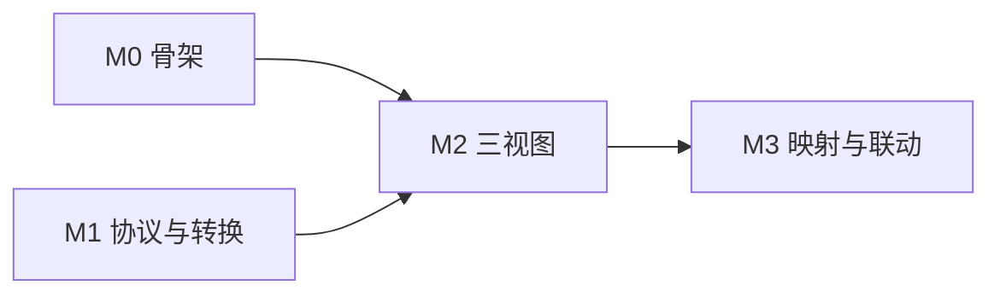

# 实施规划（按目标图倒推）

本文把目标界面拆成可施工的模块，排出里程碑与依赖，并划清子代理的文件边界。

⚠ **这份文档的后半段是历史记录，别照它判断"现在到哪儿了"。** M0–M3 是按它做的；
之后实际发生的事（真实目录、设备与任务格式、任务层分支、虚拟设备执行）记在 §3 的 M4 / M5 里。
表格里凡是写着「后置」的，先看 §3 末尾那张表——有几样已经做了，有几样被**删掉**了。

契约细节见 [`spec.md`](spec.md)，继承判定见 [`inherited.md`](inherited.md)。

## 1. 图面拆解

| 图面区域 | 模块 | 本阶段 |
| --- | --- | --- |
| 品牌条 + 固定分区（**无 tab**） | `studio/shell` | **做**（切换机制已拆除） |
| 任务 JSON 输入带 + 转译链指示 | `studio/shell` | **做**（本阶段唯一真实输入口） |
| 右栏上方：虚拟设备 | `studio/views/right` | **做**（常驻；如实说明设备层未接入） |
| 左栏 Blockly 画布 | `studio/views/blockly` + `packages/blockly-toolkit` | **做**（唯一可写） |
| 中栏 Workflow 画布 | `studio/views/flow` | **做** |
| 两栏之间的虚线 | 生成期映射表 + `studio/views/mapping` | **做** |
| 右栏 CODE 面板 | `studio/views/code-panel` | **做**（编译产物） |
| 右栏 EXECUTION TRACE + 步骤列表 | `studio/views/right` | **做**（虚拟设备执行时逐步刷） |
| 右栏 3D 机器人 | `apps/robot3d` + `views/right` | **做**（挂真 3D 执行器，见 M4） |
| 底部六段流水线 | — | **删了**（装饰性标签，见 M5） |
| 右下 RUN / STOP | — | **删了**（同上；没有执行器时它只是两个按钮） |
| 设计期差异审核 | `studio/views/design-diff` | 不做 |
| 执行回放 | `studio/views/runtime-replay` | 后置 |
| 设备选择 | `studio/shell/devices.ts` | **做**（设备 = 目录 + 任务格式 + 去处） |

## 2. 目录结构

```text
codecanvas/
  apps/
    studio/src/
      shell/                  # 品牌条、入口带（选设备 + 一句话 + 生成）、设备表、主题变量
      state/                  # 唯一真相：声明 + 选中项，写回走两道闸
      views/
        flow/                 # 中栏：按声明的图推结构，分支画成两条臂
        blockly/              # 左栏：唯一可写；实现树 / 计划层的只读视图
        code-panel/           # 右栏下：编译产物 + 计划层代码
        right/                # 右栏：虚拟设备（挂 3D）+ 代码 / 任务 JSON 两个 tab
        mapping/  shared/     # 跨栏连线；三个视图共用的计划结构判据
    robot3d/                  # RoboFrame 目录的 3D 执行器（独立应用，也导出挂载入口）
  packages/
    contracts/                # 任务协议、workflow 声明、技能计划、能力目录、诊断
    task-import/              # 任务 JSON → 声明（并按设备格式分派）
    capabilities/             # 能力目录：roboframe/ 由 tools/ 从上游生成
    blockly-toolkit/          # 积木定义（由校验器推导）、编译回声明、主题、映射表
    code-render/              # 声明 → 代码面板文本（规则由校验器推导）
  tools/import-roboframe/     # 从上游 RoboFrame 仓库生成能力目录
  docs/
```

（`test/` 那个空壳已经删了：建仓库时留的位，没人用过。）

三条布局纪律：

- **校验器是唯一规格来源。** 积木的字段、代码面板的渲染，全部从它推导，不许另写平行定义。
- **映射表的生成在 `blockly-toolkit`（生成期），`views/mapping` 只负责画线。** 视图算不出映射。
- **契约全部落在 `packages/contracts`**，稳定 ID 生成器也在这里——「id 谁生成、怎么生成」必须有唯一答案。

后置的包（`core` 执行器、`code-runner`、`device`、`simulation`、`ai-plan`、`server`）暂不建。

## 3. 里程碑

### 当前阶段



#### M0 — 骨架 ✅

已交付：五 tab、三栏、六段流水线（前三段可达）、RUN/STOP 占位、自有主题变量。
`pnpm --filter @codecanvas/studio dev` → http://localhost:5173。

**产出**：能跑起来的空壳。五个 tab 可切换（后三个是占位），三栏布局成形，自有主题变量
（不引用任何 n8n token），底部流水线的前三段可用、其余灰置，RUN/STOP 占位。

**验收**：
- `pnpm dev` 起来，浏览器见到三栏 + 五 tab + 流水线；切 tab 时右栏内容切换。
- 空壳里不出现任何 `@n8n/*` 依赖（lockfile 断言）。
- 流水线不显示任何未实现状态——灰置就是灰置，不假装。

**依赖**：无。

#### M1 — 协议与转换 ✅

已交付：`packages/contracts`（json / sha256 / diagnostic / stable-ids / task-protocol / workflow）与
`packages/task-import`（任务 JSON → 声明）。184 + 15 条测试全绿，其中 72 条语料与
`docs/reference/task_protocol.py` 逐条对照（含报错原文逐字比对）。

**产出**：`packages/contracts`（任务协议 schema + 声明 schema + 稳定 ID + 诊断）、
`packages/task-import`（任务 JSON → workflow 声明）。校验规则逐条照 `task_protocol.py` 搬，
包括七种动作的字段约束、传感器白名单、限值只能收紧不能放宽、总时长上限。

**验收**：
- 给一份任务 JSON，产出确定的声明；**除身份字段（`id` / `digest`）外，同一输入连续两次的规范化产物字节相同**。
- 非法任务逐条有诊断，且带定位：未知 action、重复 step id、超限的 linear、越界的 joint_id、
  `distance` 落在 (0, 2] 之外、限值被放宽、总时长超 `max_duration`。
- **限值放宽必须被拒**（`max_linear > 0.3` 这类）。
- 校验器与 `task_protocol.py` 的行为一致性有测试（同一批输入，两边结论相同）。

**依赖**：无。与 M0 并行。

#### M2 — 三视图

**产出**：`views/flow`（节点链 + 失败态占位）、`views/blockly`（zelos + 自有主题，
七种动作各一块）、`views/code-panel`（编译产物）、`packages/blockly-toolkit`（积木定义与编译回声明）、
`packages/code-render`。

**验收**：
- 同一份声明，三个视图同时正确渲染；**积木的形状由校验器推导**，不是手写的七块。
- **改积木上的参数 → 代码面板那个数字跟着变**（这条联动是核心）。
- 改出非法值（`distance = 0`、`joint_id = 9`）时给诊断并拒绝写回，不静默修正。
- 积木观感接近 Scratch，但仓库内不出现 Scratch 的名字、Logo、角色形象。
- 代码面板的渲染规则可追溯到校验器（有测试对照）。

**依赖**：M0、M1。

#### M3 — 映射与联动 ✅

已交付：三处同一序号徽标（积木那枚画在 SVG 里，跟着块走而不是浮层）、三向选中联动、
跨栏连线层 `views/mapping`（每个步骤两段带箭头的线，端点误差实测 0.000px，
栏宽重排 / 中栏滚动 / 积木缩放 / 拖动平移四种扰动下都不发散）。

**产出**：生成期映射表（`blockly-toolkit`）+ 渲染层（`views/mapping`）。

**验收**：
- **映射覆盖率 100%**：每个 step 都有对应的块与节点映射。
- 点积木 → 对应流程节点高亮；点节点 → 对应积木高亮。
- 无映射的块不画线。
- 映射条目指向的是**稳定 id**，不是数组下标——重排步骤后映射仍能对上。

**依赖**：M2。

#### M4 — 真实目录、设备与任务格式 ✅

计划里没写这一段，因为当时还没有上游。发生的事：

- **目录不再是手写的。** `tools/import-roboframe/import.mjs` 从上游 RoboFrame 仓库
  （`src/robot_config/config/robots/*.yaml` 与 `skill_library`）机械转出技能库，
  带 `provenance`（哪一次 commit）。手写的那份示意目录变成"一期设备"那一台。
- **任务格式成了设备属性。** 一期协议的七个动作只是一台设备的词汇表；RoboFrame 的设备听的是
  技能计划。两条路汇进同一份声明（`packages/task-import/src/format.ts`），
  第二道闸用「声明**出生时**那份格式」的尺子量。
- **设备表**：SO-101 真机 / 虚拟设备（同一份技能库，只换去处）/ 一期设备。
- **AI 生成进了界面**：一句话 → 真模型 → 任务 JSON，走 dev server 反代，key 不进浏览器。
  提示词按设备格式切，技能清单**由目录现生成**。

#### M5 — 任务层分支、等待与执行 ✅

- **分支**：`{step:'if', condition:{field:'last.success',…}, then, else?}`，深度 ≤ 8。
  声明里是 `task.branch` 节点 + **三格出边**（then / else / 同层后续）；
  流程画布按图推结构，两条臂是真的 DOM 嵌套。**没有汇合点**（写下来的限制，不是漏的）。
- **等待**：`{step:'wait', seconds}`（正数、≤ 600，可被取消打断）。
- **失败可容忍**：`onFailure:'continue'`——**没有它分支是死的**：技能一失败就停整条计划，
  `last.success` 在任何 `if` 处恒为 `true`，`== false` 那条臂永远不可达。
  缺省仍是 `'stop'`（放宽是安全决定，得由写计划的人做）。
- **执行侧**：`apps/robot3d` 的 3D 执行器真的按 `last.success` 选臂跑，失败即停（除非标了 continue）；
  它现在导出 `mountVirtualDevice()`，studio 右栏挂的就是它。
- **装饰性界面被删了**：五 tab、六段流水线、RUN/STOP、各栏的计数与英文标签——
  静止时它们只是标签（见 `f14bae52` / `8c6c26a`）。

### 还没做的

| 内容 | 为什么还没做 |
| --- | --- |
| `primitive` 步（直接叫原子动作、绕过技能包装） | 设计稿里有；现在遇到明确报错，不静默当技能 |
| `skipIf` 守卫 | 被 `onFailure` + `if` 覆盖了大部分场景；真需要再加 |
| 汇合点 | 要在数据模型里加一个明确的汇合节点，不是画布的事 |
| 真机（`DeviceSession` / OpenHarmony 插件） | 没有硬件；虚拟设备走的是同一个执行器 |
| 感知条件（夹爪里有没有东西） | 得先有会报这个量的技能 |
| 审批 / 回放 | 后置 |

## 4. 子代理分工

**第一批（可立即并行）**

1. `shell` — 只写 `apps/studio/src/shell/**` 与全局样式。产出 M0。
2. `protocol` — 只写 `packages/contracts/**` 与 `packages/task-import/**`。产出 M1。

**第二批（M0、M1 落地后）**

3. `blockly-view` — 只写 `packages/blockly-toolkit/**` 与 `apps/studio/src/views/blockly/**`
4. `flow-view` — 只写 `apps/studio/src/views/flow/**`
5. `code-panel` — 只写 `packages/code-render/**` 与 `apps/studio/src/views/code-panel/**`

**第三批**

6. `mapping` — 只写 `apps/studio/src/views/mapping/**`（映射表生成在 3 里）

规矩：不许某个代理自己发明任务协议或声明格式；校验器只有 `packages/contracts` 一个来源。
3、4、5 三个都要用校验器推导自己的定义，谁都不许手抄一份。

## 5. 需要提前定的东西（都已定，留着当决策记录）

**积木的可写程度。** 现在定的是「唯一可写」，那就意味着要处理非法中间态、要能编译回声明、
要有撤销重做。如果只想先看效果，可以先把积木做成只读，等联动做通了再开写——
但**别做成能拖却拖不动的形状**，那比不能拖更让人困惑。

**底部流水线当前显示什么。** 本阶段不执行，所以后三段不可达。建议只亮前三段
（导入 / 校验 / 编译），其余灰置。要么这样，要么整条先不画。

**代码面板的渲染风格。** 图里那份是 Python 味的伪代码，但一期协议的参数名是 `linear`/`angular`，
不是 `angle`；`stop_if_obstacle` 是原子动作，不是 if。**渲染规则从校验器推导，不要照图手写。**
具体长什么样（`move(linear=0.2, angular=0.0, duration=5.0)` 还是别的）需要一个样例定下来。

**`description` 字段的用途。** 任务里有它，但协议校验器不检查它。它是不是要显示在工作流画布上、
作为任务标题？定了才好排版。
