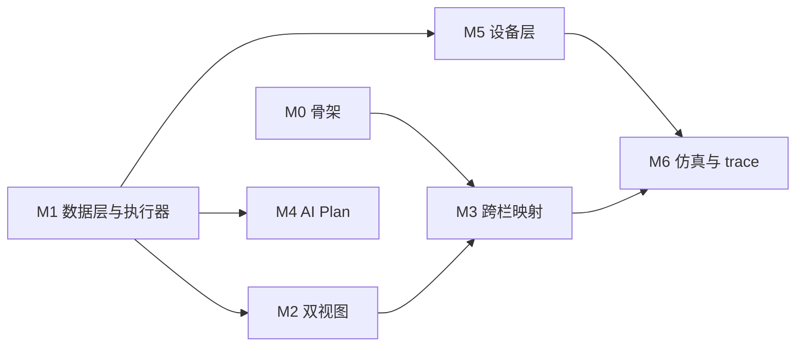

# 实施规划（按目标图倒推）

本文把目标界面拆成可施工的模块，排出里程碑与依赖，并划清子代理的文件边界。

## 1. 图面拆解

图上每一个区域都归属到一个模块，并标明它属于本仓库、还是插件、还是暂缓。

| 图面区域 | 模块 | 归属 | 备注 |
| --- | --- | --- | --- |
| 左图标栏 + 顶部五 tab | `studio/shell` | 本仓 | 模式切换，纯前端 |
| 顶部自然语言条 + GENERATE PLAN | `studio/ai-plan` | 本仓 | 需要 NL→workflow 生成器 |
| 转译链指示（AI Plan → Blockly → Workflow） | `studio/ai-plan` | 本仓 | 生成过程的阶段反馈 |
| 左栏 Blockly 画布 | `studio/blockly-view` | 本仓 | zelos renderer + 自有主题 |
| 中栏 Workflow 画布 | `studio/flow-view` | 本仓 | 自定义节点与连线渲染 |
| 两栏之间的虚线 | `studio/mapping` | 本仓 | 渲染 blockId ↔ nodeId 映射表 |
| 右栏 3D 机器人 | `studio/simulation` | **暂缓** | 见 §4 |
| 右栏 CODE 面板 | `studio/code-panel` | 本仓 | 生成的代码 + 行号 |
| 右栏 EXECUTION TRACE | `studio/trace-panel` | 本仓 | 与仿真同批 |
| 右栏步骤列表 | `studio/trace-panel` | 本仓 | 每步状态 |
| 底部六段流水线 | `studio/lifecycle` | 本仓 | 状态机驱动 |
| 右下 RUN / STOP | `studio/lifecycle` | 本仓 | 调执行器 |
| 设备选择 | `studio/device-panel` | 本仓（UI）+ 插件（协议） | 图上没有，新增 |
| 设备连接与能力目录 | `core/device` + `plugin-oh` | 本仓接口 + 插件实现 | OpenHarmony 走插件 |

## 2. 里程碑

### M0 — 骨架

**产出**：能跑起来的空壳。五个 tab 可切换，三栏布局成形，自有主题变量，底部流水线按状态高亮，RUN/STOP 按钮存在但只打日志。

**验收**：`pnpm dev` 起来，浏览器里看到三栏 + 五 tab + 六段流水线；切换 tab 时右栏内容切换；没有任何 n8n 的组件或 token 参与渲染。

**依赖**：无。这是地基。

### M1 — 数据层与执行器

**产出**：按 `spec.md` §1–3 实现的 workflow 解析、节点注册表、调度器、`CodeRunner`。附带两三个内置节点：手动触发、设置字段、`logic.blockly`。

**验收**：给一份手写的 workflow JSON，通过 CLI 跑出确定结果；错误传播、空输入、取消各有一条测试；`logic.blockly` 节点能在子进程沙箱里跑编译产物。

**依赖**：无。与 M0 并行，接口按 spec 定死。

### M2 — 双视图

**产出**：两个独立视图渲染同一份 workflow。`blockly-view`（zelos + 自有主题）和 `flow-view`（自定义节点卡片 + 连线）。

**验收**：同一份 JSON，两个视图都正确渲染；改动任一视图后数据一致；Blockly 观感接近 Scratch 但不含任何 Scratch 品牌资产。

**依赖**：M0（外壳）、M1（数据）。

### M3 — 跨栏映射

**产出**：`blockId ↔ nodeId` 映射表的渲染层。两栏之间画虚线；点任一端的元素，另一端高亮。

**验收**：点积木块 → 对应流程节点高亮并滚动到可见；反向亦然；无映射的块不画线。

**依赖**：M2。

### M4 — AI Plan

**产出**：自然语言 → workflow 的生成器。固定模型、固定 prompt、固定 JSON 契约，输出走 M1 的 schema 校验。生成过程按阶段反馈（对应图上的转译链）。

**验收**：输入一句中文指令，得到一个能通过校验、能执行的 workflow；失败时显示摘要并允许重试，不做恢复框架。

**依赖**：M1。

### M5 — 设备层

**产出**：`DeviceSession` 接口 + 设备面板 + 一个 OpenHarmony 插件骨架。设备上报的能力目录直接决定积木里出现哪些设备积木。

**验收**：面板里能发现/手动填一台设备并连上；能力列表出现在积木工具箱；调用一个能力能拿到返回。

**依赖**：M1。

### M6 — 仿真与 trace

**产出**：仿真执行模式（不碰真设备），配右栏的步骤列表与 CODE 高亮。

**验收**：点 RUN 后步骤逐步亮起，失败的那一步标红并给出原因；CODE 面板高亮当前执行到的行。

**依赖**：M1、M3。

## 3. 子代理分工

峰值并行三个。文件边界按目录切，互不重叠。

**第一批（可立即并行）**

1. `shell` — 只写 `apps/studio/src/shell/**` 与 `apps/studio/src/styles/**`。产出 M0。
2. `core` — 只写 `packages/core/**`。产出 M1。
3. `device` — 只写 `packages/device/**` 与 `plugins/openharmony/**`。产出 M5 的接口部分。

**第二批（M0、M1 落地后）**

4. `blockly-view` — 只写 `apps/studio/src/views/blockly/**`。
5. `flow-view` — 只写 `apps/studio/src/views/flow/**`。

**第三批**

6. `mapping` — 只写 `apps/studio/src/views/mapping/**`（M3）。
7. `ai-plan` — 只写 `packages/ai-plan/**` 与 `apps/studio/src/views/ai-plan/**`（M4）。
8. `simulation` — 只写 `apps/studio/src/views/simulation/**` 与 `packages/simulation/**`（M6）。

规矩：任何跨边界的接口改动，先改 `docs/spec.md` 再改代码。子代理不许自己发明 workflow 格式。

## 4. 需要提前定的东西

**3D 机器人。** 图里右栏那台是整张图最贵也最容易变成假动画的部分——真做需要模型资源加运动学，那是另一个项目的量级；假做就是一段循环播放的动画，而这个项目整套基调是可验证，假动画会毒掉它。我的建议是先做**状态仿真**（逻辑跑通、步骤亮起、设备状态变化），3D 视图单独立项，等有真实模型和设备反馈再说。

**自然语言生成的质量。** 生成器能不能稳定产出合 schema 的 workflow，取决于 prompt 和契约的严格程度。建议 M4 开工前先用手工构造的十个样例句跑一轮，看命中率再决定投入。

**设备协议细节。** OpenHarmony 设备怎么被发现、握手长什么样、能力目录怎么表达——这些不定，M5 只能做接口和 mock。

**流水线六段的状态机。** Received / Validated / Simulation / Approved / Running / Succeeded 六段之间的合法迁移要定死，否则 UI 会到处 if。
