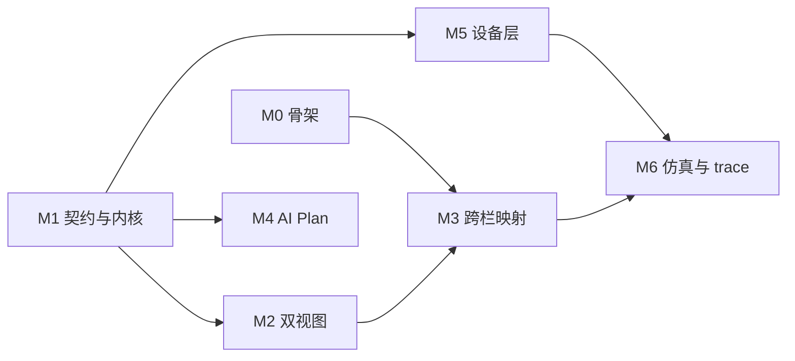

# 实施规划（按目标图倒推）

本文把目标界面拆成可施工的模块，排出里程碑与依赖，并划清子代理的文件边界。
契约细节见 [`spec.md`](spec.md)，继承判定见 [`inherited.md`](inherited.md)。

## 1. 图面拆解

| 图面区域 | 模块 | 归属 |
| --- | --- | --- |
| 左图标栏 + 顶部五 tab | `studio/shell` | 本仓 |
| 顶部自然语言条 + GENERATE PLAN + 转译链指示 | `studio/views/ai-plan` + `packages/ai-plan` | 本仓 |
| 左栏 Blockly 画布 | `studio/views/blockly` + `packages/blockly-toolkit` | 本仓 |
| 中栏 Workflow 画布 | `studio/views/flow` | 本仓 |
| 两栏之间的虚线 | `packages/blockly-toolkit`（生成期产出映射表）+ `studio/views/mapping`（只渲染） | 本仓 |
| 右栏 CODE 面板 | `studio/views/code-panel` | 本仓 |
| 右栏 EXECUTION TRACE + 步骤列表 | `studio/views/trace-panel` + `packages/simulation` | 本仓 |
| 右栏 3D 机器人 | `studio/views/simulation` | **暂缓**（见 §5） |
| 底部六段流水线 | `studio/shell` + `packages/core`（状态机） | 本仓 |
| 右下 RUN / STOP | `studio/shell` → `packages/core` | 本仓 |
| 设计期差异审核 | `studio/views/design-diff` | 本仓（图上没有，见 §5） |
| 执行回放 | `studio/views/runtime-replay` | 本仓（图上没有，见 §5） |
| 设备选择 | `studio/views/device-panel` | 本仓（图上没有，见 §5） |
| 设备协议实现 | `plugins/openharmony` | 插件 |

## 2. 目录结构

```text
codecanvas/
  apps/studio/src/
    shell/                    # 五 tab、三栏、底部流水线、RUN/STOP、主题变量
    views/
      ai-plan/  blockly/  flow/  code-panel/  trace-panel/
      mapping/  design-diff/  runtime-replay/  simulation/  device-panel/
  packages/
    contracts/                # 所有版本化契约 + zod schema + 稳定 ID 生成器
    core/                     # workflow 解析、节点注册表、调度器、生命周期状态机、执行记录
    code-runner/              # CodeRunner（子进程沙箱）
    blockly-toolkit/          # 积木语法、编译器、主题、IR→工作区生成器、映射表生成器
    device/                   # DeviceSession、CapabilityCatalog、normalizeCatalog
    validation/               # 分层校验器（结构 / 语义 / 领域 / 运行预检）
    ai-plan/                  # 自然语言 → 语义草稿（不产图）
    simulation/               # 状态仿真
  plugins/openharmony/        # 设备协议实现
  server/                     # 单进程服务：静态托管 + REST/WS + 执行器宿主
  test/{fixtures,e2e}/        # 夹具（版本化）与端到端
  docs/
```

两条布局纪律：

- **`mapping` 的生成器在 `blockly-toolkit`（生成期），`views/mapping` 只负责画线。**
  映射表是生成产物，视图算不出来。
- **契约全部落在 `packages/contracts`**，不允许散落在文档或各处 `types.ts` 里。
  稳定 ID 生成器也在这里——「id 谁来生成、怎么生成」必须有唯一答案。

## 3. 里程碑



### M0 — 骨架

**产出**：能跑起来的空壳。五个 tab 可切换，三栏布局成形，自有主题变量（不引用任何 n8n token），
底部流水线按状态高亮，RUN/STOP 存在但只打日志。**同时把生命周期状态机定死在 `packages/core` 里**：
六格各自对应哪个状态、哪些迁移合法、失败/取消/未确认落在哪里。

**验收**：
- `pnpm dev` 起来，浏览器见到三栏 + 五 tab + 六格流水线；切 tab 时右栏内容切换。
- 状态机有单元测试：每个合法迁移一条，非法迁移被拒一条，`unknown` 可达且**不可被当作成功**一条。
- 空壳里不出现任何 `@n8n/*` 依赖（`pnpm why` 或 lockfile 断言）。

**依赖**：无。**但六格终态必须先在 spec §6 拍板**——这是 M0 唯一的拦路石。

### M1 — 契约与内核

**产出**：`packages/contracts`（契约 + zod + 稳定 ID）、`packages/core`（解析、调度、节点注册表、
执行记录）、`packages/code-runner`（子进程沙箱）。附带三个内置节点：手动触发、设置字段、`logic.blockly`。

**验收**：
- 给一份手写 workflow JSON，跑出确定结果。
- **同一份输入连续跑两次，规范化产物字节级相同**（继承前作的确定性验收门）。
- 错误传播、空输入、取消、超时各有一条测试。
- `logic.blockly` 能在子进程沙箱里跑编译产物，宿主进程不执行用户代码。
- 契约的 zod 在**投入解析前先做有界预检**（深度 >64、节点 ≥10000、有环 → 直接拒）。

**依赖**：无。与 M0 并行，接口按 spec 定死。

### M2 — 双视图

**产出**：两个独立视图渲染同一份声明。`views/blockly`（zelos + 自有主题）与 `views/flow`
（自定义节点卡片 + 连线）。

**验收**：
- 同一份 JSON，两个视图都正确渲染；改动任一视图后数据一致。
- Blockly 观感接近 Scratch，但**仓库内不出现 Scratch 的名字、Logo、角色形象**。
- 积木形状与设备能力报告的对应关系有测试（能力变了，积木跟着变）。

**依赖**：M0、M1。

### M3 — 跨栏映射

**产出**：生成期的映射表（`blockly-toolkit`）+ 渲染层（`views/mapping`）。

**验收**（前作写过可测行为，直接抄）：
- **映射覆盖率 100%**：每条可执行步骤都有对应的块与节点映射；覆盖率不足时 RUN 按钮锁定。
- 点积木 → 对应流程节点高亮并滚动到可见；反向亦然。
- 点 AI 决策条目 → 同时高亮相关节点与积木。
- 无映射的块不画线；删除节点或积木时映射记录同步删除。

**依赖**：M2。

### M4 — AI Plan

**产出**：自然语言 → **语义草稿**（不产出任何一张图的 JSON），再由确定性生成器产出两张画布。
输出契约照前作 slice-2 的形态：`{ schemaVersion, designId, revisionId, name, logicNodes[], devicePlan{} }`。
生成过程按阶段反馈（对应图上的转译链）。

**验收**：
- **30 条样例指令全部产出结构有效、能通过校验、能执行的 workflow**（数量照前作的验收门）。
- 相同输入 + 相同生成器版本 → 相同规范化产物。
- 生成失败时显示摘要并允许重试，不做恢复框架。
- **至少一条宿主自带的期望值参与校验**——不能只跑模型自己声明的测试向量（前作吃过「自洽而非正确」的亏）。

**依赖**：M1。

### M5 — 设备层

**产出**：`packages/device`（会话、能力目录、`normalizeCatalog`）+ `views/device-panel` +
`plugins/openharmony` 骨架。

**验收**：
- 面板里能发现或手动填一台设备并连上；能力列表出现在积木工具箱。
- 调用一个能力能拿到返回；`invoke` 带目录摘要与追溯上下文。
- **目录摘要陈旧时停执行**，给重新生成入口（不是静默继续）。
- 取消后未获确认 → 终态 `unknown`，**界面不得表述为「已停止」**。

**依赖**：M1。

### M6 — 仿真与 trace

**产出**：状态仿真模式（不碰真设备）+ `views/trace-panel` + `views/runtime-replay`。

**验收**（照前作的清单）：
- **七问全过**：能生成两张可加载的图？慢任务在运行期间可查询？超时触发取消？失败结果仍有完整步骤？
  保存重载 / 导入导出后映射稳定？浏览器能逐块高亮？目录变化得到清晰处理？
- **三个场景原样移植**：保存重载、导出导入、AI 修订只影响目标块。
- **四种终态（completed / failed / cancelled / unknown）都有界面表现和证据**。
- **证据带等级标签**：`UNIT / CONTRACT / BUILD_LOAD / JSDOM / LOCAL_HTTP / DEVICE`，
  **禁止把前三种标成 `DEVICE`**；「执行」要拆成数据链路与设备链路两个标签，别混。

**依赖**：M1、M3。

## 4. 子代理分工

峰值并行三个。文件边界按目录切死，跨边界的接口改动先改 `spec.md`。

**第一批（可立即并行）**

1. `shell` — 只写 `apps/studio/src/shell/**` 与全局样式。产出 M0。
2. `core` — 只写 `packages/contracts/**`、`packages/core/**`、`packages/code-runner/**`。产出 M1。
3. `device` — 只写 `packages/device/**`、`plugins/openharmony/**`。产出 M5 的接口部分。

**第二批（M0、M1 落地后）**

4. `blockly-view` — 只写 `packages/blockly-toolkit/**` 与 `apps/studio/src/views/blockly/**`。
5. `flow-view` — 只写 `apps/studio/src/views/flow/**`。

**第三批**

6. `mapping` — 只写 `apps/studio/src/views/mapping/**`（映射表的生成在 4 里）
7. `ai-plan` — 只写 `packages/ai-plan/**` 与 `apps/studio/src/views/ai-plan/**`
8. `simulation` — 只写 `packages/simulation/**`、`views/trace-panel`、`views/runtime-replay`、`views/simulation`

规矩：不许某个代理自己发明 workflow 格式；契约只有 `packages/contracts` 一个来源。

## 5. 需要提前定的东西

**六段流水线的终态**（spec §6）。只有 `Succeeded` 一个出口是有问题的——失败、取消、未确认也是正式结果。
这一条不定，M0 的状态机写不出来。

**3D 机器人。** 图里右栏那台是整张图最贵也最容易变成假动画的部分。真做需要模型资源加运动学，
那是另一个项目的量级；假做就是循环播放的动画，而这个项目整套基调是可验证，假动画会毒掉它。
**建议先做状态仿真**（逻辑跑通、步骤亮起、设备状态变化），3D 单独立项。前作给过同样的答案。

**图上有、但规划里补出来的三块**：设计期差异审核（AI 改动以 diff 呈现，确认后才写入）、
执行回放、设备选择面板。前两块来自前作的设计稿，第三块是你新加的。

**OpenHarmony 协议细节。** 前作从头到尾没定（版本、发行形态、发现协议、握手都在待确认输入里）。
这些不定，M5 只能做接口和 mock——**而 mock 必须与真机共享同一套契约**，否则仿真跑通不代表设备能跑。

**自然语言生成的质量。** 建议 M4 开工前先用手工构造的十条样例跑一轮探底，再决定投入。

**「执行」这个词要拆细。** 前作有一处标签不自洽：文件名写着 real-execution 的截图，内容其实是
数据链路跑通，设备动作侧未提。新项目从第一天就把「数据链路执行」和「设备链路执行」分开标注。
