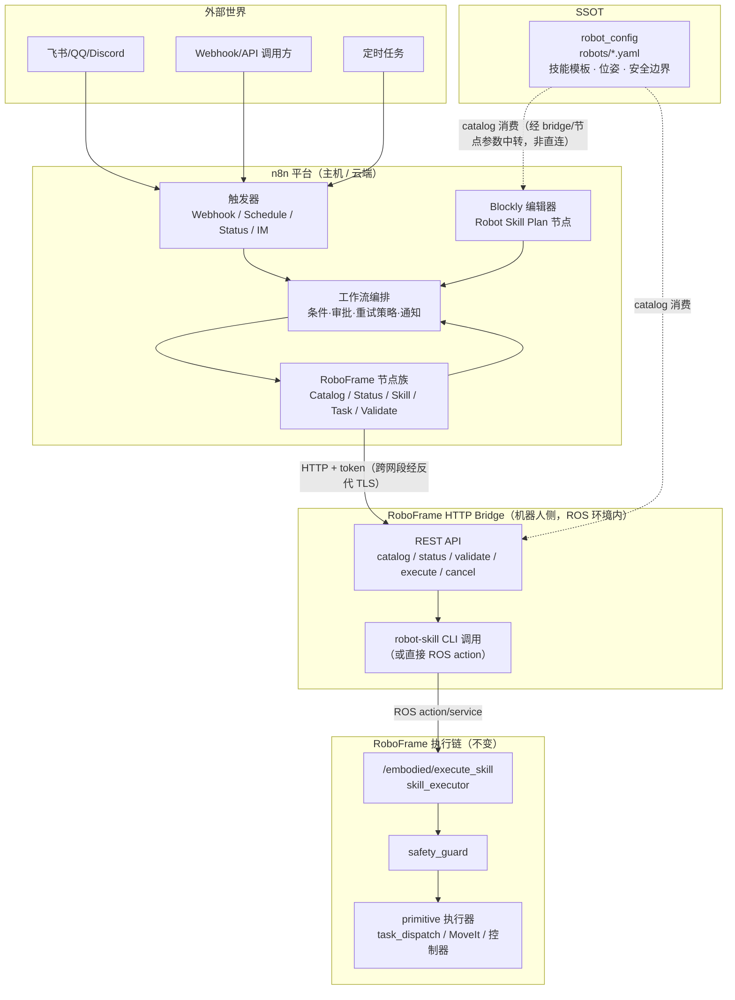
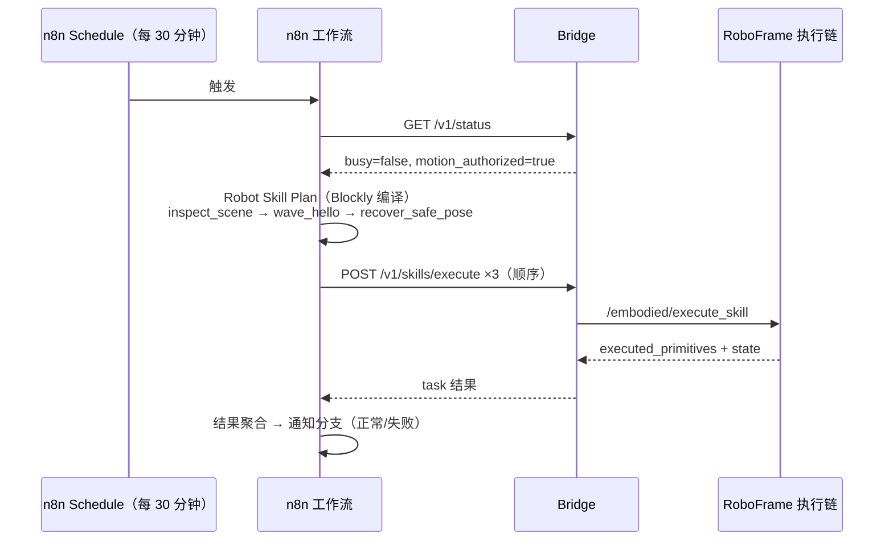

# RoboFrame × n8n × Blockly 集成设计稿

## 0. 文档信息

| 字段 | 内容 |
| --- | --- |
| 分支 | `feat/roboframe-integration` |
| 本地基线 | n8n `2.35.4` + Blockly `12.3.1`，`blockly-data-transform` v1 已落地（见 `.agents/specs/blockly-data-transform-v1.md`） |
| 上游仓库 | [gitcode.com/openeuler/IB_Robot](https://gitcode.com/openeuler/IB_Robot)，分支 `RoboFrame`，分析基线 commit `8f364c3` |
| 状态 | 设计稿 v0.2，已完成审核修订（15 条审核意见已落入正文，§12 标注已决事项） |
| 审核要点 | §3 分工矩阵（n8n vs Blockly）、§5 桥接层、§7 Blockly 语法、§10 分期与验收 |

---

## 1. 背景与目标

### 1.1 RoboFrame 是什么

RoboFrame（IB-Robot，openEuler 出品）是融合 **Hugging Face LeRobot 机器学习生态** 与 **ROS 2 机器人中间件** 的智能具身机器人开发框架，覆盖"数据采集 → 策略训练 → 推理部署 → 实机/仿真控制"全链路，支持 Ubuntu 22.04 / openEuler Embedded 24.03 / OpenHarmony 5.1 三类平台。

### 1.2 当前痛点（集成前）

| 领域 | 现状 | 问题 |
| --- | --- | --- |
| 技能编排 | 技能 = `robot_config` SSOT YAML 中的模板（primitive 序列）；规则直达靠 YAML `rule_entry` 别名 + 规则解析器 | 无可视化手段；新增/调整技能组合需要改 YAML 并重启节点 |
| 任务编排 | 自然语言 → `task_planner`/`vlm_task_planner` → 技能序列 | 只服务"单条指令 → 单次执行"；无法表达跨任务、条件、审批、定时、多机器人协作 |
| 外部系统对接 | OpenClaw Gateway（Node.js HTTP，端口 18789）对接飞书/QQ/Discord | 只覆盖社交渠道；无通用 API 化、无审计、无工作流化 |
| 数据/训练闭环 | `dataset_tools`、`inference_service`、模型转换脚本均为命令行工具 | 无编排、无状态跟踪、无通知 |
| 可观测性 | `RobotStatus`/`TaskStatus` 仅存在于 ROS topic | 无历史记录、无告警、无可视化 |

### 1.3 目标

把 n8n 的**工作流编排能力**与 Blockly 的**受限可视化编程能力**引入 RoboFrame，形成三层结构：

```text
外部编排层（n8n）  —— 任务之间、与外部世界的编排：触发器、审批、集成、数据闭环、监控
内部逻辑层（Blockly）—— 单次任务内部"怎么走"：技能/primitive 序列、条件、参数
执行安全层（RoboFrame，不变）—— safety_guard、Gateway 授权、SSOT robot_config
```

### 1.4 非目标（红线）

- 不改 ROS 2 控制链路（ros2_control / MoveIt / hardware 保持原样）。
- 不绕过 `safety_guard` 与 Gateway 授权；`authorize_motion` 永远只能由操作员在 launch 时打开。
- 不替代 `robot_config` 的 SSOT 地位；n8n/Blockly 只**消费** catalog，不复制第二份配置真相。
- 不做"通用 Blockly 插件 SDK"；沿用 v1 的"每个语法一个共享编译器包"模式。
- 不把 n8n 全栈塞进 OpenHarmony 板端（见 §6.5 运行位置决策）。

---

## 2. RoboFrame 分析结论

### 2.1 分层与关键组件

| 层 | 组件 | 状态 | 与集成的关系 |
| --- | --- | --- | --- |
| 应用层 | `embodied_agent`（任务入口/规划/执行编排）、`vlm_task_planner`（VLM 规划） | 已实现 | **旁路增强/共存**：n8n+Blockly 是与 `/voice_command` 链路并存的旁路入口，不替代、不修改原链路；VLM 规划保留 |
| 规划分发层 | `action_dispatch`（ACT/VLA 流式动作）、`task_dispatch`（任务级序列）、`robot_teleop` | 已实现 | 执行侧，n8n/Blockly 不直接调用 |
| 技能执行层 | `skill_library`（技能→primitive）、`robot_skill_cli`（`robot-skill` CLI）、Gateway policy | 已实现 | **主要对接边界**（见 §2.3） |
| 推理研发层 | `tensormsg`（ROS↔张量契约转换）、`inference_service`（多后端推理）、`dataset_tools`（录制/转换） | 已实现 | 数据/ML 闭环由 n8n 编排，内部不动 |
| 感知层 | `perception_service`、`semantic_mapping`、`voice_asr_service` | 已实现 | 可作为 n8n 工作流的输入来源 |
| 控制/执行层 | `robot_config`（SSOT）、`robot_description`、`so101_hardware`、仿真/实机 | 已实现 | 完全不动 |
| 接口标准 | `ibrobot_msgs`（action/srv/msg） | 已实现 | 桥接层映射目标 |

### 2.2 关键接口（集成点）

**ROS 2 接口（ibrobot_msgs）**

- `SkillCommand.action`：`task_id, skill_name, target_name, place_name, motion_direction, motion_distance, timeout_sec` → `success/error_code/message/executed_primitives/state` —— **技能执行的唯一 sanctioned 入口**。
- `PrimitiveCommand.action`：primitive 级入口（同样经过 safety_guard）。
- `ValidateSkill.srv` / `ValidatePrimitive.srv` / `GetSkillGatewayStatus.srv`：执行前校验与状态查询。
- `TaskStatus.msg`：`task_id, state(planned/planning/rejected/executing/completed/failed), success, current_skill, completed_skills, error_code, message, recoverable, replan_requested`。
- `RobotStatus.msg`：`is_moving, is_healthy, executor_type, progress, error, timing, queue_size`。
- `TaskStep.msg`：`MOVE_TO_POSE=0 / GRIPPER=1 / WAIT=2`（task_dispatch 的步骤格式，Blockly 计划可在 v2 映射到它）。

**Gateway 状态（gateway_policy）**

- `motion_authorized`（运动授权，人工开启）、`active_control_mode` / `required_control_mode`（控制模式匹配）、`busy` / `active_task_id`（单飞行租约）、`readiness`（就绪原因）、`ledger`（请求账本）。

**`robot-skill` CLI（agent 边界，Hermes/Agent 调用链）**

```text
list-skills | describe SKILL | list-poses | status | validate SKILL | execute SKILL --task-id ID | cancel --task-id ID
```

- catalog-only 命令不初始化 `rclpy`；runtime 命令只访问 Gateway status / `ValidateSkill` / `SkillCommand` / `CancelGoal`。
- 调用顺序强制：`status → list-skills → describe → validate → 用户明确确认 → execute`；失败/超时**不得自动重试**。

**OpenClaw Gateway**

- Node.js HTTP 服务（板端 127.0.0.1:18789），把飞书/QQ/Discord 消息路由为机器人动作；对外开放必须 token 鉴权。

### 2.3 SSOT 技能模板 schema（`robot_config/config/robots/<robot>.yaml`）

```yaml
skill_templates:
  <skill_name>:
    description:            # Agent/规则解析器选技能的语义契约（强制）
      summary, category, when_to_use, do_not_use, aliases_zh, aliases_en,
      motion_scope, anchor_pose, intensity, duration_sec_estimate,
      requires_motion_params, rule_entry
    capability:             # Gateway catalog 暴露的机器可读契约
      schema_version, summary, domain, moves_robot, required_control_mode,
      parameters: <JSON Schema>   # 参数 schema，执行前校验
      recovery_policy: never_retry
    primitive_sequence:     # 技能展开为有限 primitive（10 种，含轨迹模板展开）
      - primitive_name: move_to_named_pose
        pose_name: observe_table
      - primitive_name: move_through_joint_positions
        trajectory_template: {type: wave_dance_v1, ...}
```

配套资产：`named_poses`（home/observe_table/zero…，位置+姿态）、`safety.workspace`（笛卡尔安全边界）、`planning_policy.allowed_skills`（VLM 输出边界）、`execution.relative_motion_*`（方向映射）、`embodied.timeouts`。

### 2.4 可复用资产结论

- **catalog（list-skills/describe/list-poses）** 可直接驱动 n8n 节点下拉与 Blockly 工具箱 —— 技能增删自动传播。
- **capability.parameters（JSON Schema）** 可直接驱动参数表单渲染与服务端校验。
- **config_digest** 可作为 catalog 缓存失效的依据。
- **rule_entry + aliases_zh/en** 是"文本 → 技能序列"的规则源，v2 可在 Blockly 中可视化编辑。
- **TaskStep 三态（MOVE_TO_POSE/GRIPPER/WAIT）** 是低级任务计划的天然积木形态。

---

## 3. 分工总则（核心：哪些给 n8n，哪些给 Blockly）

### 3.1 划分原则

1. **Blockly 管"一次任务内部怎么走"**：单次任务的技能/primitive 序列、条件分支、参数取值 —— 编译为**结构化计划（JSON）**，不是任意代码。因为 RoboFrame 的核心安全哲学就是"有限技能集、禁止任意动作"，与 Blockly 的受限语法天然同构。
2. **n8n 管"任务与外部世界怎么编排"**：触发器、多任务顺序/条件/审批、跨系统集成（IM/数据库/告警）、ML 数据闭环、监控与审计。因为 n8n 的强项是事件驱动的外部编排与集成生态。
3. **两者都不得绕过 sanctioned 边界**：所有动作最终只走 `/embodied/execute_skill` → `skill_executor` → `safety_guard` → primitive 执行器；Blockly 产出的计划只是"请求"，执行权在 n8n/桥接层手中。
4. **SSOT 不变**：技能目录来自 catalog，双方（n8n 节点、Blockly 工具箱）都是 catalog 的**消费者**；`config_digest` 驱动缓存刷新。
5. **不泛化**：Blockly 侧复用 v1 的编辑器组件与 payload 保存协议，但语法白名单、编译器、限制独立成包，不做通用 SDK。

### 3.2 分工矩阵

| RoboFrame 能力域 | 归属 | 理由 |
| --- | --- | --- |
| 任务级外部编排：定时/Webhook/IM 触发、多任务串联、条件路由、人工审批、错误策略 | **n8n** | n8n 原生触发器 + Wait 审批 + 条件节点，开箱即用 |
| 技能/primitive 序列组合（单次任务内部逻辑） | **Blockly** | 受限语法与"有限技能集"哲学同构；可视化、可编译、可审计 |
| 技能参数绑定（方向/距离/目标/位姿/超时） | **Blockly**（块内字段） | 参数 schema 驱动块字段，编译期校验 |
| 计划执行与轮询、取消、超时 | **n8n**（Robot Task 节点） | 执行是"外部编排"动作；n8n 可记录执行历史、对接通知 |
| 状态监控与告警（RobotStatus/TaskStatus） | **n8n** | 落库、告警、看板是 n8n 生态强项 |
| 数据闭环：录制触发→bag→LeRobot 转换→训练→部署→评估 | **n8n** | 跨工具链的编排 + 状态跟踪 + 通知 |
| VLM 规划（自然语言→技能序列） | **RoboFrame 保留**（`vlm_task_planner`），n8n 可选接入其 API | 规划器属于机器人领域逻辑；n8n 可作为其调用方 |
| 规则直达（rule_entry 文本→技能） | **v2 Blockly**（规则表可视化编辑→生成规则配置） | 本质是"受限映射表"，适合积木化；v1 不碰 |
| 技能执行器 / safety_guard / Gateway 授权 | **RoboFrame 保留** | 安全红线，任何人不得绕过 |
| tensormsg / inference_service / dataset_tools 内部 | **RoboFrame 保留** | 只通过 sanctioned 接口消费 |
| ros2_control / MoveIt / 硬件驱动 | **RoboFrame 保留** | 完全不动 |
| 配置 SSOT（robot_config YAML） | **RoboFrame 保留** | 双方只读消费 |

### 3.3 一句话总结

> **Blockly 把"一次任务"变成可审核的结构化计划；n8n 把"计划"变成安全、可追踪、可集成外部世界的执行；RoboFrame 的 SSOT 与安全边界原封不动地约束两端。**

---

## 4. 总体架构



---

## 5. 桥接层：RoboFrame HTTP Bridge

### 5.1 为什么需要

- n8n 的 HTTP Request / 凭据体系是原生一等公民；远程（主机/云端 ↔ 机器人）编排必须走 HTTP。
- `robot-skill` CLI 是现成的 sanctioned 边界，但只适合本机/SSH 调用，且没有给外部系统用的稳定 REST 面。
- OpenClaw Gateway 只覆盖社交渠道，不覆盖通用 catalog/execute/cancel。

### 5.2 形态与部署

- 轻量 Python（FastAPI）服务，**运行在机器人侧 ROS 环境内**（Ubuntu 主机或端侧），复用 `robot_config` 解析、Gateway 授权模型与 `robot-skill` CLI（runtime 命令经 `rclpy`）。
- **近无状态**：无数据库、只转发不裁决；但需在内存保留最近 N 条任务终态以支撑 `GET /v1/tasks/{task_id}`（CLI 进程退出后终态即失；bridge 重启导致的历史丢失可接受，长期记录以 n8n 执行记录为准）。
- 鉴权与传输：Bearer token（部署时生成，n8n 凭据保存）；**最低要求 = 局域网 + token，跨网段访问必须经反向代理 TLS**（bridge 本身不终结 TLS）。**不提供** `authorize_motion` 开关（运动授权仍只能 launch 时人工打开）。
- 本分支内实现于 `services/roboframe-bridge/`（独立 Python 服务目录，含部署打包说明），契约与 CLI 对齐；后续可作为对 IB_Robot 上游的可选贡献。

### 5.3 API 契约（v1）

| 方法/路径 | 说明 | 映射 |
| --- | --- | --- |
| `GET /v1/catalog` | 技能列表 + `config_digest` + 机器人名 | `robot-skill list-skills` |
| `GET /v1/catalog/skills/{name}` | 技能详情（capability schema、参数、recovery、timeout） | `robot-skill describe` |
| `GET /v1/catalog/poses` | 命名位姿 | `robot-skill list-poses` |
| `GET /v1/status` | Gateway：`motion_authorized / control_mode / busy / readiness / ledger` | `robot-skill status` |
| `POST /v1/skills/validate` | 本地 schema + Gateway 安全校验，不执行 | `robot-skill validate` |
| `POST /v1/skills/execute` | 提交 `task_id + skill + params`，异步执行；返回受理 + `task_id` | `robot-skill execute` |
| `GET /v1/tasks/{task_id}` | 任务状态（含 `executed_primitives`） | ROS `TaskStatus` |
| `POST /v1/tasks/{task_id}/cancel` | 取消（同一 deterministic goal UUID） | `robot-skill cancel` |
| `GET /v1/health` | 存活与版本 | — |

执行语义：单飞行租约（Gateway 已有 `busy/active_task_id`）；失败/超时**不自动重试**，是否重试由 n8n 按 `recovery_policy` 决定。

### 5.4 备选方案（降级）

- 本机模式：n8n 节点直接以子进程调用 `robot-skill` CLI（需 ROS 环境变量）。仅用于开发机联调，不作为产品形态。

---

## 6. n8n 模块设计

### 6.1 新节点族：`custom-nodes/n8n-nodes-roboframe`

| 节点 | 职责 | 关键实现点 |
| --- | --- | --- |
| **Robot Catalog** | 拉取并缓存技能/位姿目录 | `loadOptionsMethod` 经 bridge 拉取；`config_digest` 缓存失效；输出 catalog JSON 供下游使用 |
| **Robot Status** | 查询 Gateway/机器人状态 | 输出 `motion_authorized / control_mode / busy / readiness / is_moving / is_healthy` 等 |
| **Robot Skill** | 执行单个技能 | 技能下拉（catalog 驱动）+ 按 `capability.parameters` JSON Schema 渲染参数（公共字段 target/place/direction/distance/timeout 固定暴露，其余走 `parameters` JSON 字段，执行前 schema 校验）；`task_id` 生成；轮询至 terminal；输出 `state / success / executed_primitives` |
| **Robot Task** | 执行 Blockly 产出的计划（§7） | 输入 `RobotTaskPlan` JSON 项；顺序执行各步骤；尊重 `recovery_policy`；超时与取消；输出每步结果 + 汇总 |
| **Robot Validate** | 执行前校验（dry-run） | 本地 schema 校验 + Gateway 安全校验 |
| **Robot Status Trigger** | 状态边沿触发 | 轮询 bridge `/v1/status`，`busy`/`motion_authorized` 变化时触发 |
| **Robot Voice Trigger**（v2） | 语音/文本命令触发 | bridge 订阅 `/voice_command` 经 SSE/WebSocket 转发 |

触发策略：v1 以 n8n 原生 **Webhook / Schedule** 触发器为主（零新增代码），`Robot Status Trigger` 为辅。

### 6.2 凭据

- 新凭据类型 **RoboFrame Bridge API**：`baseUrl`、`token`、超时。（`ROS_DOMAIN_ID` 属于 bridge 侧部署配置，不进 n8n 凭据。）
- 按 AGENTS.md/安全规范：token 只存 n8n 凭据库，绝不落日志。

### 6.3 安全与执行策略（继承 RoboFrame 语义）

- **人工确认前置**：执行技能前可用 n8n Wait/审批节点做"用户明确确认"（对应 robot-skill 调用顺序第 5 步）。
- **不自动重试**：`recovery_policy: never_retry` 的技能，n8n 节点默认关闭自动重试；仅 `recoverable=true` 的失败才允许用户手动配置重试。
- **超时**：默认取技能 `timeout_policy`；n8n 侧超时 ≥ 机器人侧超时。
- **取消**：统一走 `POST /v1/tasks/{id}/cancel`，取消后状态未知时不得表述为"已停止"。
- **authorize_motion**：n8n 任何节点都不提供开启入口；状态为未授权时节点直接报"运动未授权"。
- **错误分类**（映射本仓库规范）：参数非法/未授权/技能不存在/计划过期 → `NodeOperationError`（用户错误语义，不重试）；bridge 不可达/网络超时 → 操作性错误（可走 n8n 错误分支）。日志与执行记录不输出 payload/workspace/凭据。

### 6.4 与 OpenClaw / IM 集成

- IM 消息（飞书/QQ/Discord）经 OpenClaw Gateway 或 n8n 原生 Webhook 进入工作流，作为机器人任务的触发器或通知出口。
- n8n 作为 OpenClaw 的**旁路控制面**：社交消息 → n8n 工作流 →（审批/审计）→ bridge → 机器人，而非消息直接驱动机器人。

### 6.5 运行位置决策

| 组件 | 位置 | 理由 |
| --- | --- | --- |
| n8n 全栈 | 主机 / 云端（局域网可达机器人即可） | n8n 依赖较重（PostgreSQL/Redis 可选）；OpenHarmony 板端仅 Node.js 22，不承载全栈 |
| RoboFrame Bridge | 机器人侧（主机或板端，ROS 环境内） | 必须贴近 `rclpy` / `robot-skill` / Gateway |
| Blockly 编辑器 | 随 n8n 前端 | 无需 ROS 环境 |

### 6.6 ML 数据闭环（n8n 编排示例）

```text
Schedule/Webhook → Robot Task（录制 episodes）
  → 调用 dataset_tools（bag → LeRobot v3 转换）
  → 训练任务（远程/算力集群）
  → 模型 bundle 校验（inference_manifest fingerprint）
  → inference_service 部署（deployment 切换）
  → 仿真评估（use_sim）→ 通知/告警
```

每步失败走 n8n 错误分支与通知；全部通过 sanctioned 命令行/API，不修改 roboframe 内部。

### 6.7 可观测性

- 每个技能/计划执行生成结构化执行记录（n8n executions + 自定义输出项），可落库、导出、审计。
- `RobotStatus`/`TaskStatus` 定期采集（Robot Status 节点 + Schedule），异常（unhealthy / failed）触发告警分支。

---

## 7. Blockly 模块设计

### 7.1 新节点：**Robot Skill Plan**（`CUSTOM.robotSkillPlan`）

- 与 v1 同构：`parameterPane: 'wide'`、`noDataExpression: true`、payload 为字符串参数。
- 参数编辑器：`typeOptions.editor: 'robotSkillEditor'` —— 需在 `packages/workflow/src/interfaces.ts` 的 `EditorType` 联合类型中新增该值（与 v1 添加 `blocklyEditor` 同一接缝），`ParameterInput.vue` 增加一个分发分支，**复用 `BlocklyEditor.vue` 组件**并通过新增 `editorMode` prop 区分语法。注意：这是对 v1 共享组件的代码修改（不改其行为），v1 编辑器回归测试必须覆盖。
- **catalog 数据来源（v1 决策）**：技能/位姿下拉以**节点包内嵌离线白名单**为准（catalog 快照随节点版本发布）；不在编辑器内做 live 拉取——隐藏参数不渲染即不触发前端 `loadOptions`，该机制不可行。live catalog 动态下拉列为 v2（需新增 editor-ui→bridge 代理通道，届时独立设计）。新鲜度由执行期兜底：后端对照实时 catalog 校验，技能已删除/禁用时明确报错（见 §7.3 digest 校验）。

### 7.2 积木语法（v1 白名单）

| 积木 | 类型 | 说明 |
| --- | --- | --- |
| `robot_task_plan` | 根（statements） | 唯一根；输出"按顺序执行的计划" |
| `robot_execute_skill` | 语句 | 技能下拉（catalog 驱动）+ 参数块（`target_name / place_name / motion_direction / motion_distance / timeout_sec`），可选 `parameters` JSON 补充字段；参数在编译期做 schema 校验 |
| `robot_execute_primitive` | 语句 | primitive 下拉（10 种受支持 primitive）；默认工具箱折叠，需在节点设置显式开启（风险提示） |
| `robot_wait` | 语句 | 等待时长（受 `task_budget_sec` 约束） |
| `robot_gripper` | 语句 | 开/合/旋转快捷块（语法糖：编译结果与等价的 `robot_execute_skill`/`robot_execute_primitive` 完全一致；可选，不影响语法完备性） |
| `robot_named_pose` | 值 | 位姿下拉（catalog 驱动：home/observe_table/zero…） |
| `robot_condition` | 步级守卫 | 基于上一步结果的简单条件（如 `last.success == true`）；**编译为步级 `skipIf` 守卫，plan 保持线性**，不做嵌套分支——嵌套控制流由 n8n 工作流层表达（避免双层控制流与计划解释器复杂化）；感知字段条件推迟 v2 |
| `robot_observe`（v2） | 语句 | 触发感知快照，结果供后续条件使用 |

工具箱：只含上述语法；无变量、无循环、无任意代码块。

### 7.3 编译契约（结构化计划，不是 JavaScript）

- 编译器把 workspace 编译为 **`RobotTaskPlan`（JSON）**：

```jsonc
{
  "schemaVersion": 1,
  "robot": "so101_single_arm",
  "plan": [
    { "step": "skill", "skill": "inspect_scene", "params": {}, "timeoutSec": 30 },
    { "step": "skill", "skill": "move_relative_ee", "params": { "motionDirection": "forward", "motionDistance": 0.03 } },
    { "step": "primitive", "primitive": "open_gripper" },
    { "step": "wait", "seconds": 2 },
    { "step": "skill", "skill": "close_gripper_skill", "skipIf": { "field": "last.success", "op": "==", "value": false } }
  ]
}
```

- 编译规则（沿用 v1 决策模式）：
  - 唯一根、全部块可达、未知/断开/重复根/畸形块 = 编译错误；
  - 危险 key（`__proto__`/`prototype`/`constructor`）拒绝；大小/深度/步数上限；
  - 参数必须通过技能 `capability.parameters` schema 校验；
  - payload 记录编译时的 `configDigest`；执行期与实时 catalog digest 比对，不一致即报"计划已过期"（技能增删后旧计划不得静默变化）；
  - **后端重编译**：node runtime 忽略 payload 中的 plan，只信任 workspace 重编译结果。

### 7.4 共享包：`packages/@n8n/blockly-robot-skills`

无浏览器/Blockly 依赖，供前端与后端共同使用：

```ts
export const ROBOT_SKILL_SCHEMA_VERSION = 1;
export type RobotTaskPlan = { schemaVersion: 1; robot: string; configDigest: string; plan: PlanStep[] };
export type CompileResult =
  | { ok: true; plan: RobotTaskPlan; blockCount: number }
  | { ok: false; error: string };
export function compileRobotWorkspace(workspace: unknown, catalog: SkillCatalog): CompileResult;
export function createDefaultRobotWorkspace(): Record<string, unknown>;
export function parseRobotPlanPayload(value: string): ...;
export function serializeRobotPlanPayload(workspace: Record<string, unknown>): string;
```

限制表（初值，实施时按需调整）：payload 256 KiB、块数 200、嵌套深度 40、计划步数 100、文本/参数长度与 v1 对齐；**plan 总预算**：所有步骤 `timeoutSec` 与 `wait` 时长之和 ≤ `task_budget_sec`（默认 180s），防止超长计划撞 n8n 节点执行上限。

### 7.5 输出形态与执行模式

- **模式 A（推荐，编译）**：节点输出 `RobotTaskPlan` JSON 到下游 → `Robot Task` n8n 节点执行。计划是一等公民：可保存、可审核、可审批后执行、可复用。
- **模式 B（直接执行）**：节点内选项 `execute: true`，节点直接调用 bridge 顺序执行（适合简单场景，跳过 n8n 中间节点）。
- 两种模式后端都重编译 workspace，且都以 `Robot Task` 节点的执行语义（§6.1）为准。

### 7.6 与现有 `blockly-data-transform` 的关系

| 维度 | 数据转换 v1（既有） | 技能计划（本次） |
| --- | --- | --- |
| 节点 | `CUSTOM.blocklyCode` | `CUSTOM.robotSkillPlan` |
| 编辑器 | `blocklyEditor` | `robotSkillEditor`（复用组件） |
| 共享包 | `@n8n/blockly-data-transform` | `@n8n/blockly-robot-skills` |
| 编译产物 | JavaScript（数据变换） | RobotTaskPlan JSON（动作计划） |
| 执行 | 内置 runner 逐项转换 | bridge → skill 执行链 |

两者逻辑互不依赖；共享 `BlocklyEditor.vue` 组件（通过 `editorMode` prop 扩展，**不改 v1 行为**，v1 回归测试必须覆盖）与"workspace 为唯一真相 + 后端重编译"模式。**不做**通用 Blockly SDK。

### 7.7 v2 可选：规则直达（rule_entry）可视化

- 新积木语法"规则表"：`文本别名（aliases_zh/en）→ 技能序列` 的映射表，编译为 `rule_entry` 配置段（YAML/JSON），供 `robot_config` 规则解析器消费。
- 产出物为配置而非代码，仍保持受限语义；是否实施由审核决定。

---

## 8. 端到端场景

### 8.1 场景一：定时安全巡检（Phase 2 验收场景）



### 8.2 场景二：社交消息驱动的抓取任务（Phase 2）

```text
飞书消息 → OpenClaw/Webhook → n8n 工作流
  → Robot Status（授权/模式检查）
  → 可选：人工确认（Wait 审批）
  → Robot Task：执行 Blockly 计划（inspect_scene → pick_object(target=…) → recover）
  → 结果回飞书 + 执行记录落库
```

### 8.3 场景三：数据闭环（Phase 3）

```text
Schedule → 录制（RecordEpisode action）
  → bag → LeRobot v3 转换（dataset_tools）
  → 训练任务提交/等待 → bundle fingerprint 校验
  → inference_service 部署 → 仿真评估 → 通知
```

---

## 9. 安全红线（验收时逐条检查）

1. 所有动作最终只经 `/embodied/execute_skill`（或 `/embodied/execute_primitive`）→ `safety_guard`；n8n/Blockly 不产生任何直连 `ros2_control`/MoveIt/`/task_executor/*` 的调用。
2. `authorize_motion` 无任何 API/节点入口；未授权时一律拒绝并明确报错。
3. 尊重 `recovery_policy`（never_retry 不自动重试）；取消后状态未知不得声称"已停止"。
4. 参数三层校验：Blockly 编译期（schema）→ bridge（schema + Gateway 安全校验）→ roboframe（`ValidateSkill`）。
5. workspace 消毒：危险 key、大小/深度/步数上限，后端重编译，忽略 payload 中的 plan 字段。
6. 凭据（bridge token）只存 n8n 凭据库；日志与执行记录脱敏（不含 token/密钥/私密路径）。
7. 所有 E2E 先在 `use_sim:=true` 仿真环境验证，实机验收单独列项。
8. 不修改 roboframe 的 SSOT 与执行层代码（除可选的 bridge 新增）。

---

## 10. 分期路线图与验收

### Phase 0 — 分析与设计（本稿，已完成）

- [x] RoboFrame 分析、分工矩阵、总体架构、桥接契约、n8n/Blockly 设计、安全红线、分期。

### Phase 1 — n8n 侧 MVP（机器人侧 bridge + 节点族）

- [ ] `services/roboframe-bridge/`：FastAPI 服务实现 §5.3 契约（catalog/status/validate/execute/cancel/health，含内存任务终态登记）。
- [ ] `custom-nodes/n8n-nodes-roboframe/`：Robot Catalog / Robot Status / Robot Skill / Robot Validate + 凭据类型。
- [ ] 触发：Webhook + Schedule 跑通"状态检查 → 技能执行 → 结果输出"。
- [ ] 验收（仿真）：**单技能执行链路端到端 PASS**（Webhook/Schedule → Robot Status → Robot Skill（可多节点串联）→ 结果输出；不依赖 Phase 2 的计划节点）；未授权/忙/超时/参数非法四类错误路径 PASS；执行记录可导出。
- [ ] 安全验收：§9 第 1、2、3、6、7 条。

### Phase 2 — Blockly 侧（技能计划编辑器）

- [ ] `packages/@n8n/blockly-robot-skills/`：编译器 + schema + 限制 + 测试。
- [ ] `robotSkillEditor`：`ParameterInput.vue` 分发分支 + `BlocklyEditor.vue` `editorMode` + 技能/位姿动态下拉。
- [ ] `CUSTOM.robotSkillPlan` + `CUSTOM.robotTask` 节点：编译 → 顺序执行 → 取消/超时。
- [ ] 验收（仿真）：场景一全链路 PASS；workspace 篡改（plan 字段伪造）无效果；编译错误本地化提示；保存/重载/导出导入 PASS。

### Phase 3 — 增强

- [ ] `Robot Status Trigger` 边沿触发；`robot_observe` + 感知条件块。
- [ ] rule_entry 可视化（§7.7）。
- [ ] ML 数据闭环编排（§6.6）；OpenClaw 集成工作流（§6.4）。
- [ ] 可观测性：状态落库 + 告警；catalog digest 自动刷新。
- [ ] 实机（SO-101 / lekiwi）验收（单独审批）。

---

## 11. 测试与验收矩阵

| 层 | 必测项 |
| --- | --- |
| Bridge | 契约单测（每个端点 + 鉴权 + 非法参数）；仿真联调；`config_digest` 行为 |
| 共享编译器 | 合法计划编译确定性；未知/断开/重复根/畸形/超限/危险 key 全部失败；schema 参数校验 |
| n8n 节点 | catalog 下拉与缓存；状态/技能/任务/校验四节点正确输出；未授权/忙/超时/失败/取消路径；凭据缺失报错 |
| Blockly 编辑器 | 工具箱与语法一致；动态下拉；编译错误本地化且不丢 workspace；与 v1 编辑器互不影响 |
| E2E（仿真） | 场景一、场景二（模拟消息）Playwright 全链路；保存/重载/导出导入；后端重编译防篡改 |
| 安全 | §9 全部 8 条；token 脱敏；无直连控制接口的调用证据 |
| 打包 | custom-node 包与 fork 产物不含运行数据/日志/私密路径 |

---

## 12. 风险与待决问题（请审核时确认）

| # | 问题 | 倾向方案 | 影响 |
| --- | --- | --- | --- |
| 1 | Bridge 归属：维护在本分支 vs 贡献 IB_Robot 上游 | 本分支先实现（`services/roboframe-bridge/`），稳定后贡献上游 | 维护成本 vs 生态收益 |
| 2 | 技能动态参数的 UI 形态：固定公共字段 + `parameters` JSON 补充 vs 全动态表单 | v1 用固定字段 + JSON 补充（n8n 参数 schema 动态化成本高） | 参数 UX 与实现复杂度权衡 |
| 3 | 计划执行粒度：整计划一个任务 vs 每步一个任务 | 每步一个 gateway 租约（`Robot Task` 顺序执行） | 步骤间可插审批/重试；取消语义清晰 |
| 4 | n8n 部署位置：主机/云端 vs 板端 | 主机/云端（§6.5）；板端只跑 bridge | 网络拓扑与延迟 |
| 5 | Blockly 技能下拉数据来源（**审核已决**） | v1 = 节点内嵌离线白名单 + 执行期 digest 校验；live 动态下拉推迟 v2（需 editor-ui→bridge 代理通道） | 离线可用性 vs 目录新鲜度 |
| 6 | `robot_condition` v1 支持范围（**审核已决**） | 步级 `skipIf` 守卫、plan 保持线性；嵌套控制流归 n8n 工作流层 | 执行器复杂度与双层控制流 |
| 7 | VLM 规划器接入：n8n 直接调用 `vlm_task_planner` API 还是保留 ROS 链路 | 保留 ROS 链路，n8n 不接（v1） | 范围控制 |
| 8 | 分支策略：本分支长期承载集成 vs 按 Phase 再拆分支 | 按 Phase 拆子分支，本分支合入 v1 全量 | 评审粒度 |

---

## 13. 本分支文件清单（实施期目标，当前仅设计稿）

```text
docs/roboframe/roboframe-integration-design.md          ← 本设计稿
services/roboframe-bridge/**                            ← Phase 1：HTTP bridge（独立 Python 服务 + 部署说明）
custom-nodes/n8n-nodes-roboframe/**                     ← Phase 1：节点族 + 凭据
packages/@n8n/blockly-robot-skills/**                    ← Phase 2：共享编译器
packages/workflow/src/interfaces.ts                     ← Phase 2：EditorType 增加 'robotSkillEditor'
packages/frontend/editor-ui/.../BlocklyEditor/**        ← Phase 2：editorMode 扩展（含 v1 回归测试）
packages/frontend/@n8n/i18n/src/locales/en.json         ← Phase 2：i18n
packages/frontend/editor-ui/src/features/ndv/parameters/components/ParameterInput.vue  ← Phase 2：编辑器分发分支
docs/roboframe/phase1-acceptance.md / phase2-acceptance.md  ← 各阶段验收记录
```

不改动：`packages/@n8n/blockly-data-transform`（既有 v1 保持不动）、roboframe 上游执行层代码。
