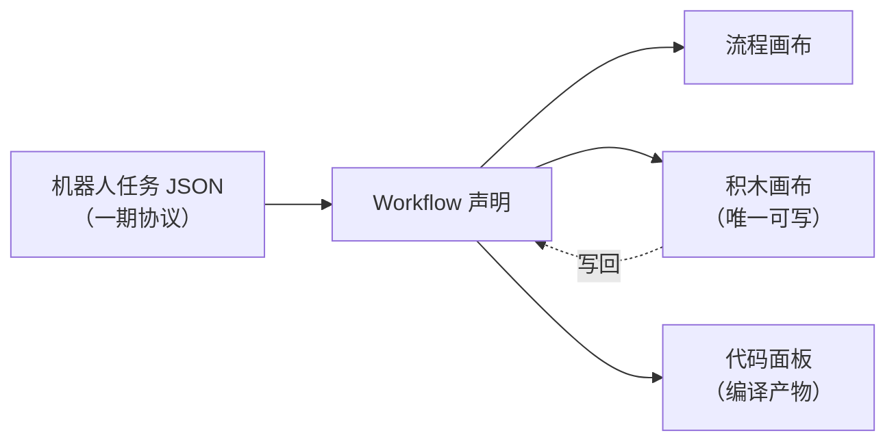
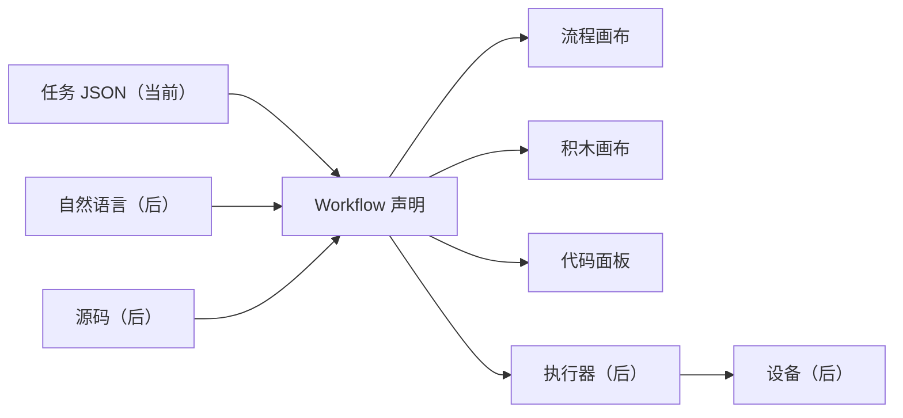

# CodeCanvas Spec v0（草案）

## 0. 定位与当前阶段

一句话：**把一份机器人任务变成可执行的 workflow，并用三个视图同时呈现它——流程、积木、代码。**

### 当前阶段只做一条链



上游「把自然语言变成任务 JSON」不在本阶段范围内，由第一步的生成器负责。
设备执行、仿真、审批同样后置。

**将来**可能追加的输入口（自然语言直入、源码导入）共用同一个 IR，但都不在本阶段。



### 非目标（写死，防止重蹈上一个实现的覆辙）

账号体系、多用户、RBAC、凭证管理、任务队列、分布式与多主、Webhook 触发体系、
集成节点生态、表达式语言、云托管、插件市场。

这些不是「以后再做」，是**不做**。需要它们的场景不在本项目的目标里。

> 设计与契约有相当一部分继承自前作（一个基于 n8n 的旧实现）。逐条判定见
> [`inherited.md`](inherited.md)，那里标明了哪些可直接搬、哪些要改造、哪些已被推翻。

---

## 1. 输入与 Workflow 格式

### 1.1 输入：机器人任务协议（一期）

输入是一份任务 JSON。

```jsonc
{
  "schema_version": "1.0",
  "task_id": "task-...",              // 非空、全局唯一，重复即拒
  "description": "前进1米，避障后停止",  // 人类可读的任务说明
  "steps": [ /* Step，非空 */ ],
  "limits": {
    "max_linear": 0.3,
    "max_angular": 1.2,
    "max_duration": 30.0,
    "require_confirmation": true
  }
}
```

**七种动作，这是全集**：

| action | 必填参数 | 约束 |
| --- | --- | --- |
| `move` | `linear`, `angular`, `duration` | `\|linear\| ≤ max_linear`；`\|angular\| ≤ max_angular`；`duration > 0` |
| `turn` | `angular`, `duration` | `\|angular\| ≤ max_angular`；`duration > 0` |
| `stop` | —— | —— |
| `stop_if_obstacle` | `sensors[]`, `distance` | sensors 只能是 `/scan0` 或 `/scan1`；`0 < distance ≤ 2.0` |
| `get_status` | —— | —— |
| `arm_joint` | `joint_id`, `joint`, `time?` | joint_id 1–6；joint 0–180 度；time 100–10000 ms（默认 1500） |
| `arm6_joints` | `joint1`…`joint6`, `time?` | 各 0–180 度；time 100–10000 ms（默认 1500） |

每个 step 还必须有 `id`（非空、步骤内唯一）。

**限值只能收紧，不能放宽**：`0 < max_linear ≤ 0.3`、`0 < max_angular ≤ 1.2`、`0 < max_duration ≤ 30.0`，
且所有 `duration` 之和不得超过 `max_duration`。校验器强制这条，视图侧不许绕过。

**校验器是唯一规格来源。** 积木的种类、字段、取值范围，代码面板的参数名与格式，
全部从校验器推导，不许在视图里手写一份平行的定义。协议变了改校验器一处，三个视图跟着变。

> 当前实现在 `task_protocol.py`（`ALLOWED_ACTIONS`、`ALLOWED_SENSORS`、`DEFAULT_LIMITS`
> 以及每个 action 分支的校验）。它是一期协议的可执行定义。

### 1.2 Workflow 格式

任务 JSON 进来后先变成一份 workflow 声明，三个视图都从它派生。
一个 workflow 就是一份 JSON。

```jsonc
{
  "formatVersion": 1,
  "id": "wf_01J...",
  "name": "避障前进",
  "nodes": [ /* Node */ ],
  "connections": { /* 见下 */ },
  "digest": "sha256-...",     // 稳定键序序列化后的内容摘要
  "meta": {}                  // 画布外观、教学 profile 等，引擎不解释
}
```

### Node

```jsonc
{
  "id": "nd_01J...",        // 稳定、生成即固定、永不改
  "name": "逻辑",            // 显示名，工作流内唯一，可改
  "type": "logic.blockly",  // 节点类型
  "typeVersion": 1,
  "parameters": {},         // 由节点自己解释，引擎不碰
  "position": { "x": 0, "y": 0 },
  "disabled": false
}
```

四条硬规则：

1. **`id` 不可变，且必须是稳定引用**：匹配 `/^[a-zA-Z0-9][a-zA-Z0-9._:-]*$/`，长度 1–128。
   这个字符集继承自前作的 `stableReferenceSchema`，它保证 id 能进 JSON 指针、能当 Map 键、能被 diff。
2. **引用 ID 与内容指纹是两回事。** `id` 在生成时一次性分配，永不变；「这个产物是不是从那份声明来的」
   用 `digest` 回答。前作把两者混在一起（ID 由内容路径哈希而来），导致改标签、挪位置、重排语句都会换 ID——
   那个做法**不要继承**。
3. **`type` + `typeVersion` 决定实现**。引擎按这两个字段找节点实现，找不到就报错，不做兜底猜测。
   `typeVersion` 是整数；实现内容变化时由机械规则递增，不靠人记。
4. **`parameters` 是不透明载荷**。引擎只负责存和传，schema 校验归节点自己。

### connections

按**源节点 id** 索引，不是按名字。

```jsonc
"connections": {
  "nd_A": {
    "main": [
      [ { "node": "nd_B", "input": 0 } ]   // 第 0 个输出端口，第 0 条支路
    ]
  }
}
```

`main` 是输出端口名，外层数组是支路，内层数组是同一支路上的目标。
留了端口名的位置，是为了将来有 `error` 端口时不用改格式。

---

## 2. 节点接口

```ts
type JsonValue = null | boolean | number | string | JsonValue[] | { [k: string]: JsonValue };

interface Item {
  json: JsonValue;
  pairedItem?: { item: number };   // 血缘：这一项来自上游第几项
}

interface NodeContext {
  getParameter<T>(name: string): T;        // 从 parameters 取，按节点 schema 校验
  getInputItems(input?: number): Item[];   // 某个输入端口收到的全部项
  readonly mode: 'run' | 'test';
  readonly signal: AbortSignal;
  log(message: string): void;              // 写进执行记录，UI 可见
}

interface NodeImplementation {
  readonly type: string;
  readonly typeVersion: number;
  execute(ctx: NodeContext): Promise<Item[]>;
}
```

四条约定：

- **节点收批，不逐项。** 一次调用拿到该端口的全部 items，自己决定是 `map` 还是聚合。
  前作是逐项语义（每个节点被调 N 次、每次重建上下文），那条路不要走。
- **输入为空数组 → 输出空数组**，不报错、不跳过。
- **`pairedItem` 由引擎维护**。节点按 `map` 处理时引擎自动续接血缘；节点自己聚合时负责重写。
- **节点不做 I/O 之外的状态**。文件、网络走节点自己，引擎不提供隐式全局。

### 错误

节点不抛裸异常，返回**诊断**（继承前作的形状）：

```ts
interface Diagnostic {
  code: string;                    // 稳定引用词法
  severity: 'error' | 'warning' | 'info';
  message: string;
  path?: string;                   // JSON 路径用点号；源码位置用 source.<line>.<col>
  ref?: string;                    // 谁出错了（节点 id / 块 id / 步骤 id）
  details?: JsonObject;            // 结构化载荷
}
```

`details` 是有用的：前作把整份「缺少模块」的请求塞进 `details`，前端据此直接渲染出生成入口。

---

## 3. 执行语义

### 调度

- 拓扑序，但**依赖就绪即刻执行**，不按固定分层等齐。
- 一个节点只要有**任意一条**入边，就必须等所有**已连线**的输入端口就绪才执行；没连线的端口视为空数组。
- 同一批就绪的节点可以并行。

### 数据传递

- 上游输出按 `connections` 声明顺序拼接后交给下游。**顺序必须确定**，不能依赖完成时序。
- 上游 0 项 → 下游收到空数组，照常执行。

### 两条纪律

**预览不参与执行。** 任何「生成产物预览」（编译出的代码、推导出的计划、教学解释文本）都是只读派生，
运行时一律**从真相重新推导**。前作靠这条避免了「预览与真相悄悄漂移」的整类 bug。

**`unknown` 是一等终态。** 取消或查询未获执行端确认时，状态是 `unknown`，不是 `cancelled`、更不是「已停止」。
界面保留任务标识、最后已知状态和建议的检查动作。

### 代码沙箱

积木编译出来的 JS 绝不在宿主进程里跑。

```ts
interface CodeRunner {
  run(input: {
    code: string;
    items: Item[];
    timeoutMs: number;
  }): Promise<{ ok: true; items: Item[] } | { ok: false; error: string }>;
}
```

- v0 实现：**独立子进程 + `node:vm`**。隔离强度与前作同级（它的沙箱也是独立进程 + `node:vm`），
  但没有它那堆依赖。
- 超时和内存上限由宿主强制，子进程用完即弃或复用一个池。
- `isolated-vm`、`quickjs-emscripten` 都只是这个接口的另一个实现。

> `node:vm` **不是**安全边界。真正的隔离来自进程边界。不要在宿主进程里 `runInContext` 用户的代码。

**有界表达式不走沙箱。** 语言模型生成的纯函数表达式（literal / parameter / unary / binary / conditional /
array / object 七种节点，有深度与节点数上限）是**解释执行**的，它压根不是代码。
把它塞进沙箱是无谓开销——两者分开，不要合成一条路。

### 执行记录

```ts
interface TraceEntry {
  traceRef: string;
  runRef: string;
  sequence: number;
  occurredAt: string;
  state: 'queued' | 'running' | 'succeeded' | 'failed' | 'cancelled' | 'skipped';
  location?: { nodeRef?: string; canvasRef?: string; blockRef?: string; stepRef?: string };
  message?: string;
  input?: JsonObject;
  output?: JsonObject;
  error?: { code: string; message: string; details?: JsonObject };
}
```

**粒度是「一个步骤 = 一个可执行块」**，不是 item 级、也不是数据流级。（前作给的答案是同一档。）

⚠ 这套 `state` 是**步骤**执行态，别和整次运行的生命周期（§6）合并成一套枚举。

---

## 4. 三个视图与映射

一份声明，三个视图。跨栏连线渲染的就是下面的映射表。

### 4.1 编辑权只有一条

真相是由任务 JSON 导入的 workflow 声明，三个视图都从它派生。

| 视图 | 读 | 写 | 它回答什么 |
| --- | --- | --- | --- |
| 流程画布 | ✓ | ✗ | 顺序是什么、现在跑到哪、哪一步失败 |
| 积木画布 | ✓ | **唯一可写** | 这一步由什么构成、参数多少、限值在哪 |
| 代码面板 | ✓ | ✗ | 紧凑可读形态 |

三条规矩：

- **只有积木能写。** 改完编译回声明，**编译时跑同一套校验器**；非法状态给诊断，不静默修正。
- **代码面板显示的是编译产物**，不是另写一份对照文本。改一个积木上的参数，面板上那个数字跟着变——
  这个联动才是教学价值所在。
- **代码面板的渲染规则从校验器推导**，不许手编。手编出来的会是一门协议里不存在的语言：
  无法执行、无法校验，纯粹是画出来的。

### 4.2 映射表

| 映射 | 用途 | v0 |
| --- | --- | --- |
| `blockId ↔ nodeId` | 积木和流程节点之间的连线 | **要** |
| `blockId ↔ 源码 span` | 点积木跳到 TypeScript 源码行列 | **要** |
| `blockId ↔ 生成代码行范围` | 点积木高亮生成的 JS | **要**（见下） |

**映射表是生成期产物，不是视图层的东西。** 生成器在产出两张画布的同时产出映射表；视图只渲染它。
把它划进 `views/` 会得到一个算不出映射的渲染器。

映射条目共享**语义身份**（`stepRef`）来表达跨画布对应，而不是互相直接引用：

```ts
interface SourceMapEntry {
  mappingRef: string;
  semanticRef: string;                       // stepRef 或 callRef
  artifact: {
    kind: 'workflowNode' | 'canvasBlock' | 'planStep' | 'canvas';
    ref: string;
  };
  source?: SourceSpan;                       // { sourceRef, start, end }，1-based 行 / 0-based 列
  context?: JsonObject;
}
```

校验规则（继承前作，防伪造映射）：`artifact.ref` 必须真实存在；若给了 `context.nodeRef`，
则 ref 必须**恰好等于**由 `(documentId, nodeRef, semanticRef)` 重算出的块引用；
同一 `mappingRef` 在多处出现时内容必须逐字节一致。

**第三行要求编译器从第一天就接住 `blockId`。** 前作的编译器只按块的 `type` 和 fields 走、**不读 `block.id`**，
所以「积木 ↔ 代码行」在那边是零实现——这不是补个字段就能补上的，得给编译器加一条 blockId 上下文。
编译时逐块记录 `{ blockId, startLine, endLine }` 即可。

统一标识：`blockId` 和 `nodeId` 都是生成即固定的字符串，禁止用数组下标或名字做引用。

---

## 5. 设备层

设备 = 局域网里一个能连上、能报出自己会干什么的东西。

```ts
interface DeviceSession {
  connect(): Promise<DeviceInfo>;
  disconnect(): Promise<void>;
  capabilities(): Promise<unknown>;          // 原始报告，交给 normalizeCatalog 净化
  invoke(call: CapabilityCall): Promise<JsonValue>;
  readonly online: boolean;
}

interface CapabilityCall {
  capabilityRef: string;
  kind: 'skill' | 'primitive' | 'action';    // 判别字段，别省
  arguments: JsonObject;
  catalogDigest: string;                     // 调用的目录快照
  timeoutMs?: number;
  context?: JsonObject;                      // 追溯用：runRef / planRef / blockId / stepRef
}

interface CapabilityCatalog {
  catalogRef: string;
  revisionRef: string;
  digest: string;
  capabilities: Array<{
    capabilityRef: string;
    kind: 'skill' | 'primitive' | 'action';
    displayName: string;
    description?: string;
    category?: string;
    inputs: Array<{
      parameterRef: string;
      displayName: string;
      valueType: 'string' | 'number' | 'boolean' | 'object' | 'array' | 'binary';
      required: boolean;
      defaultValue?: JsonValue;
      constraints?: JsonObject;
    }>;
    outputs: Array<{ outputRef: string; displayName: string; valueType: string }>;
  }>;
}
```

四件事要盯住：

**`kind` 不能省。** 前作吃过「把 primitive 名称送进 skill 接口」的亏，那条路径最后被整个删掉。

**`invoke` 要带目录摘要和追溯上下文。** 只传 `(capabilityId, args)` 是不够的——设备侧无法判断
「你这份计划是不是基于我现在的目录编的」，出问题也无法回溯到是哪块积木触发的。

**`capabilities()` 的原始返回必须过一道 `normalizeCatalog(raw)`。** 设备给的东西不可信，
净化（白名单字段、长度与超时归一、类型校验）是进入系统的唯一入口。

**目录摘要决定陈旧判定。** 编译产物带生成时的 `digest`，执行前与 live 目录比对，不一致 = 「计划已过期」，
停在执行前并给重新生成入口，**不静默执行**。

**边界**：核心只认 `DeviceSession` 与 `CapabilityCatalog` 两个接口。发现协议、连接握手、消息编码、
设备品牌与型号，全部在插件里。

设备上报的能力目录直接决定积木里出现哪些设备积木——**「设备连上」和「积木长出来」是同一件事**，
不需要两套机制。

---

## 6. 生命周期

一次运行的生命周期：

```text
draft → preflight → pending_approval → approved → validated
      → accepted → running → completed | failed | cancelled | unknown
```

三条规则：

1. **`unknown` 是正式终态**（见 §3）。
2. **任何有效修改都退回 `pending_approval`**；只改视图位置或折叠状态**不触发**复审。
3. **审核门有两道**：设计期（生成物以**差异**形式呈现，确认后才写入）与运行期（涉及物理动作的任务
   在校验之后才走批准）。

**⚠ 未决**：界面上那条六段流水线（`Received → Validated → Simulation → Approved → Running → Succeeded`）
只有 `Succeeded` 一个出口，而上面这套把 `failed / cancelled / unknown` 当一等公民。
**必须先决定：失败、取消、未确认是占第六格，还是另开一路显示。** 前作的经验是前者。

流水线的每一格对应哪个状态、由谁触发，见 [`plan.md`](plan.md) 的 M0。

---

## 7. 技术选型（建议，待确认）

- 语言：TypeScript
- 运行时：Node 22+
- 形态：**单进程服务**——托管前端静态资源 + REST/WS + 执行器；沙箱子进程独立
- 前端：Vue 3 + Vite；Blockly 12 + `zelos` renderer（近 Scratch 观感，但**不碰 Scratch 的名字、Logo、
  角色形象**——那是注册商标）
- 校验：zod
- 存储：workflow 存 JSON 文件，执行记录可只在内存

选单进程的理由：一台机器上跑起来就能连局域网设备，不需要浏览器直接触碰设备，也不需要部署编排。

---

## 8. 待拍板

1. **执行器跑在哪**——本地 Node 服务（建议）／浏览器内 WASM 沙箱／直接下发到设备。
2. **六段流水线的终态**（见 §6 末尾）。
3. **前端框架**——Vue 3（承接已有经验）还是另起。
4. **积木与流程的「提升」规则**——什么时候一个积木块变成流程里的一个节点，谁决定。
