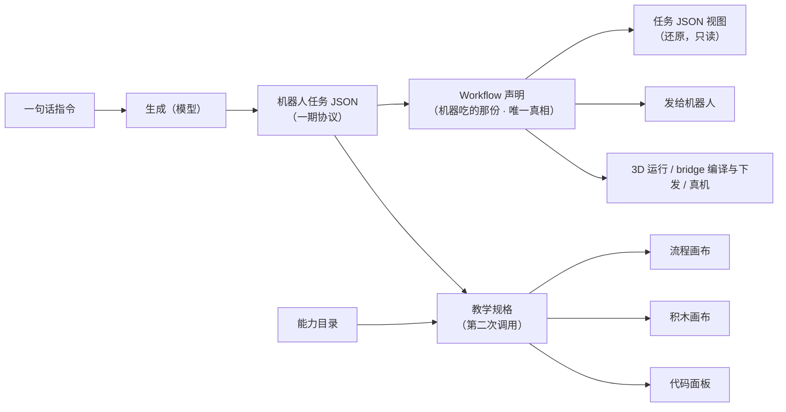
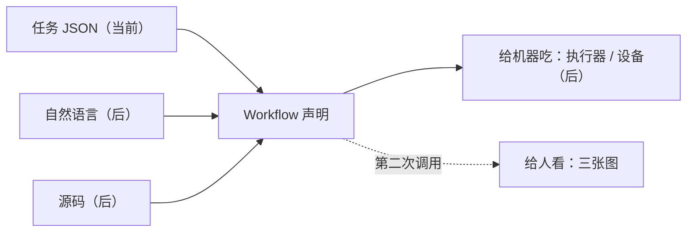

# CodeCanvas Spec v0（草案）

## 0. 定位与当前阶段

一句话：**把一份机器人任务变成可执行的 workflow，并用三张图讲清它——流程、积木、代码。**

补一句本期定下来的：**给机器吃的那份**（任务 JSON / 声明）与**给人看的那三张图**是两份东西，
由**两次**模型调用分别产出，谁也不许改谁（见 §4）。

### 当前阶段只做一条链



「把自然语言变成任务 JSON」由 studio 入口直接调模型完成：选设备、写一句话、点生成。
这**不是**新增一条上游链路——它落到同一个 IR 上，走同一道校验；模型给出的任务如果不合协议，
声明一字不动，只在入口下方出诊断。

屏幕上那三张图由**第二次**调用产出（材料是任务 JSON + 能力目录），与声明**没有**派生关系：
它讲错了不会让声明变一个字，声明变了也不会自动重画。这条分界见 §4。

**将来**可能追加的输入口（源码导入、接口取回）共用同一个 IR，但都不在本阶段。



### 非目标（写死，防止重蹈上一个实现的覆辙）

账号体系、多用户、RBAC、凭证管理、任务队列、分布式与多主、Webhook 触发体系、
集成节点生态、表达式语言、云托管、插件市场。

这些不是「以后再做」，是**不做**。需要它们的场景不在本项目的目标里。

> 设计与契约有相当一部分继承自前作（一个基于 n8n 的旧实现）。逐条判定见
> [`inherited.md`](inherited.md)，那里标明了哪些可直接搬、哪些要改造、哪些已被推翻。

---

## 1. 输入与 Workflow 格式

### 1.1 输入：机器人任务协议（一期）

> **这一节描述的是一台设备的任务格式，不是全局格式。** 见 §1.4。

输入是一份任务 JSON。

```jsonc
{
  "schema_version": "1.0",
  "task_id": "task-...",              // 非空、全局唯一，重复即拒
  "description": "前进1米，避障后停止",  // 人类可读的任务说明
  "steps": [ /* Step，非空 */ ],
  "limits": {
    "max_linear": 0.3,
    "max_angular": 1.2,
    "max_duration": 30.0,
    "require_confirmation": true
  }
}
```

**七种动作，这是全集**：

| action | 必填参数 | 约束 |
| --- | --- | --- |
| `move` | `linear`, `angular`, `duration` | `\|linear\| ≤ max_linear`；`\|angular\| ≤ max_angular`；`duration > 0` |
| `turn` | `angular`, `duration` | `\|angular\| ≤ max_angular`；`duration > 0` |
| `stop` | —— | —— |
| `stop_if_obstacle` | `sensors[]`, `distance` | sensors 只能是 `/scan0` 或 `/scan1`；`0 < distance ≤ 2.0` |
| `get_status` | —— | —— |
| `arm_joint` | `joint_id`, `joint`, `time?` | joint_id 1–6；joint 0–180 度；time 100–10000 ms（默认 1500） |
| `arm6_joints` | `joint1`…`joint6`, `time?` | 各 0–180 度；time 100–10000 ms（默认 1500） |

每个 step 还必须有 `id`（非空、步骤内唯一）。

**限值只能收紧，不能放宽**：`0 < max_linear ≤ 0.3`、`0 < max_angular ≤ 1.2`、`0 < max_duration ≤ 30.0`，
且所有 `duration` 之和不得超过 `max_duration`。校验器强制这条，视图侧不许绕过。

**校验器是唯一规格来源。** 积木的种类、字段、取值范围，代码面板的参数名与格式，
全部从校验器推导，不许在视图里手写一份平行的定义。协议变了改校验器一处，屏幕跟着变。

> 本期的一处修正：屏幕上那三张图现在由**第二次模型调用**画（材料是任务 JSON + 能力目录，
> 目录直接序列化进提示词，没有手写清单）。所以「跟着变」这件事落在**提示词**上，
> 不再是「视图读校验器」——见 §4.2。校验器仍然是协议的唯一规格来源，只是它管的是
> **给机器吃的那份**，不是屏幕上那三张图长什么样。

> 当前实现在 `task_protocol.py`（`ALLOWED_ACTIONS`、`ALLOWED_SENSORS`、`DEFAULT_LIMITS`
> 以及每个 action 分支的校验）。它是一期协议的可执行定义。

### 1.2 Workflow 格式

任务 JSON 进来后先变成一份 workflow 声明——**给机器吃的那份，唯一真相**。
屏幕上那三张图不从它派生（见 §4）。
一个 workflow 就是一份 JSON。

```jsonc
{
  "formatVersion": 1,
  "id": "wf_01J...",
  "name": "避障前进",
  "nodes": [ /* Node */ ],
  "connections": { /* 见下 */ },
  "digest": "sha256-...",     // 稳定键序序列化后的内容摘要
  "meta": {}                  // 画布外观、教学 profile 等，引擎不解释
}
```

### Node

```jsonc
{
  "id": "nd_01J...",        // 稳定、生成即固定、永不改
  "name": "逻辑",            // 显示名，工作流内唯一，可改
  "type": "logic.blockly",  // 节点类型
  "typeVersion": 1,
  "parameters": {},         // 由节点自己解释，引擎不碰
  "position": { "x": 0, "y": 0 },
  "disabled": false
}
```

四条硬规则：

1. **`id` 不可变，且必须是稳定引用**：匹配 `/^[a-zA-Z0-9][a-zA-Z0-9._:-]*$/`，长度 1–128。
   这个字符集继承自前作的 `stableReferenceSchema`，它保证 id 能进 JSON 指针、能当 Map 键、能被 diff。
2. **引用 ID 与内容指纹是两回事。** `id` 在生成时一次性分配，永不变；「这个产物是不是从那份声明来的」
   用 `digest` 回答。前作把两者混在一起（ID 由内容路径哈希而来），导致改标签、挪位置、重排语句都会换 ID——
   那个做法**不要继承**。
3. **`type` + `typeVersion` 决定实现**。引擎按这两个字段找节点实现，找不到就报错，不做兜底猜测。
   `typeVersion` 是整数；实现内容变化时由机械规则递增，不靠人记。
4. **`parameters` 是不透明载荷**。引擎只负责存和传，schema 校验归节点自己。

### connections

按**源节点 id** 索引，不是按名字。

```jsonc
"connections": {
  "nd_A": {
    "main": [
      [ { "node": "nd_B", "input": 0 } ]   // 第 0 个输出端口，第 0 条支路
    ]
  }
}
```

`main` 是输出端口名，外层数组是支路，内层数组是同一支路上的目标。
留了端口名的位置，是为了将来有 `error` 端口时不用改格式。

任务步骤节点约定：`type: 'task.action'`、`typeVersion: 1`，动作名放在 `parameters.action`，
`parameters.step_id` 保留原始步骤的语义身份（映射用）。
七种动作共用这一个节点类型——如果将来某个动作需要独立版本化，再拆成各自的类型。

### 1.3 身份与确定性

两个概念不要混：

- **`id` 是身份**：生成时一次性分配（ULID），此后永不改变。同一份任务导入两次会得到**两个文档**、
  两套 id——这是对的，因为导入就是创建新文档。
- **`digest` 是内容指纹**：稳定键序序列化后的 SHA-256，不含 `digest` 自身，含 `meta`。
  它回答的是「这份声明还是不是原来那份」，不是「这是谁」。

所以验收口径是：**除身份字段（`id`、`digest`）外，同一输入两次产出的规范化产物字节相同**。
测试与重放注入确定性 ID 工厂（带种子），生产走随机。

### 1.4 任务格式由设备决定

一期协议的七个动作是**一台设备的词汇表**，不是全局词汇表。RoboFrame 的设备听的不是那七个动作，
而是一串技能调用，技能写在它的 `robot_config` SSOT 里，随时可以增删。
把词汇表写死在核心，等于「设备决定了目录，却决定不了任务长什么样」——那条链是断的。

所以任务格式是**设备属性**：

| 格式 | 谁用 | 长什么样 | 判据 |
| --- | --- | --- | --- |
| `phase1_task` | 一期设备（差速底盘 + 六轴臂） | §1.1 那份，七个固定动作 | `validateTask`（逐条对照 `task_protocol.py`） |
| `skill_plan` | RoboFrame SO-101（真机 / 虚拟设备） | `{schemaVersion, robot, description?, plan:[Step, …]}`，其中 `Step` 是四员之一：`{step:'skill', skill, params?, timeoutSec?, onFailure?:'stop' / 'continue'}`、`{step:'if', condition:{field:'last.success', op:'==' / '!=', value:boolean}, then:[Step, …], else?:[Step, …]}`、`{step:'wait', seconds}`、`{step:'primitive', primitive, params?, timeoutSec?, onFailure?:'stop' / 'continue'}` | `validateSkillPlan`：**技能与参数照设备目录判**（原语照 `catalog.primitives` 那份白名单判）；分支照条件、臂与深度判；等待照秒数判；失败处置照取值判 |

三条规矩：

- **两条路汇进同一份声明。** 三个视图（流程 / 积木 / 代码）完全不知道任务原来是哪种格式——
  分叉点只有一处，见 `packages/task-import/src/format.ts`。
- **尺子跟着声明走。** 第二道闸用「这份声明出生时那台设备的格式」量，不是用当前选中的设备。
  生成之后换设备，声明还是上一台产出的；这时拿新尺子量，改一个数字都会被莫名其妙拒掉。
- **`skill_plan` 的形状沿用前作集成设计稿 §7.3 的 `RobotTaskPlan`**，几处偏离写在
  `packages/contracts/src/skill-plan.ts` 头上：参数名照抄上游（`motion_direction` 而不是示例里的
  `motionDirection`）；`step` 认 `'skill'` / `'if'` / `'wait'` / `'primitive'`（设计稿的 `skipIf`
  还没做，遇到就明确报错，不静默当技能）；`if` 这一版的条件只认 `last.success`；而 `skipIf`
  （守卫挂在**后一步**上）换成了技能步自己的 `onFailure`（见下）。

**原语步（`primitive`）为什么有、以及那条约束：**

- **它是一条直路，不是一个新能力。** 目录里有些原子动作**没有**技能包装（SO-101 的 `open_gripper` /
  `close_gripper` 就是这样），计划里想直接叫它只能编一个假技能——假技能不在目录里，校验器当场拒。
  `primitive` 步就是给这些动作留的直路，落到执行侧就是上游的 `/embodied/execute_primitive`
  （`PrimitiveCommand.action` 那条路）。
- **约束：`primitive` 必须是当前设备目录 `catalog.primitives` 里的名字。** 判据是**目录**，不是写死的表——
  设备报上来的原语可以随时增删，写死一张表等于让「能生成什么」与「能执行什么」分家。
  查不到报 `plan.step.primitive.unknown`，并把目录里有什么一并给上（与 `skill.unknown` 同一个写法）。
  `params` 里每个键必须是那个原语声明的参数名、类型要对得上；标了 `required: true` 的缺了是错误
  （`plan.step.param.required`），没标必填的缺了只提醒——**这一段与技能步共用同一个校验函数**
  （同一份坏参数在两条路上给的是同一个码）。
- **待遇与技能步完全一样**：`timeoutSec` 与 `onFailure`（缺省 `'stop'`）都收，且它真的会成会败，
  所以**参与 `last.success`**——它后面那个 `if` 能按它的成败分叉。
- **什么时候用它**：目录里有对应技能时**优先用技能**（技能带着自己的守卫与恢复策略），
  没有包装的原子动作才用 `primitive`。提示词里也是这么写的（`apps/studio/src/shell/task-generation.ts`）。

**分支为什么长成这样（三条，都是被现实逼出来的）：**

- **条件只认 `last.success`。** 计划是送给**机器**执行的，条件得是机器身上真的观测得到的量。
  这台设备报上来的只有「上一步成没成」（它的 `recovery_policy` 也是照这一条写的），
  写别的字段等于让数据模型承诺一件执行侧兑现不了的事。将来要加感知条件（比如夹爪里有没有东西），
  加的是**一个新的 `field`**——那时执行侧也真的会报这个量——而不是把这里放宽成「随便填」。
- **「汇合」就是第三格出边，不需要单独的汇合节点。** `if` 执行**之后**的同层步骤挂在
  `task.branch` 节点的第三格（`main[0]`=then、`main[1]`=else、`main[2]`=`if` 之后的那些步，
  空的那一格给 `[]`，位置不省略）。分支节点执行完接着走 `main[2]`，与走了哪一臂无关——
  这正是结构化 `if/else` 的语义（语句执行完，下一条语句继续），所以它**就是**汇合。
  单独的汇合节点只在**非结构化图**里才有意义：两条臂各自结束在不同地方，或者某一臂要提前退出计划。
  这一版不表达那两种，因为计划是一棵树而不是任意图。

  （早先这里写的是「回汇是下一步的事」——那句话说错了：对一棵结构化的计划树，汇合点已经在了。
  真正缺的是「某一臂提前退出」，那是另一个特性，不是汇合。）
- **嵌套深度上限定 8。** 校验器与三个视图都要走这棵树，一份恶意嵌套的 JSON 不该能把它们打爆；
  正常人也不会写九层条件。超了给 `plan.step.depth_exceeded`，且那一层不再往下递归——
  恶意嵌套的代价是一层诊断，不是一次爆栈。

**等待（`wait`）与失败处置（`onFailure`）为什么是这个形状：**

- **`wait` 是「停一下」，不是一次动作。** 技能自己带的时长管不了「两步之间停一下」
  （抓起来、等它稳定两秒、再移动），所以计划层要有这一步：`{step:'wait', seconds}`，
  秒数必须是正数、最多 `SKILL_PLAN_MAX_WAIT_SECONDS`（十分钟）——计划是送给机器执行的东西，
  一个 `86400` 不是「等一天」，是把执行器挂在那儿过夜。
  它**不改 `last.success`**：它没有「成」也没有「败」，所以它后面那个 `if` 看到的仍是
  它**之前**那个技能步的结果（执行侧 `apps/robot3d/src/roboframe/plan.ts` 里钉着）。
  它**不带 `onFailure`**（等不到点不是失败，是取消），给了报 `plan.step.onfailure_not_applicable`。
- **`onFailure` 缺省是 `'stop'`——这是安全立场，不是省事。** 执行器一直是「失败即停、
  不自动重试」（与 bridge 同一条纪律：重试与否由技能自己的 `recovery_policy` 决定）。
  默认改成 `'continue'`，等于让**每一次**技能失败之后整台机器继续按计划动；要放宽必须是
  **写计划的人显式说的**（他才知道后面有没有可走的路），所以缺省不许动。
- **`'continue'` 只改两件事：计划继续往下走，`last.success` 记成 `false`。**
  这是为了让 `if (last.success == false)` 那条臂**真的可达**：在它之前，任何技能步失败都会
  结束整条计划，`last.success` 在 `if` 求值处恒为 `true`，一半的分支是死的。
  它**不粉饰**：这一步照报 `failed`，也不算进 `completed`——失败是事实，被容忍也是事实。
  只有技能步带这一栏（取值只认 `'stop'` / `'continue'`，别的给 `plan.step.onfailure_invalid`）：
  `wait` 不会失败，`if` 走哪条臂由条件决定，两处带上都报错。

设备这一层因此是「一份目录 + 一套任务格式 + 一个去处」。同一份 SO-101 技能库发给真机还是发给仿真，
换的只是去处——这也是 RoboFrame 自己的分法。

---

## 2. 节点接口

```ts
type JsonValue = null | boolean | number | string | JsonValue[] | { [k: string]: JsonValue };

interface Item {
  json: JsonValue;
  pairedItem?: { item: number };   // 血缘：这一项来自上游第几项
}

interface NodeContext {
  getParameter<T>(name: string): T;        // 从 parameters 取，按节点 schema 校验
  getInputItems(input?: number): Item[];   // 某个输入端口收到的全部项
  readonly mode: 'run' | 'test';
  readonly signal: AbortSignal;
  log(message: string): void;              // 写进执行记录，UI 可见
}

interface NodeImplementation {
  readonly type: string;
  readonly typeVersion: number;
  execute(ctx: NodeContext): Promise<Item[]>;
}
```

四条约定：

- **节点收批，不逐项。** 一次调用拿到该端口的全部 items，自己决定是 `map` 还是聚合。
  前作是逐项语义（每个节点被调 N 次、每次重建上下文），那条路不要走。
- **输入为空数组 → 输出空数组**，不报错、不跳过。
- **`pairedItem` 由引擎维护**。节点按 `map` 处理时引擎自动续接血缘；节点自己聚合时负责重写。
- **节点不做 I/O 之外的状态**。文件、网络走节点自己，引擎不提供隐式全局。

### 错误

节点不抛裸异常，返回**诊断**（继承前作的形状）：

```ts
interface Diagnostic {
  code: string;                    // 稳定引用词法
  severity: 'error' | 'warning' | 'info';
  message: string;
  path?: string;                   // JSON 路径用点号；源码位置用 source.<line>.<col>
  ref?: string;                    // 谁出错了（节点 id / 块 id / 步骤 id）
  details?: JsonObject;            // 结构化载荷
}
```

`details` 是有用的：前作把整份「缺少模块」的请求塞进 `details`，前端据此直接渲染出生成入口。

### 校验器

- **收集式，不是 fail-fast**：一次给出全部诊断，而不是遇到第一条就停。参考实现是 fail-fast 的，
  但界面上一次看全更有用。
- **诊断 message 与参考实现逐字相同**，这样「TS 校验器与 `task_protocol.py` 结论一致」才能被机械核对。
  **代价要记住**：将来改进文案会打破那组对照测试，届时把对照口径从「文案一致」放宽为「结论一致」。
- 非 JSON 文本解析失败给 `task_import.json_parse_error`。
- 参考实现不检查 `description`，所以我们只发 warning，不影响合法判定。
- 规范化输出会把缺省的 `time` 补成 1500，并**丢弃未知字段**（判定仍然容忍它们，与参考实现一致）。
  丢弃是为了让产物稳定；如果哪天上游加了新字段而这里静默消失，那就是这条约定的账单。

---

## 3. 执行语义

### 调度

- 拓扑序，但**依赖就绪即刻执行**，不按固定分层等齐。
- 一个节点只要有**任意一条**入边，就必须等所有**已连线**的输入端口就绪才执行；没连线的端口视为空数组。
- 同一批就绪的节点可以并行。

### 数据传递

- 上游输出按 `connections` 声明顺序拼接后交给下游。**顺序必须确定**，不能依赖完成时序。
- 上游 0 项 → 下游收到空数组，照常执行。

### 两条纪律

**预览不参与执行。** 任何「生成产物预览」（编译出的代码、推导出的计划、教学解释文本）都是只读派生，
运行时一律**从真相重新推导**。前作靠这条避免了「预览与真相悄悄漂移」的整类 bug。

**`unknown` 是一等终态。** 取消或查询未获执行端确认时，状态是 `unknown`，不是 `cancelled`、更不是「已停止」。
界面保留任务标识、最后已知状态和建议的检查动作。

### 代码沙箱

积木编译出来的 JS 绝不在宿主进程里跑。

```ts
interface CodeRunner {
  run(input: {
    code: string;
    items: Item[];
    timeoutMs: number;
  }): Promise<{ ok: true; items: Item[] } | { ok: false; error: string }>;
}
```

- v0 实现：**独立子进程 + `node:vm`**。隔离强度与前作同级（它的沙箱也是独立进程 + `node:vm`），
  但没有它那堆依赖。
- 超时和内存上限由宿主强制，子进程用完即弃或复用一个池。
- `isolated-vm`、`quickjs-emscripten` 都只是这个接口的另一个实现。

> `node:vm` **不是**安全边界。真正的隔离来自进程边界。不要在宿主进程里 `runInContext` 用户的代码。

**有界表达式不走沙箱。** 语言模型生成的纯函数表达式（literal / parameter / unary / binary / conditional /
array / object 七种节点，有深度与节点数上限）是**解释执行**的，它压根不是代码。
把它塞进沙箱是无谓开销——两者分开，不要合成一条路。

### 执行记录

```ts
interface TraceEntry {
  traceRef: string;
  runRef: string;
  sequence: number;
  occurredAt: string;
  state: 'queued' | 'running' | 'succeeded' | 'failed' | 'cancelled' | 'skipped';
  location?: { nodeRef?: string; canvasRef?: string; blockRef?: string; stepRef?: string };
  message?: string;
  input?: JsonObject;
  output?: JsonObject;
  error?: { code: string; message: string; details?: JsonObject };
}
```

**粒度是「一个步骤 = 一个可执行块」**，不是 item 级、也不是数据流级。（前作给的答案是同一档。）

⚠ 这套 `state` 是**步骤**执行态，别和整次运行的生命周期（§6）合并成一套枚举。

---

## 4. 两个层次，三张图

屏幕上同时有两份东西，**谁也不许改谁**：

| 层 | 是什么 | 谁写 | 谁读 |
| --- | --- | --- | --- |
| 给机器吃的 | 任务 JSON / 声明（§1） | 入口那一次模型调用 | 3D 运行、bridge 编译与下发、真机 |
| 给人看的 | **教学规格**（`packages/contracts/src/teaching-spec.ts`） | **第二次**模型调用 | 流程画布、积木画布、代码面板 |

三张图**不再从声明派生**——它们是模型从任务 JSON + 能力目录讲出来的一堂课。
声明也**不因为那堂课改一个字**：`apps/studio/src/state/document.ts` 的 `declaration` 仍是唯一真相。
这是本期最要紧的一处分界：**机器吃的那份不跟着屏幕变**——真机不会跟着我们更新。

### 4.1 给机器吃的：一份声明

一个节点 = 一个**能力**，声明里说清它叫什么、排在第几步、带什么参数。它是唯一契约：
3D 运行读它、bridge 编译与下发读它、真机读它。屏幕上画得好不好看，与它无关。

能力的**实现**来自**能力目录**（`capabilities[].implementation`），由设备侧提供；
底盘和机械臂各自的原语集不同，但结构一样（见 §5）。

实现是一棵**语句树**——调用、赋值、条件、**委托**，表达式由字面量、引用、调用、比较算术与取反组成——
不是一串平铺的步骤。理由很实际：函数体是**程序**，有「如果……那么」这样的结构；
只有树才长得成 C 形积木、才渲染得出带缩进的代码。原语是这棵树的词汇表，
其中声明了 `returns` 的才能出现在表达式里。

**委托**（`delegate`）是第四种语句，说的是「这一步的实现在执行侧，模板里没有步骤」：
它带一个执行侧接口名（`/manipulation/execute_pick`）与交出去的实参。
少了它，上游那种 `primitive_sequence` 为空的技能只能被拒之门外，或者被编一条假的实现——
两条都是错。接口名**不是原语**，不进 `catalog.primitives`。

本机 3D 执行器演不了它，于是照报一步 `unreachable`：不是 `done`（什么都没演就说走通了是假账），
也不是 `failed`（它没坏，是这里没有那套东西）。计划照常往下走，`last.success` 不动
（与等待步同一个口径：演都没演，凭什么说上一步成没成）。
派出去了没有是另一回事：`pick_object` 作为一个**技能步**，照旧走 bridge 那条路（见 §6）。

### 4.2 给人看的：第二次调用画三张图

第二次调用的**材料**是任务 JSON 逐字 + 能力目录**直接序列化**——不手抄一张清单，
目录改了提示词跟着改（`apps/studio/src/shell/teaching-prompt.ts`）。
产出是一份**教学规格**，形状校验只拦「不成话」：引用存在、图连得通、块树成棵、拆得开。

三条纪律写进提示词（为什么成立写在 `teaching-spec.ts` 的文件头）：

- **目录里有的照目录说**（技能名、原语名、参数、坐标、到位值都从目录来）；目录里没有的
  （执行侧内部怎么做的）可以讲，但**不许编具体数值**。
- **不许一块包全部**：一个动作至少拆成调用块 + 实参值块；有 `if` 就是 C 形块 + 里面嵌一条语句链。
  一块包全部，积木画布上就只有一块——教学一句话就讲完了。
- **模型赢**：这份规格与任务 JSON 对不上**不拦**，界面上也不做任何区分标注。

**「模型赢」是有代价的，两条实测如实记在这里：**

- 模型自己加过一步声明里没有的（「停一下确认」）；
- 模型写反过一次分支条件（`last.success == false` 配了「观察成功 → 打开夹爪」的臂名）。

契约只校验形状与「指得到指不到」，**不校验那是不是事实**——那件事没有机器可核的判据，
只有目录可对照，而对照的结果是**并列显示**，不是自动否决。

### 4.3 两层之间唯一的对应关系：联动

设备跑到哪一步，三张图一起跟过去。这是两层之间仅存的一根轴，也是规格里**必须写出来**的一栏：

| 位置 | 这一栏 | 取值口径 |
| --- | --- | --- |
| 流程节点 | `flow.nodes[].planPath` | **执行路径**（`0`、`1.then.0`），与设备报的 `runningPlanPath`、`nodeAtPlanPath` 同一份口径；`start` / `end` 不许带；`decision` **必须**带（它讲的是"哪一步的成败"）；`action` / `wait` **可以不带**——不带就是纯讲解框，跑到哪一步都不点亮它（见下） |
| 块树的每一块 | `blocks[].planPath` | **流程节点 id**——积木是流程图的下钻，锚在流程节点上 |
| 代码 | `codeSegments[].planPath` | **流程节点 id**，同上一栏 |

代码那一栏选「分段给文字 + 这段属于哪一步」而不是「整段文字 + 行号」：
行号那套要求模型**自己数行**，而它同时还在写那段文字——两份独立产出必须逐行对上，
错一位就整段错位，而我们没有任何机械判据能发现它错了。分段那套里行范围是**推出来的**，
`code` 由分段拼成（`codeOfSegments`），模型只产出「这一段属于哪一步」这一件事。

**不是"必须写"，而是"能写对就写"**（2026-10 定下来的分界）。原来的规矩是动作 / 分支 / 等待
三种节点都必须写 `planPath`，而讲解里天然会有不对应任何一步的框——"等它稳下来""收个尾"都是。
逼它写，模型只能编一个越界路径，于是整份被拒、三张画布全空（真实踩过：输入「旋转360度」，
任务只有一步，模型给那个等待框编了个 `"2"`）。

现在的办法是分两层，**先修再判，不是放宽**：

1. **能机械修的，本地修掉**（`teaching-repair.ts`）：多写的键、`"3"` 写成字符串、
   语法合法的越界路径（拿这次任务真会走到的那几条路径一对就知道）、给不存在的臂、文本超长。
   修过的每一处都记下来，**逐条摆给用户看**——改过就说改过，不让它悄悄发生。
2. **修不了的才拒**：缺开始节点、一个结束节点都没有、块树空、代码段拼不出来。
   这些是真"说不通"，拒掉是对的，理由原样交回给模型（下一条它照着改）。

指到不存在的步骤 ⇒ **整份规格拒收**（说不清「跑到的是图上哪个框」，三张图就退回各说各的）；
顶层块没有归属 ⇒ 非致命，画出来但不点亮。

读出来的是 DOM 上三个属性（验收脚本读它们，不靠肉眼）：`data-cc-current-step`（流程节点 id）、
`data-cc-current-block`（此刻落在哪几块上）、`data-cc-current-line`（此刻亮哪几行）。
**三者相等 = 联动成立。** 设备报的路径优先，没在跑时看用户在计划里的选中——
两条都算「现在讲的是哪一步」，都是同一个空间里的一个位置。

### 4.4 已经停用的：跨栏连线与映射表

本期之前，三张图是「同一份声明分别在三种形态下的样子」，于是有两样东西：跨栏连线
（`apps/studio/src/views/mapping/**`）与一张映射表（`blockId ↔ nodeId`、`blockId ↔ 源码 span`、
`blockId ↔ 生成代码行范围`）。

**跨栏连线已关掉**（`StudioShell.vue` 里不再挂 `LinkOverlay`，连带它的三个测试文件下线）。
理由：三张图不再从声明派生之后，那三条箭头画的是一个**已经不存在的对应关系**——
流程图的节点 id 是模型起的（与声明的节点没有对应关系，也不该由我们编一个），
积木画的是教学块树，代码是模型写的一段文本。「这个积木块就是声明里那一步」这句话，
我们没有任何依据说出口——那比不画坏得多。纯几何与量测函数保留
（`measure.ts` / `geometry.ts` / `run-trace.ts`），将来若真有一条被证实过的「规格 ↔ 声明」
对应关系，这一层可以直接接回来。

**映射表不做了**：它成立的前提同样是三张图从声明派生。§4.3 那一栏是它唯一的替代——
一栏「指得到指不到」，而不是一张逐块逐行的对应表。

**积木画布不再写回**：写回那条通道还在（`state/document.ts` 的 `applyDeclaration`，
两道闸都在，测试也还在），但屏幕上现在没有入口调它——积木画布画的是模型写的那棵教学树，
不是声明的实现树。「结构只读、参数可写」这条规矩因此暂时没有落点；什么时候接回来，
得先有 §4.3 那种被校验过的对应关系。
---

## 5. 设备层

设备 = 局域网里一个能连上、能报出自己会干什么的东西。

```ts
interface DeviceSession {
  connect(): Promise<DeviceInfo>;
  disconnect(): Promise<void>;
  capabilities(): Promise<unknown>;          // 原始报告，交给 normalizeCatalog 净化
  invoke(call: CapabilityCall): Promise<JsonValue>;
  readonly online: boolean;
}

interface CapabilityCall {
  capabilityRef: string;
  kind: 'skill' | 'primitive' | 'action';    // 判别字段，别省
  arguments: JsonObject;
  catalogDigest: string;                     // 调用的目录快照
  timeoutMs?: number;
  context?: JsonObject;                      // 追溯用：runRef / planRef / blockId / stepRef
}

interface CapabilityCatalog {
  catalogRef: string;
  revisionRef: string;
  digest: string;
  capabilities: Array<{
    capabilityRef: string;
    kind: 'skill' | 'primitive' | 'action';
    displayName: string;
    description?: string;
    category?: string;
    inputs: Array<{
      parameterRef: string;
      displayName: string;
      valueType: 'string' | 'number' | 'boolean' | 'object' | 'array' | 'binary';
      required: boolean;
      defaultValue?: JsonValue;
      constraints?: JsonObject;
    }>;
    outputs: Array<{ outputRef: string; displayName: string; valueType: string }>;
  }>;
}
```

四件事要盯住：

**`kind` 不能省。** 前作吃过「把 primitive 名称送进 skill 接口」的亏，那条路径最后被整个删掉。

**`invoke` 要带目录摘要和追溯上下文。** 只传 `(capabilityId, args)` 是不够的——设备侧无法判断
「你这份计划是不是基于我现在的目录编的」，出问题也无法回溯到是哪块积木触发的。

**`capabilities()` 的原始返回必须过一道 `normalizeCatalog(raw)`。** 设备给的东西不可信，
净化（白名单字段、长度与超时归一、类型校验）是进入系统的唯一入口。

**目录摘要决定陈旧判定。** 编译产物带生成时的 `digest`，执行前与 live 目录比对，不一致 = 「计划已过期」，
停在执行前并给重新生成入口，**不静默执行**。

**边界**：核心只认 `DeviceSession` 与 `CapabilityCatalog` 两个接口。发现协议、连接握手、消息编码、
设备品牌与型号，全部在插件里。

设备上报的能力目录直接决定积木里出现哪些设备积木——**「设备连上」和「积木长出来」是同一件事**，
不需要两套机制。

### 5.1 目录从哪儿来：从设备源码转，不手抄

真实目录不是手写的。`tools/import-roboframe/import.mjs` 从上游 RoboFrame 仓库
（`gitcode.com/openeuler/IB_Robot`，分支 `RoboFrame`）机械地转出
`packages/capabilities/src/roboframe/<robot>.catalog.json`（不点名就转单臂与抓取两台，
同一个 `srcRoot` 所以 `provenance.commit` 必然相同——出处是仓库级的）：

| 目录里的东西 | 上游出处 |
| --- | --- |
| 技能（capabilities） | `src/robot_config/config/robots/<robot>.yaml` 的 `skill_templates` |
| 实现（`implementation`） | 同一个技能的 `primitive_sequence`，逐条转成语句树 |
| 委托（`delegate`） | `primitive_sequence` 为空、且 `executor` 是已知委托型的技能：接口名取 `robot.<executor 所在段>.action_name` |
| 原语白名单 | `src/skill_library/README.md` §3（上游自己维护的「有限原语」表） |
| 命名位姿 | 同一份 YAML 的 `named_poses` |
| 中文名 | 技能的 `description.aliases_zh[0]` |

四处翻译写在脚本头上，一条都不藏：`initial_gripper_state` 会在序列最前面插一条夹爪动作
（照抄上游 resolver 的行为）；`<字段>_from_request: true` 落成参数引用而不是写死的值；
上游模板层与 ROS action 层的字段名不同（`duration_sec` vs `primitive_duration_sec`），
目录记的是**模板层**——技能作者写的那一层；空实现的委托型技能落成一条 `delegate`，
实参按技能自己声明的参数逐个映射（`target_name` 在上游就是运行时的视觉文本查询）。

转换脚本读不懂的地方**当场报错**，不猜。所以目录里每一个字都能追到上游某一行，
`provenance` 里记着是哪一次 commit。手抄一遍迟早与上游分叉，而且分叉了没人知道。

**真实数据带来的形状变化**：上游原语的实参不只是标量——关节位置映射
（`joint_positions={"1": 0.02, …}`）、轨迹模板都是**结构化载荷**。
所以实现里的字面量放开了任意 JSON（`ImplExpression` 的 `literal.value`），
参数类型多了一个 `json`；渲染时紧凑 JSON 摊不下就摊成多行，
那些续行与结构一样**只读**。

### 5.2 计划 → bridge：编译契约

技能计划要送到真机器人那边去，第一步是把它编成 **bridge 的调用序列**
（`@codecanvas/robot-bridge` 的 `compilePlanToCalls`）。这一节钉的是那份编译的对外承诺：
哪一类步送去哪儿、**轮询在哪一侧**、以及**哪一步送不出去**。

形状的判据不是这份文档，是 bridge 自己的 pydantic 模型：`services/roboframe-bridge` 的
`roboframe_bridge/models.py` 原样抄进 `docs/reference/bridge_models.py`（commit `561f75f9`，
只抄 models 那一层，FastAPI app 不抄）。`packages/robot-bridge/src/models.ts` 是它的 zod 镜像，
`test/model-parity.test.ts` 把编出来的请求交给那份 pydantic 逐个 validate——文档会漂，
判据不会。

bridge 暴露的接口：

| 方法 / 路径 | 请求 | 响应 |
| --- | --- | --- |
| `POST /v1/skills/validate` | `{skill, params}` | `{valid, error_code, message}` |
| `POST /v1/skills/execute` | `{task_id(1..128), skill, params, timeout_sec? > 0}` | 202 `{accepted, task_id, skill}`；**技能不在目录里就 404** |
| `GET /v1/tasks/{task_id}` | — | `{task_id, skill, state, success, error_code, message, executed_primitives}` |
| `POST /v1/tasks/{task_id}/cancel` | — | `{task_id, requested, state, message}` |
| `GET /v1/catalog`、`/v1/catalog/skills/{name}`、`/v1/catalog/poses`、`/v1/status`、`/v1/health` | — | 见 `bridge_models.py` |

四类计划步的去向（这份清单是**导出的数据**——`STEP_ROUTING`，界面直接读它，不另编一套说法）：

| 计划步 | 送去哪儿 | 编译产物 |
| --- | --- | --- |
| `skill` | **bridge** | `POST /v1/skills/execute` 的请求体（字段名逐字对得上 `ExecuteRequest`）+ 要轮询的那条路径 |
| `if` | **客户端** | 一条 `branch`：条件原样带过来，两条臂都编出来（走哪条等运行时才知道） |
| `wait` | **客户端** | 一条 `wait`：秒数原样，bridge 不参与 |
| `primitive` | **无处可送** | 一条调用都不产出，出一条诊断 `bridge.plan.primitive_unsupported` |

**轮询在客户端这一侧。** `execute` 是异步的：它立刻回 202，成败**从不**进请求的响应，
只通过任务注册表暴露——所以「这一步成没成」只能在客户端轮询 `GET /v1/tasks/{task_id}` 读到终态。
终态判据是 `success && state === 'completed'`：`state` 是 `canceled` / `unknown` 时，哪怕设备说成了
也**不算走完**——把取消说成成功，计划会照着「上一步成了」往下走，而机器其实没动。
轮询的两个缺省值（500ms 一次、截止时间 = 超时 + 30 秒余量）与这条判据来自**已经跑过**的实现
（旧仓库的 `nodes/shared/engine.ts`），不是这一层拍的。**分支读的就是那个 `success`**：
`if` 只有 `last.success` 一个字段，而它指的是上一步轮询回来的结果——条件在客户端判，
判据来自 bridge 的响应，两句话要一起说才成立。

**原语送不了。** bridge 只接技能名：`execute` 拿请求里的 `skill` 去技能目录里比，不在就 404，
而那份目录由 CLI 的 `skill_templates` 建出来——**只有技能，没有原语**。所以 `primitive` 步
（`open_gripper` 这种没有技能包装的原子动作）**没有端点可送**。不许把它硬塞进 `execute`
（那会把原语名当技能名发出去，换来一个 404），也不许假装它执行过——它出诊断，界面上照实说。
**这不是我们的欠账，是执行侧没有这条路**：要送得先给 bridge（或它背后的 CLI）加一条原语通路。

**`task_id` 是确定性的**：同一份计划两次编译给同一串 id（测试因此能逐字对账），长度落在
bridge 的上限里（1..128），路径进 id 所以每一步、每条臂各有各的。真要下发第二次时，
调用方传一个带时间戳的前缀——bridge 靠 `task_id` 认任务，重号就是把两次执行记成一次。

**执行器在客户端**（`runCompiledPlan`，`packages/robot-bridge/src/run.ts`）：**下发、轮询、选臂**三件事
都由客户端做——bridge 那边只有「收一条 execute」与「报一个任务的状态」两个端点，它不知道什么叫做计划、
也不知道有两条臂。所以一份编译产物走起来是这样的：按 `calls` 的顺序，`execute` → POST 换 202 →
客户端轮询 `GET /v1/tasks/{task_id}` 到终态；`wait` → 客户端真的等（可被取消打断）；`branch` →
读**上一步轮询回来的** `reportedSuccess` 选一条臂，**只发被选中那条臂的调用，另一条臂一条都不发**。
`primitive` 在编译期就产不出调用（见上一条），所以执行器根本看不到它。

**「发不出去」与「跑失败」不是一回事**，执行器把它们分成两种事件：轮询到终态、而那个终态不算走完
（`stepCompleted` 为假）才是 `failed`；连不上、**技能不在 bridge 的目录里（404）**、回了读不懂的东西，
报的是 `unreachable`，并且**就地停**——机器可能一步都没动，把 404 记成「这一步没成」会让后面的分支
照着编造的成败往下走。这也是为什么分支读的是 `reportedSuccess`（设备对这一次执行的说法）而不是
`stepCompleted`（这一步算不算走完）：两个问题，两个函数。失败之后停不停写在计划的 `onFailure` 上
（缺省停，缺省是安全立场）；它**跟着编译产物走**（`PlanCall.onFailure`，只加的一栏，不进请求体）
——执行器手上只有那一列调用，不带这一栏它就只知道停。

**没有机器人时这条链也能跑通**：开发替身在 `tools/fake-bridge/`（裸 node、无第三方依赖，按上面那份
契约说话，技能表从真目录转出，可配成败与时长）。它**不是** bridge 的实现、不转发、不鉴权。
`test/run-http.test.ts` 起的就是它：真 spawn、真 HTTP、真轮询，判据取它对侧的请求日志
（「轮询真的发生过」看 `GET /v1/tasks/...` 的行数，「另一条臂没发」看日志里没有它的 `task_id`）。

---

## 6. 生命周期

一次运行的生命周期：

```text
draft → preflight → pending_approval → approved → validated
      → accepted → running → completed | failed | cancelled | unknown
```

三条规则：

1. **`unknown` 是正式终态**（见 §3）。
2. **任何有效修改都退回 `pending_approval`**；只改视图位置或折叠状态**不触发**复审。
3. **审核门有两道**：设计期（生成物以**差异**形式呈现，确认后才写入）与运行期（涉及物理动作的任务
   在校验之后才走批准）。

**⚠ 未决**：界面上那条六段流水线（`Received → Validated → Simulation → Approved → Running → Succeeded`）
只有 `Succeeded` 一个出口，而上面这套把 `failed / cancelled / unknown` 当一等公民。
**必须先决定：失败、取消、未确认是占第六格，还是另开一路显示。** 前作的经验是前者。

流水线的每一格对应哪个状态、由谁触发，见 [`plan.md`](plan.md) 的 M0。

---

## 7. 技术选型（建议，待确认）

- 语言：TypeScript
- 运行时：Node 22+
- 形态：**单进程服务**——托管前端静态资源 + REST/WS + 执行器；沙箱子进程独立
- 前端：Vue 3 + Vite；Blockly 12 + `zelos` renderer（近 Scratch 观感，但**不碰 Scratch 的名字、Logo、
  角色形象**——那是注册商标）
- 校验：zod
- 存储：workflow 存 JSON 文件，执行记录可只在内存

选单进程的理由：一台机器上跑起来就能连局域网设备，不需要浏览器直接触碰设备，也不需要部署编排。

---

## 8. 待拍板

1. **执行器跑在哪**——本地 Node 服务（建议）／浏览器内 WASM 沙箱／直接下发到设备。
2. **六段流水线的终态**（见 §6 末尾）。
3. **前端框架**——Vue 3（承接已有经验）还是另起。
4. ~~**积木与流程的「提升」规则**——什么时候一个积木块变成流程里的一个节点，谁决定。~~
   **本期已由「模型赢」答掉**：流程节点与「往下钻一层」的块树都由第二次调用决定，
   受形状校验约束（§4.2）。于是它不再是一个待拍板的问题，而是一个待观察的风险——
   模型可能拆得太粗（一块包全部，教学讲不动）或太细（块多到看不清）。
5. **前端的「世界」什么时候接实体设备**——技能库要按真机的位姿与能力重建，
   目录这条链（§5.1）是现成的入口，但建模与更新策略还没定。

---

## 9. 界面：为什么是浅色的，以及那块 3D 为什么比周围暗

这一节不是设计规范，是**几条被踩出来的纪律**。下一版想改配色之前先读它。

**一、页面是浅色的，不是深色的。** 深色是本仓库第一天随手定的默认（"深色底 + 青色描边"），
后面有好几轮修改都在这条默认上打转（"暗房""明度阶梯"），直到有人问了一句
"页面为什么一直是黑的"——**没有理由，它不该是黑的**。现在：工作区浅灰、面板近白、深墨字，
画布（三块内容区）稍微下沉。层次靠明度差，不靠色相。

**二、色相收到"几乎不着色"，只留两处有色。** 五个面的色相统一压在冷侧、饱和度 8–14%，
彼此之间只差明度——肉眼读作"冷黑"或"浅灰"，不是"蓝主题"，也不是"系统灰"。
全屏有色处只有两处：**青色**（选中 / 联动 / 描边）与 **3D 那一格里的机器**。
把一个面改成中性灰（去掉色相）试过，屏幕立刻变成脏灰；改成饱和 20% 的深蓝也试过，
和 3D 场景里那条深蓝墙、被暖光打褐的地面挤成三种色温。两条都退回来了。

**三、块面与描边是两个变量，不是两个值。** 深色主题下"块面要亮"与"描边要亮"方向一致，
浅色下相反：描边要**在画布底上看得见**（要深），块面要**让块上的字读得出来**（要浅）。
`--cc-block-fill` 与 `--cc-block-edge` 因此成对存在，`--cc-block-{turn,guard,arm,arm6}`
指的是**描边**那一档。改配色时这两头要一起看：`blockly-toolkit` 的测试同时钉住
"字压块面 ≥4.5"与"描边对画布底 ≥4.5"。

**四、3D 那一格比走廊更暗，这是故意的。** 它是全屏唯一有光照的地方：容器比四周更黑，
机器才像被一束灯罩住。下一版谁想"把它对齐明度阶梯"，先读这一句。

**五、"亮"只发给正在发生的事。** 三张画布上只有三样东西会动：当前步的呼吸辉光、
走过的路（暗青的痕，不发光）、代码面板当前行那条扫描线。**同时动的东西不超过两处**——
满屏都在动等于没有重点，这条与"背景不许有自己的颜色"是同一条原则的两面。
生成时三张画布**错峰开场**（图 0ms / 积木 200ms / 代码 400ms，`PHASE_DELAY_MS` 一处定义），
一起涌出来是"数据到了"，依次落下来才像"在画"。
