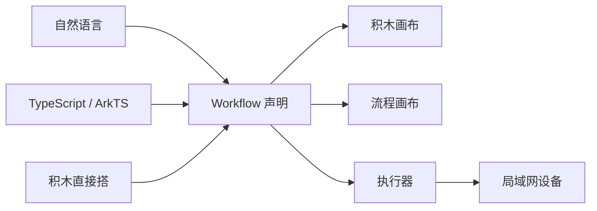

# CodeCanvas Spec v0（草案）

## 0. 定位

一句话：**把一段意图变成可执行的 workflow，并同时用积木和流程两种视图呈现它。**

三个输入口，一份声明，两个视图，一个执行器。



### 非目标（写死，防止重蹈上一个实现的覆辙）

账号体系、多用户、RBAC、凭证管理、任务队列、分布式与多主、Webhook 触发体系、
集成节点生态、表达式语言、云托管、插件市场。

这些不是"以后再做"，是**不做**。需要它们的场景不在本项目的目标里。

---

## 1. Workflow 格式

一个 workflow 就是一份 JSON。

```jsonc
{
  "formatVersion": 1,
  "id": "wf_01J...",
  "name": "避障前进",
  "nodes": [ /* Node */ ],
  "connections": { /* 见下 */ },
  "meta": {}          // 画布外观、教学 profile 等，引擎不解释
}
```

### Node

```jsonc
{
  "id": "nd_01J...",        // 稳定、生成即固定、永不改
  "name": "逻辑",            // 显示名，工作流内唯一，可改
  "type": "logic.blockly",  // 节点类型
  "typeVersion": 1,
  "parameters": {},         // 由节点自己解释，引擎不碰
  "position": { "x": 0, "y": 0 },
  "disabled": false
}
```

三条硬规则：

1. **`id` 不可变**。映射、执行记录、跨画布引用一律用它。`name` 只是给人看的，改名不许影响图。
2. **`type` + `typeVersion` 决定实现**。引擎按这两个字段找节点实现，找不到就报错，不做兜底猜测。
3. **`parameters` 是不透明载荷**。引擎只负责存和传，schema 校验归节点自己。

### connections

按**源节点 id** 索引，不是按名字。

```jsonc
"connections": {
  "nd_A": {
    "main": [
      [ { "node": "nd_B", "input": 0 } ]   // 第 0 个输出端口，第 0 条支路
    ]
  }
}
```

`main` 是输出端口名，外层数组是支路，内层数组是同一支路上的目标。
留了端口名的位置，是为了将来有 `error` 端口时不用改格式。

> 旧实现按节点名索引。纯重写不用背这个包袱，但迁移旧产物时映射一次即可。

---

## 2. 节点接口

```ts
type JsonValue = null | boolean | number | string | JsonValue[] | { [k: string]: JsonValue };

interface Item {
  json: JsonValue;
  pairedItem?: { item: number };   // 血缘：这一项来自上游第几项
}

interface NodeContext {
  getParameter<T>(name: string): T;        // 从 parameters 取，按节点 schema 校验
  getInputItems(input?: number): Item[];   // 某个输入端口收到的全部项
  readonly mode: 'run' | 'test';
  readonly signal: AbortSignal;
  log(message: string): void;              // 写进执行记录，UI 可见
}

interface NodeImplementation {
  readonly type: string;
  readonly typeVersion: number;
  execute(ctx: NodeContext): Promise<Item[]>;
}
```

四条约定：

- **节点收批，不逐项。** 一次调用拿到该端口的全部 items，自己决定是 `map` 还是聚合。
  上一个实现用的是逐项语义，结果是每个节点都要被调用 N 次、每次都要重建上下文。收批更好写也更快。
- **输入为空数组 → 输出空数组**，不报错、不跳过。
- **`pairedItem` 由引擎维护**。节点按 `map` 处理时引擎自动续接血缘；节点自己聚合时负责重写。
- **节点不做 I/O 之外的状态**。文件、网络走节点自己，引擎不提供隐式全局。

---

## 3. 执行语义

### 调度

- 拓扑序，但**依赖就绪即刻执行**，不按固定分层等齐。
- 一个节点只要有**任意一条**入边，就必须等所有**已连线**的输入端口就绪才执行；没连线的端口视为空数组。
- 同一批就绪的节点可以并行。

### 数据传递

- 上游输出按 `connections` 声明顺序拼接后交给下游。**顺序必须确定**，不能依赖完成时序。
- 上游 0 项 → 下游收到空数组，照常执行（节点自己决定空输入怎么办）。

### 错误与取消

- 节点抛错 → 该节点 `failed`，下游不执行，workflow 整体 `failed`，错误带节点 id 冒泡到 UI。
- v0 不做错误输出端口、不做 `continueOnFail`。要做的时候加端口名，格式已经留好。
- 取消通过 `AbortSignal` 贯穿到节点和沙箱子进程。

### 代码沙箱

积木编译出来的 JS 绝不在宿主进程里跑。

```ts
interface CodeRunner {
  run(input: {
    code: string;
    items: Item[];
    timeoutMs: number;
  }): Promise<{ ok: true; items: Item[] } | { ok: false; error: string }>;
}
```

- v0 实现：**独立子进程 + `node:vm`**。隔离强度与上一个实现同级（进程边界 + 上下文隔离），
  但没有它那堆依赖。
- 超时和内存上限由宿主强制，子进程用完即弃或复用一个池。
- `isolated-vm`、`quickjs-emscripten` 都只是这个接口的另一个实现，将来可替换。

> 注意 `node:vm` **不是**安全边界。真正的隔离来自进程边界。不要在宿主进程里 `runInContext` 用户的代码。

---

## 4. 双画布与映射

一份声明，两个视图。跨栏连线渲染的就是下面的映射表。

| 映射 | 用途 | v0 |
| --- | --- | --- |
| `blockId ↔ nodeId` | 积木和流程节点之间的连线 | **要** |
| `blockId ↔ 源码 span` | 点积木跳到 TypeScript 源码行列 | **要**（编译时顺手就有） |
| `blockId ↔ 生成代码行范围` | 点积木高亮生成的 JS | 缓，留给 trace |

统一标识：`blockId` 和 `nodeId` 都是生成即固定的字符串，禁止用数组下标或名字做引用。

---

## 5. 设备层

设备 = 局域网里一个能连上、能报出自己会干什么的东西。

```ts
interface DeviceSession {
  connect(): Promise<DeviceInfo>;
  disconnect(): Promise<void>;
  capabilities(): Promise<CapabilityCatalog>;
  invoke(capabilityId: string, args: JsonValue[]): Promise<JsonValue>;
  readonly online: boolean;
}

interface CapabilityCatalog {
  deviceId: string;
  capabilities: Array<{
    id: string;
    label: string;
    parameters: Array<{ name: string; type: 'number' | 'string' | 'boolean' | 'json' }>;
    returns: 'number' | 'string' | 'boolean' | 'json' | 'void';
  }>;
}
```

**边界**：核心只认 `DeviceSession` 这个接口。OpenHarmony 的发现协议、连接握手、消息编码
全部在插件里，不进核心。核心代码里不许出现设备品牌、协议名、硬件型号。

`capabilities()` 的返回直接决定积木里能出现哪些设备积木——所以"设备连上"和"积木长出来"
是同一件事，不需要两套机制。

---

## 6. 技术选型（建议，待确认）

- 语言：TypeScript（现有积累全部在此）
- 运行时：Node 22+
- 形态：**单进程服务**——托管前端静态资源 + REST/WS + 执行器；沙箱子进程独立
- 前端：Vue 3 + Vite；Blockly 12 + `zelos` renderer（近 Scratch 观感，但**不碰 Scratch 的
  名字、Logo、角色形象**——那是注册商标）
- 校验：zod
- 存储：workflow 存 JSON 文件，执行记录可只在内存

选单进程的理由：一台机器上跑起来就能连局域网设备，不需要浏览器直接触碰设备，也不需要部署编排。

---

## 7. 待你们拍板

1. **执行器跑在哪**——本地 Node 服务（建议）／浏览器内 WASM 沙箱／直接下发到设备。
2. **trace 粒度**——块级执行反馈要不要做，还是只做静态的积木↔代码对应。这决定沙箱要不要开回传通道。
3. **前端框架**——Vue 3（承接已有经验）还是另起。
4. **积木与流程的"提升"规则**——什么时候一个积木块变成流程里的一个节点，谁决定。
